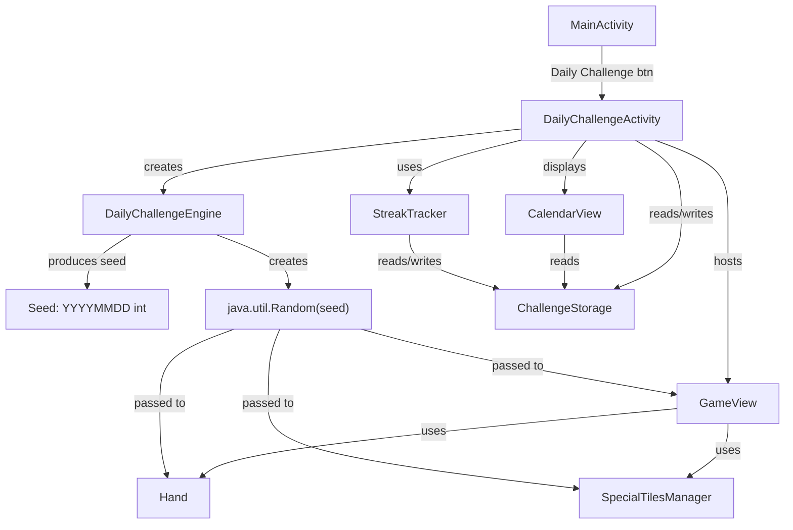

# Design Document

## Overview

The Daily Challenge feature adds a deterministic daily puzzle mode to TileBlast. Each day, all players receive the same piece sequence generated from a date-based seed (`YYYYMMDD` as integer → `java.util.Random`). Players aim to reach a 2000-point target score to earn a star, track progress on a 30-day calendar, and build streaks for rewards.

The feature introduces five new classes (`DailyChallengeEngine`, `StreakTracker`, `ChallengeStorage`, `CalendarView`, `DailyChallengeActivity`) and modifies existing classes (`GameView`, `Hand`, `MainActivity`) to accept a seeded `Random` for deterministic piece generation.

### Design Goals

- **Determinism** — Same date seed produces identical gameplay across all devices.
- **Offline-first** — No network required; seed derived from local date, data stored in SharedPreferences.
- **Minimal disruption** — Existing `GameView` and `Hand` gain an optional `Random` parameter; default behavior unchanged.
- **Reuse** — Leverages existing `SpecialTilesManager` (from special-tiles spec) with the shared seeded `Random`.

## Architecture



**Flow:**
1. `MainActivity` → tap "Daily Challenge" → launches `DailyChallengeActivity`.
2. `DailyChallengeActivity.onCreate` → `DailyChallengeEngine.generateSeed()` → creates `Random(seed)`.
3. `GameView.setup(8, 3, "daily", callback, random)` — overloaded setup passes seeded Random.
4. `Hand` uses the seeded Random for `refill()`. `SpecialTilesManager` uses same Random for spawn decisions.
5. On game over → `ChallengeStorage.recordScore(date, score)` → `StreakTracker.update()`.
6. Calendar/streak UI shown via `CalendarView` in the activity layout.

## Components and Interfaces

### `DailyChallengeEngine`

Package: `com.allan.tileblast.daily`

```java
public class DailyChallengeEngine {
    public static final int TARGET_SCORE = 2000;
    public static final int BOARD_SIZE = 8;
    public static final int HAND_SIZE = 3;

    // Generates seed from current local date
    public static long generateSeed();              // returns YYYYMMDD as long
    public static long generateSeed(LocalDate date); // testable overload

    // Creates the seeded Random instance
    public static Random createRandom(long seed);
}
```

Pure static utility — no mutable state. The `generateSeed(LocalDate)` overload enables unit testing without depending on system clock.

### `StreakTracker`

Package: `com.allan.tileblast.daily`

```java
public class StreakTracker {
    public StreakTracker(ChallengeStorage storage);

    // Recalculates streak from stored history. Call after recording a new star.
    public int calculateStreak();

    // Returns current persisted streak count.
    public int getCurrentStreak();

    // Checks and awards any newly-reached streak rewards. Returns list of awarded rewards.
    public List<StreakReward> checkRewards();
}

public enum StreakReward {
    POWER_UP_3DAY(3),
    THEME_7DAY(7),
    XP_BONUS_14DAY(14);

    public final int threshold;
}
```

`calculateStreak()` iterates backwards from today through `ChallengeStorage` entries, counting consecutive starred days. Streak resets to 0 if yesterday is unstarred.

### `ChallengeStorage`

Package: `com.allan.tileblast.daily`

```java
public class ChallengeStorage {
    private static final String PREFS_NAME = "daily_challenge_prefs";

    public ChallengeStorage(Context context);

    // Daily results
    public void recordScore(String dateKey, int score);  // dateKey = "YYYYMMDD"
    public int getScore(String dateKey);
    public boolean hasStar(String dateKey);
    public void awardStar(String dateKey);

    // Streak
    public int getStreakCount();
    public void setStreakCount(int count);

    // Rewards
    public boolean isRewardClaimed(StreakReward reward);
    public void claimReward(StreakReward reward);

    // Calendar data (last 30 days)
    public List<DayEntry> getCalendarEntries(LocalDate today);

    // Graceful corruption handling
    // All getters return defaults (0, false, empty) on parse failure.
}

public class DayEntry {
    public String dateKey;
    public int score;       // 0 if not attempted
    public boolean starred;
    public boolean isToday;
}
```

Storage format in SharedPreferences:
- `daily_scores` → JSON object: `{"20250715": 2450, "20250714": 1800, ...}`
- `daily_stars` → JSON array: `["20250715", "20250713", ...]`
- `streak_count` → int
- `claimed_rewards` → JSON array: `["POWER_UP_3DAY", ...]`

### `CalendarView`

Package: `com.allan.tileblast.daily`

Custom `View` subclass using Canvas drawing (consistent with existing app style).

```java
public class CalendarView extends View {
    public CalendarView(Context context, AttributeSet attrs);

    public void setData(List<DayEntry> entries, int streakCount);

    @Override
    protected void onDraw(Canvas canvas);
}
```

Layout: 6 rows × 5 columns grid showing 30 days (most recent at bottom-right). Each cell shows:
- Empty: gray outline
- Played (no star): score text, dim fill
- Starred: gold star icon, bright fill
- Today: highlighted border (white or accent color)

Streak count displayed above the grid as "🔥 X days".

### `DailyChallengeActivity`

Package: `com.allan.tileblast`

```java
public class DailyChallengeActivity extends AppCompatActivity
        implements GameView.GameCallback {

    private GameView gameView;
    private ChallengeStorage storage;
    private StreakTracker streakTracker;
    private long seed;
    private String todayKey;

    @Override
    protected void onCreate(Bundle savedInstanceState);

    @Override
    public void onGameOver(int finalScore);

    private void showResultDialog(int score, boolean starEarned);
    private void showCalendar();
}
```

On game over:
1. `storage.recordScore(todayKey, score)` — keeps best.
2. If `score >= TARGET_SCORE` → `storage.awardStar(todayKey)`.
3. `streakTracker.calculateStreak()` → persist.
4. `streakTracker.checkRewards()` → notify if new rewards.
5. Show result overlay with score, target, star status, and "View Calendar" / "Retry" buttons.

### Integration with `GameView`

Add overloaded `setup` method:

```java
// Existing (unchanged)
public void setup(int boardSize, int handSize, String modeName, GameCallback cb);

// New overload for seeded mode
public void setup(int boardSize, int handSize, String modeName, GameCallback cb, Random seededRandom);
```

When `seededRandom` is provided:
- Pass it to `Hand` constructor (new overload).
- Pass it to `SpecialTilesManager` constructor instead of `new Random()`.

### Integration with `Hand`

Add constructor overload:

```java
public Hand(int size);                    // existing — uses Piece.getRandomPiece()
public Hand(int size, Random random);     // new — uses seeded random for piece generation
```

Add static method to `Piece`:

```java
public static Piece getRandomPiece(Random rng);  // uses provided Random instead of static field
```

### Integration with `SpecialTilesManager`

Already accepts `Random rng` in constructor (per special-tiles spec). `DailyChallengeActivity` passes the same seeded `Random` instance used by `Hand`, ensuring deterministic spawn decisions.

### `MainActivity` Integration

Add a "Daily Challenge" button to `activity_main.xml` and wire it:

```java
findViewById(R.id.btnDaily).setOnClickListener(v ->
    startActivity(new Intent(this, DailyChallengeActivity.class)));
```

## Data Models

### SharedPreferences Schema

| Key | Type | Example |
|-----|------|---------|
| `daily_scores` | JSON String (Object) | `{"20250715":2450,"20250714":1800}` |
| `daily_stars` | JSON String (Array) | `["20250715","20250713"]` |
| `streak_count` | int | `5` |
| `claimed_rewards` | JSON String (Array) | `["POWER_UP_3DAY","THEME_7DAY"]` |

### Seed Derivation

```
date = LocalDate.now()  (or device date)
seed = date.getYear() * 10000 + date.getMonthValue() * 100 + date.getDayOfMonth()
// e.g., 2025-07-15 → 20250715
random = new java.util.Random(seed)
```

### DayEntry

```java
public class DayEntry {
    public String dateKey;   // "YYYYMMDD"
    public int score;        // 0 = not attempted
    public boolean starred;  // true if score >= TARGET
    public boolean isToday;  // highlight flag
}
```

## Correctness Properties

*A property is a characteristic or behavior that should hold true across all valid executions of a system — essentially, a formal statement about what the system should do. Properties serve as the bridge between human-readable specifications and machine-verifiable correctness guarantees.*

### Property 1: Seed generation produces YYYYMMDD integer

*For any* valid `LocalDate`, `DailyChallengeEngine.generateSeed(date)` SHALL return the integer value equal to `year * 10000 + month * 100 + day`.

**Validates: Requirements 1.1**

### Property 2: Deterministic piece sequence

*For any* seed value, two independent calls to generate a piece sequence of length N using `new Random(seed)` SHALL produce identical piece shape and color indices at every position.

**Validates: Requirements 1.3, 1.4, 10.3, 10.5**

### Property 3: Star threshold correctness

*For any* integer score, a star is awarded if and only if `score >= DailyChallengeEngine.TARGET_SCORE`. Scores below the target never produce a star; scores at or above always do.

**Validates: Requirements 2.2**

### Property 4: Best score retention

*For any* sequence of scores recorded for the same date key, `ChallengeStorage.getScore(dateKey)` SHALL return the maximum value from that sequence.

**Validates: Requirements 3.1, 3.2**

### Property 5: Streak calculation

*For any* sequence of calendar days with starred/unstarred status, `StreakTracker.calculateStreak()` SHALL return the count of consecutive starred days counting backwards from the most recent day (today or yesterday). If the most recent day is unstarred, streak is 0.

**Validates: Requirements 5.1, 5.2, 5.3**

### Property 6: Reward claim idempotence

*For any* streak that has already claimed a reward at threshold T, calling `checkRewards()` again at the same streak level SHALL NOT produce a duplicate award for T.

**Validates: Requirements 6.5**

### Property 7: Persistence round-trip

*For any* valid `ChallengeStorage` state (scores map, stars set, streak count, claimed rewards), serializing to SharedPreferences and then reading back SHALL produce an equivalent state.

**Validates: Requirements 8.1, 8.2, 8.3, 8.4**

### Property 8: Corrupted data resilience

*For any* malformed or missing SharedPreferences string value, `ChallengeStorage` getters SHALL return default empty state (score=0, starred=false, streak=0, empty lists) without throwing an exception.

**Validates: Requirements 8.5**

## Error Handling

| Scenario | Handling |
|----------|----------|
| SharedPreferences JSON parse failure | Return defaults (empty scores, 0 streak). Log warning. |
| Date parsing edge cases (timezone) | Use `LocalDate.now()` with device default timezone. |
| Firebase unavailable (leaderboard) | Show local score only; no error dialog. |
| Corrupted streak count (negative) | Clamp to 0. |
| Missing reward claim data | Treat all rewards as unclaimed (may re-award once). |

## Testing Strategy

### Property-Based Tests (JUnit 5 + jqwik)

Library: **jqwik** (property-based testing for Java)
Configuration: Minimum 100 iterations per property.
Tag format: `@Tag("Feature: daily-challenge, Property N: <description>")`

Each correctness property maps to one `@Property` test:
1. Seed generation — generate arbitrary `LocalDate` values, verify YYYYMMDD formula.
2. Determinism — generate arbitrary long seeds, produce two sequences, assert equality.
3. Star threshold — generate arbitrary int scores, verify star iff >= 2000.
4. Best score — generate arbitrary score lists per date, verify max retained.
5. Streak calculation — generate arbitrary boolean arrays (starred days), verify trailing-true count.
6. Reward idempotence — generate streak histories with claimed sets, verify no duplicates.
7. Persistence round-trip — generate arbitrary state objects, serialize/deserialize, assert equality.
8. Corrupted data — generate arbitrary strings (including invalid JSON), verify no exceptions and defaults returned.

### Unit Tests (JUnit 5)

- `DailyChallengeEngine`: board size = 8, hand size = 3, target = 2000 (constants).
- `StreakTracker`: specific reward thresholds (3, 7, 14) trigger correct rewards.
- `ChallengeStorage`: specific date operations (record, read, star award).
- `CalendarView`: data model produces 30 entries with correct today flag.

### Integration Tests

- `DailyChallengeActivity`: full flow from launch → game over → score recorded → streak updated.
- Firebase leaderboard: graceful fallback when unavailable.
- `GameView` with seeded Random: verify piece sequence matches expected for known seed.
