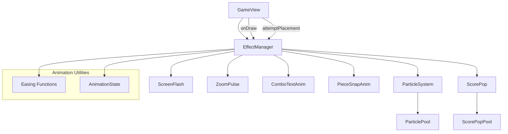

# Design Document: Enhanced Visual Feedback

## Overview

This design adds a particle system, animation framework, and multiple visual effects to the TileBlast Android game. All rendering integrates into the existing Canvas-based `GameView.onDraw()` pipeline. The architecture prioritizes zero-allocation rendering through object pooling and pre-allocated data structures.

The system introduces six visual effects:
1. **Particle explosions** on line breaks
2. **Screen flash** on big combos (≥3)
3. **Camera zoom pulse** on large combos/multi-line breaks
4. **Animated combo text** with overshoot easing
5. **Perfect clear bonus** with celebration particles
6. **Smooth piece snap** animation
7. **Score pop** floating text

Each effect is self-contained with its own update/draw lifecycle, managed by an `EffectManager` that orchestrates timing and rendering order within the existing draw loop.

## Architecture



### Integration into GameView.onDraw()

The existing `onDraw()` pipeline is extended with effect rendering at specific layers:

```
onDraw(canvas):
  1. updateShake()
  2. canvas.save()
  3. canvas.translate(shakeX, shakeY)
  4. [NEW] Apply ZoomPulse scale transform around grid center
  5. drawHUD(canvas)
  6. drawGrid(canvas)
  7. drawHandPieces(canvas)
  8. [NEW] drawPieceSnapAnim(canvas)  // instead of drawDraggingPiece when snapping
  9. drawDraggingPiece(canvas)
  10. drawPauseButton(canvas)
  11. canvas.restore()
  12. [NEW] drawParticles(canvas)       // above game, below overlays
  13. [NEW] drawScreenFlash(canvas)
  14. [NEW] drawScorePops(canvas)
  15. [NEW] drawComboTextAnim(canvas)
  16. [NEW] drawPerfectClearText(canvas)
  17. drawComboOverlay(canvas)          // existing (will be replaced by ComboTextAnim)
  18. drawPauseOverlay(canvas)
  19. drawGameOverOverlay(canvas)
```

### Game Loop Continuation

Effects keep the render loop alive by calling `invalidate()` whenever any effect is active. The `EffectManager.isActive()` method returns true if any sub-effect is still animating, which triggers continued invalidation.

## Components and Interfaces

### Easing (utility class)

```java
public final class Easing {
    // t is normalized [0.0, 1.0]
    public static float easeOut(float t);      // 1 - (1-t)^2
    public static float easeIn(float t);       // t^2
    public static float overshoot(float t);    // cubic overshoot, peaks at 1.2
    public static float linear(float t);       // t
}
```

**Overshoot formula**: Uses a modified back-ease that peaks at 1.2 at approximately t=0.7, then settles to 1.0 at t=1.0:
```
overshoot(t) = 1 + (2.2 * t - 2.2) * t * (t - 1)
```
This produces a curve that overshoots to ~1.2 before settling.

### Particle

```java
public class Particle {
    float x, y;           // position in screen pixels
    float vx, vy;         // velocity px/s
    float alpha;          // [0.0, 1.0]
    float radius;         // in px (2-5 dp converted)
    int color;            // ARGB color
    float lifetime;       // total lifetime in ms
    float elapsed;        // elapsed time in ms
    boolean active;       // pool flag
    
    void reset(float x, float y, float vx, float vy, int color, float radius, float lifetime);
    void update(float deltaMs);
    boolean isExpired();
}
```

### ParticlePool

```java
public class ParticlePool {
    private static final int MAX_PARTICLES = 512;
    private Particle[] pool;
    private int activeCount;
    
    Particle obtain();          // get inactive particle from pool
    void release(Particle p);  // return to pool
    void updateAll(float deltaMs);
    void drawAll(Canvas canvas, Paint paint);
    boolean hasActive();
    void releaseAll();
}
```

**Design rationale**: Pre-allocates 512 particles at initialization. A line break clearing an entire 8x8 row = 8 cells × 8 particles max = 64 particles. Multiple simultaneous line breaks + celebration = up to ~200 particles. 512 provides headroom without over-allocating.

### ParticleSystem

```java
public class ParticleSystem {
    private ParticlePool pool;
    private float density;
    private Random random;
    
    void spawnLineBreak(int cellX, int cellY, int blockSize, int gridLeft, int gridTop, int colorIndex);
    void spawnCelebration(float centerX, float centerY);
    void update(float deltaMs);
    void draw(Canvas canvas, Paint paint);
    boolean isActive();
}
```

### ScreenFlash

```java
public class ScreenFlash {
    private float opacity;       // current opacity [0.0, 1.0]
    private float initialOpacity;
    private int color;           // base color (white or gold)
    private float duration;      // fade duration ms
    private float elapsed;
    private boolean active;
    
    void trigger(int comboLevel);
    void update(float deltaMs);
    void draw(Canvas canvas, Paint paint, int viewWidth, int viewHeight);
    boolean isActive();
}
```

### ZoomPulse

```java
public class ZoomPulse {
    private static final float PEAK_SCALE = 1.03f;
    private static final float HALF_DURATION = 150f; // ms
    
    private float currentScale;
    private float elapsed;
    private boolean active;
    private float startScale; // for interruption support
    
    void trigger();
    void triggerFrom(float currentScale); // interruption
    void update(float deltaMs);
    float getScale();
    boolean isActive();
}
```

### ComboTextAnim

```java
public class ComboTextAnim {
    private static final float SCALE_DURATION = 300f;
    private static final float FADE_DURATION = 300f;
    
    private String text;
    private float holdDuration;  // 400ms for combo, 800ms for perfect clear
    private float elapsed;
    private float scale;
    private float alpha;
    private boolean active;
    private int color;
    private float fontSize; // in px
    
    void trigger(String text, int color, float fontSizePx, float holdDurationMs);
    void update(float deltaMs);
    void draw(Canvas canvas, Paint paint, Typeface font, int viewWidth, int viewHeight);
    float getScale();
    float getAlpha();
    boolean isActive();
}
```

**Animation phases**:
- Phase 1 (0–300ms): Scale from 0.0 to 1.0 with overshoot (peaks at 1.2)
- Phase 2 (300–700ms for combo, 300–1100ms for perfect): Hold at scale 1.0, alpha 1.0
- Phase 3 (last 300ms): Fade alpha from 1.0 to 0.0

### ScorePop

```java
public class ScorePop {
    float x, y;          // starting position
    float offsetY;       // current vertical offset
    float alpha;
    String text;
    float elapsed;
    boolean active;
    int stackIndex;      // for vertical stacking
    
    void reset(String text, float x, float y, int stackIndex);
    void update(float deltaMs);
    boolean isExpired();
}
```

### ScorePopManager

```java
public class ScorePopManager {
    private static final int MAX_POPS = 8;
    private static final float LIFETIME = 800f;
    private static final float RISE_DISTANCE_DP = 60f;
    private static final float STACK_OFFSET_DP = 25f;
    private static final long STACK_WINDOW_MS = 200;
    
    private ScorePop[] pool;
    private long lastSpawnTime;
    private int recentCount; // pops within stack window
    
    void spawn(String text, float x, float y, float density);
    void update(float deltaMs);
    void draw(Canvas canvas, Paint paint, Typeface font, float density);
    boolean isActive();
}
```

### PieceSnapAnim

```java
public class PieceSnapAnim {
    private static final float DURATION = 100f; // ms
    
    private Piece piece;
    private float startX, startY;  // drag release position
    private float endX, endY;      // grid target position
    private float elapsed;
    private boolean active;
    private int gridX, gridY;      // board coordinates for commit
    
    void start(Piece piece, float fromX, float fromY, float toX, float toY, int gridX, int gridY);
    void update(float deltaMs);
    float getCurrentX();
    float getCurrentY();
    boolean isComplete();
    void forceComplete();  // for interruption
    boolean isActive();
}
```

### EffectManager

```java
public class EffectManager {
    private ParticleSystem particleSystem;
    private ScreenFlash screenFlash;
    private ZoomPulse zoomPulse;
    private ComboTextAnim comboTextAnim;
    private ScorePopManager scorePopManager;
    private PieceSnapAnim pieceSnapAnim;
    private long lastFrameTime;
    
    void init(float density);
    
    // Trigger methods (called from GameView game logic)
    void onLineBreak(List<int[]> clearedCells, int blockSize, int gridLeft, int gridTop);
    void onCombo(int comboLevel, int linesBroken);
    void onPerfectClear(float centerX, float centerY, int viewWidth, int viewHeight);
    void onScoreGain(int points, float x, float y);
    void startPieceSnap(Piece piece, float fromX, float fromY, float toX, float toY, int gridX, int gridY);
    
    // Frame update and draw
    void update();  // calculates deltaTime internally
    void applyZoomTransform(Canvas canvas, float gridCenterX, float gridCenterY);
    void drawParticles(Canvas canvas);
    void drawScreenFlash(Canvas canvas, int viewWidth, int viewHeight);
    void drawScorePops(Canvas canvas);
    void drawComboText(Canvas canvas, int viewWidth, int viewHeight);
    void drawPieceSnap(Canvas canvas, float blockSize);
    
    boolean isActive();
    boolean isPieceSnapping();
    PieceSnapAnim getPieceSnapAnim();
}
```

### Perfect Clear Detection

Added to `Board.java`:

```java
public boolean isEmpty() {
    for (int y = 0; y < size; y++)
        for (int x = 0; x < size; x++)
            if (cells[y][x] == FILLED) return false;
    return true;
}
```

Called in `GameView.attemptPlacement()` after `board.breakLines()`:

```java
int linesBroken = board.breakLines();
// ... existing combo logic ...

// Perfect clear check
if (linesBroken > 0 && board.isEmpty()) {
    scoreManager.addPerfectClearBonus(); // +500
    effectManager.onPerfectClear(gridCenterX, gridCenterY, getWidth(), getHeight());
    audioManager.playPerfectClear();
}
```

## Data Models

### Particle State

| Field | Type | Range | Description |
|-------|------|-------|-------------|
| x, y | float | screen coords | Current position |
| vx, vy | float | [-400, 400] px/s | Velocity components |
| alpha | float | [0.0, 1.0] | Current transparency |
| radius | float | [2dp, 5dp] in px | Circle radius |
| color | int | ARGB | Render color |
| lifetime | float | [400, 700] ms | Total lifespan |
| elapsed | float | [0, lifetime] ms | Time since spawn |
| active | boolean | — | Pool availability flag |

### Animation Constants

| Effect | Duration | Easing | Notes |
|--------|----------|--------|-------|
| Particle lifetime | 400–700ms | Linear alpha fade | Gravity: 800 px/s² |
| Screen flash | 100–200ms | Linear fade | Triggers at combo ≥ 3 |
| Zoom pulse | 300ms total | EaseOut + EaseIn | 150ms each half |
| Combo text scale | 300ms | Overshoot (peak 1.2) | — |
| Combo text hold | 400ms | — | 800ms for perfect clear |
| Combo text fade | 300ms | Linear | — |
| Piece snap | 100ms | EaseOut | Position interpolation |
| Score pop | 800ms | Linear rise + fade | 60dp rise distance |

### Screen Flash Color Rules

| Combo Level | Color | Initial Opacity |
|-------------|-------|-----------------|
| 3 | White (0xFFFFFFFF) | 15% |
| 4 | Gold (0xFFFFD700) | 20% |
| 5 | Gold (0xFFFFD700) | 25% |
| 6+ | Gold (0xFFFFD700) | min(40%, 15% + 5%*(combo-3)) |

### Object Pool Sizes

| Pool | Max Size | Rationale |
|------|----------|-----------|
| ParticlePool | 512 | 8 cells × 8 particles × ~4 simultaneous breaks + celebration headroom |
| ScorePopPool | 8 | Rarely more than 3-4 active simultaneously |

## Correctness Properties

*A property is a characteristic or behavior that should hold true across all valid executions of a system — essentially, a formal statement about what the system should do. Properties serve as the bridge between human-readable specifications and machine-verifiable correctness guarantees.*

### Property 1: Particle spawn count per cleared cell

*For any* line break event with N cleared cells, the ParticleSystem SHALL spawn between 4×N and 8×N particles (inclusive).

**Validates: Requirements 1.1**

### Property 2: Particle color matches source cell

*For any* cleared cell with color index C, all particles spawned from that cell SHALL have the color corresponding to index C.

**Validates: Requirements 1.2**

### Property 3: Particle initialization invariants

*For any* spawned particle, its velocity magnitude SHALL be between 100 and 400 pixels per second, AND its radius SHALL be between 2dp and 5dp (converted to pixels).

**Validates: Requirements 1.3, 1.7**

### Property 4: Particle physics update

*For any* active particle with initial position (x₀, y₀), velocity (vx, vy), and elapsed time dt milliseconds, the updated position SHALL equal (x₀ + vx×dt/1000, y₀ + vy×dt/1000 + 0.5×800×(dt/1000)²) where 800 is gravity in px/s².

**Validates: Requirements 1.4**

### Property 5: Particle lifecycle — alpha and removal

*For any* particle with lifetime L milliseconds, at elapsed time t: alpha SHALL equal max(0, 1.0 - t/L), AND if t ≥ L the particle SHALL not be in the active set.

**Validates: Requirements 1.5, 1.6**

### Property 6: Screen flash opacity formula

*For any* combo level C ≥ 3, the screen flash initial opacity SHALL equal: if C == 3 then 0.15, else min(0.40, 0.15 + 0.05×(C-3)). The color SHALL be white for C == 3 and gold (0xFFFFD700) for C ≥ 4.

**Validates: Requirements 2.1, 2.2, 2.3**

### Property 7: Screen flash fade

*For any* active screen flash with initial opacity O and duration D, at elapsed time t the current opacity SHALL equal O × max(0, 1.0 - t/D).

**Validates: Requirements 2.4**

### Property 8: Zoom pulse trigger condition

*For any* combo level C and lines broken count L, a zoom pulse SHALL be triggered if and only if C ≥ 4 OR L ≥ 3.

**Validates: Requirements 3.1**

### Property 9: Zoom pulse easing curve

*For any* active zoom pulse at elapsed time t in [0, 300ms]: if t ≤ 150 then scale = 1.0 + 0.03 × easeOut(t/150), else scale = 1.0 + 0.03 × (1.0 - easeIn((t-150)/150)).

**Validates: Requirements 3.2, 3.3**

### Property 10: Combo text animation state

*For any* combo text animation at elapsed time t: if t ∈ [0, 300) then scale = overshoot(t/300) and alpha = 1.0; if t ∈ [300, 300+holdDuration) then scale = 1.0 and alpha = 1.0; if t ∈ [300+holdDuration, 300+holdDuration+300) then scale = 1.0 and alpha = 1.0 - (t - 300 - holdDuration)/300. The overshoot function SHALL reach a peak of 1.2 at some point during [0, 300ms].

**Validates: Requirements 4.1, 4.3, 4.4**

### Property 11: Perfect clear detection and bonus

*For any* board state where all cells are EMPTY after piece placement and line break processing, the ScoreManager SHALL have added exactly 500 bonus points.

**Validates: Requirements 5.1**

### Property 12: Perfect clear celebration particles

*For any* perfect clear event, the ParticleSystem SHALL spawn between 80 and 120 particles, and all spawned particles SHALL have gold color.

**Validates: Requirements 5.3**

### Property 13: Piece snap interpolation

*For any* piece snap animation with start position S, end position E, and elapsed time t in [0, 100ms], the current position SHALL equal S + (E - S) × easeOut(t/100).

**Validates: Requirements 6.1, 6.2**

### Property 14: Score pop text format

*For any* score increase of N points, the spawned Score_Pop text SHALL equal "+" concatenated with the string representation of N.

**Validates: Requirements 7.1**

### Property 15: Score pop animation state

*For any* active score pop at elapsed time t in [0, 800ms], the vertical offset SHALL equal -60dp × (t/800) AND the alpha SHALL equal 1.0 - t/800.

**Validates: Requirements 7.2, 7.3**

### Property 16: Score pop stacking

*For any* set of N score pops spawned within a 200ms window, each pop SHALL have a distinct vertical starting offset equal to its stack index × 25dp.

**Validates: Requirements 7.5**

## Error Handling

| Scenario | Handling |
|----------|----------|
| Particle pool exhausted (512 active) | New spawn requests are silently dropped; existing particles continue normally |
| ScorePop pool exhausted (8 active) | Oldest active pop is recycled for the new one |
| DeltaTime spike (>100ms, e.g., app resume) | Clamp deltaTime to 33ms (one frame at 30fps) to prevent particles teleporting |
| Perfect clear sound not loaded | AudioManager's existing null-check pattern handles gracefully |
| Piece snap interrupted by new drag | `forceComplete()` commits piece immediately, no visual glitch |
| Zoom pulse interrupted by new trigger | New pulse starts from current scale value, smooth transition |
| Zero cleared cells passed to particle spawn | No-op, no particles created |
| Negative deltaTime (clock skew) | Clamp to 0, no update applied |

## Testing Strategy

### Property-Based Tests (JUnit 5 + jqwik)

The feature's pure logic components (easing functions, particle physics, animation state machines, opacity calculations) are well-suited for property-based testing. These are pure functions with clear input/output behavior and universal properties that hold across wide input spaces.

**Library**: [jqwik](https://jqwik.net/) — property-based testing for JUnit 5 on JVM
**Configuration**: Minimum 100 iterations per property test
**Tag format**: `@Tag("Feature: enhanced-visual-feedback, Property {N}: {description}")`

Each correctness property (1–16) maps to a single property-based test that generates random inputs and verifies the universal property holds.

### Unit Tests (JUnit 5)

Example-based tests for:
- Screen flash at combo 3 produces white color at 15% (Req 2.2)
- Zoom pulse pivot is grid center (Req 3.4)
- Zoom pulse interruption starts from current scale (Req 3.5)
- Combo text positioned at 30% height (Req 4.5)
- Perfect clear text is "PERFECT CLEAR" in gold at 48dp (Req 5.2)
- Perfect clear uses 800ms hold duration (Req 5.4)
- AudioManager.playPerfectClear() called on perfect clear (Req 5.5)
- Piece snap renders at full opacity (Req 6.3)
- Piece snap commits piece on completion (Req 6.4)
- Piece snap force-completes on new drag (Req 6.5)
- Score pop uses white, 20dp, bold (Req 7.4)
- Rendering order: particles above game, below overlays (Req 2.5, 5.6)

### Integration Tests

- Full `attemptPlacement()` flow triggers correct effects for line breaks
- Perfect clear detection works end-to-end (place piece → break lines → board empty → bonus + celebration)
- Multiple rapid placements don't cause pool exhaustion or visual artifacts
- State save/restore preserves active animation state (or gracefully drops animations)

### Performance Tests

- Measure frame time with 512 active particles (target: <16ms on mid-range device)
- Verify zero allocations in update/draw hot path via allocation tracker
- Confirm object pool reuse (no GC pressure during gameplay)
