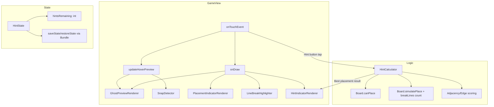
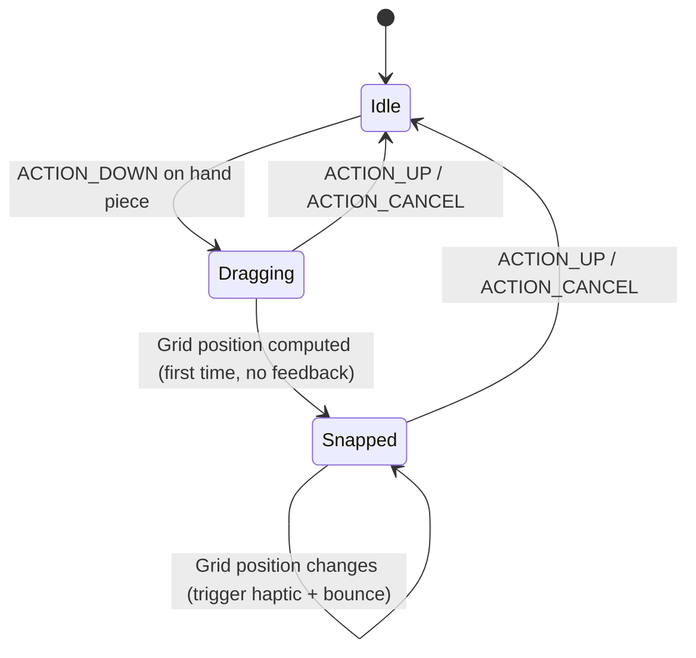

# Design Document: Ghost Preview & Smart Hints

## Overview

This feature enhances the TileBlast block puzzle game with improved visual feedback during piece placement and an optional hint system. The current implementation uses a basic 30% alpha hover preview via `Board.setHover()` and `Board.HOVERED` cell states. This design introduces:

1. **Enhanced Ghost Preview** — Outlined, pulsing ghost blocks at 60% alpha with a 2dp white border
2. **Valid/Invalid Placement Indicator** — Green/red tint overlay based on `Board.canPlace()` result
3. **Line Break Highlight** — Gold-bordered glow on rows/columns that would complete upon placement
4. **Snap-to-Grid Feedback** — Haptic pulse + scale bounce when the dragged piece aligns to a new grid cell
5. **Hint System** — A `HintCalculator` that scores all valid placements and animates the best suggestion
6. **Hint State Persistence** — Remaining hint count saved/restored via the existing `Bundle` state mechanism

The design integrates entirely within the existing Canvas-based rendering pipeline in `GameView.onDraw()` and the touch handling in `GameView.onTouchEvent()`. No new Activities, Fragments, or external libraries are required.

## Architecture



### Key Design Decisions

| Decision | Rationale |
|----------|-----------|
| Keep rendering in `GameView.onDraw()` | Avoids introducing a separate rendering layer; consistent with existing architecture |
| New `HintCalculator` class | Separates scoring logic from view code for testability |
| `SnapDetector` as inner helper | Lightweight state tracking (previous grid position) doesn't warrant a full class |
| No new cell states in `Board` | Ghost preview enhancements are purely visual overlays drawn on top of existing states |
| Scoring uses `int` arithmetic | Deterministic, no floating-point rounding issues, fast enough for 100ms budget |

## Components and Interfaces

### 1. HintCalculator

A standalone class responsible for evaluating all valid placements and returning the best one.

```java
package com.allan.tileblast.game;

public class HintCalculator {

    public static class PlacementResult {
        public final int pieceIndex;  // index in hand array
        public final int gridX;       // top-left grid X
        public final int gridY;       // top-left grid Y
        public final int score;       // computed score
        
        public PlacementResult(int pieceIndex, int gridX, int gridY, int score) { ... }
    }

    private final Board board;
    private final int boardSize;

    public HintCalculator(Board board) { ... }

    /**
     * Evaluate all valid placements for all hand pieces.
     * Returns the highest-scoring PlacementResult, or null if no valid placement exists.
     */
    public PlacementResult findBestPlacement(Piece[] handPieces) { ... }

    /**
     * Score a single placement.
     * Formula: (lines_completed * 1000) + (adjacent_filled_cells * 10) + (edge_cells * 5)
     */
    public int scorePlacement(Piece piece, int px, int py) { ... }

    /** Count how many rows + columns would be completed if piece is placed at (px, py). */
    int countLinesCompleted(Piece piece, int px, int py) { ... }

    /** Count filled cells adjacent (4-directional) to the piece's blocks after placement. */
    int countAdjacentFilled(Piece piece, int px, int py) { ... }

    /** Count how many of the piece's blocks touch a board edge. */
    int countEdgeCells(Piece piece, int px, int py) { ... }

    /** Manhattan distance from placement center to board center (for tiebreaking). */
    int distanceToCenter(Piece piece, int px, int py) { ... }
}
```

### 2. GhostPreviewRenderer (methods in GameView)

Replaces the current `drawBeveledBlock(..., 0.3f)` rendering for `HOVERED` cells with:
- 60% alpha fill using the piece color
- 2dp white outline stroke around each ghost block
- Pulsing alpha animation (50%–70% over 600ms cycle using `System.currentTimeMillis()`)

```java
// In GameView
private void drawGhostBlock(Canvas canvas, int cx, int cy, int blockSize, int colorIdx) {
    float pulse = computePulseAlpha(600, 0.5f, 0.7f);
    // Fill with piece color at pulsing alpha
    paint.setStyle(Paint.Style.FILL);
    paint.setColor(Piece.getColorFromIndex(colorIdx));
    paint.setAlpha((int)(pulse * 255));
    canvas.drawRect(cx, cy, cx + blockSize, cy + blockSize, paint);
    // White outline (2dp)
    paint.setStyle(Paint.Style.STROKE);
    paint.setStrokeWidth(2 * density);
    paint.setColor(Color.WHITE);
    paint.setAlpha((int)(pulse * 255));
    canvas.drawRect(cx, cy, cx + blockSize, cy + blockSize, paint);
    paint.setAlpha(255);
}

private float computePulseAlpha(int periodMs, float min, float max) {
    float t = (System.currentTimeMillis() % periodMs) / (float) periodMs;
    return min + (max - min) * (0.5f + 0.5f * (float) Math.sin(2 * Math.PI * t));
}
```

### 3. PlacementIndicatorRenderer (methods in GameView)

Draws a green or red tint overlay on cells during dragging:
- **Green (valid)**: When `Board.canPlace()` returns true — tint all cells the piece would occupy
- **Red (invalid)**: When piece overlaps filled cells or extends beyond bounds — tint overlapping/in-bounds cells

```java
private void drawPlacementIndicator(Canvas canvas, Piece piece, int gx, int gy, boolean valid) {
    int tintColor = valid ? 0x6600FF00 : 0x66FF0000; // 40% alpha green or red
    paint.setStyle(Paint.Style.FILL);
    paint.setColor(tintColor);
    for (int dy = 0; dy < piece.getRows(); dy++) {
        for (int dx = 0; dx < piece.getCols(); dx++) {
            if (piece.matrix[dy][dx] == 1) {
                int bx = gx + dx, by = gy + dy;
                if (bx >= 0 && bx < boardSize && by >= 0 && by < boardSize) {
                    int cx = gridLeft + bx * blockSize;
                    int cy = gridTop + by * blockSize;
                    canvas.drawRect(cx, cy, cx + blockSize, cy + blockSize, paint);
                }
            }
        }
    }
}
```

### 4. LineBreakHighlighter (methods in GameView)

Draws a gold pulsing border around cells in rows/columns that would complete:

```java
private void drawLineBreakHighlight(Canvas canvas) {
    // Iterate cells with HOVERED_BREAK_FILLED or HOVERED_BREAK_EMPTY state
    float pulse = computePulseAlpha(800, 0.6f, 1.0f);
    paint.setStyle(Paint.Style.STROKE);
    paint.setStrokeWidth(3 * density);
    paint.setColor(0xFFFFD700); // Gold
    paint.setAlpha((int)(pulse * 255));
    for (int y = 0; y < boardSize; y++) {
        for (int x = 0; x < boardSize; x++) {
            int cell = board.getCell(x, y);
            if (cell == Board.HOVERED_BREAK_FILLED || cell == Board.HOVERED_BREAK_EMPTY) {
                int cx = gridLeft + x * blockSize;
                int cy = gridTop + y * blockSize;
                canvas.drawRect(cx, cy, cx + blockSize, cy + blockSize, paint);
            }
        }
    }
    paint.setAlpha(255);
}
```

### 5. SnapDetector (state fields in GameView)

Tracks the previous valid grid position and triggers feedback on change:

```java
// Fields
private int prevSnapGridX = -1, prevSnapGridY = -1;
private long snapBounceStartTime = 0;
private boolean firstPickup = true;

// In updateHoverPreview(), after computing new gx, gy:
private void checkSnap(int newGx, int newGy) {
    if (firstPickup) {
        firstPickup = false;
        prevSnapGridX = newGx;
        prevSnapGridY = newGy;
        return; // No feedback on first pickup
    }
    if (newGx != prevSnapGridX || newGy != prevSnapGridY) {
        if (newGx >= 0 && newGy >= 0) { // valid position
            vibrateSnap(15);
            snapBounceStartTime = System.currentTimeMillis();
        }
        prevSnapGridX = newGx;
        prevSnapGridY = newGy;
    }
}
```

### 6. HintIndicatorRenderer (methods in GameView)

Draws the animated hint indicator when a hint is active:

```java
// Fields
private HintCalculator.PlacementResult activeHint = null;
private long hintDisplayStartTime = 0;
private static final long HINT_DISPLAY_DURATION = 3000; // 3 seconds

private void drawHintIndicator(Canvas canvas) {
    if (activeHint == null) return;
    long elapsed = System.currentTimeMillis() - hintDisplayStartTime;
    if (elapsed > HINT_DISPLAY_DURATION) { activeHint = null; return; }
    
    Piece piece = hand.get(activeHint.pieceIndex);
    if (piece == null) { activeHint = null; return; }
    
    float pulse = computePulseAlpha(800, 0.4f, 1.0f);
    paint.setStyle(Paint.Style.STROKE);
    paint.setStrokeWidth(3 * density);
    paint.setColor(0xFF00FFAA); // Bright teal
    paint.setAlpha((int)(pulse * 255));
    
    for (int dy = 0; dy < piece.getRows(); dy++) {
        for (int dx = 0; dx < piece.getCols(); dx++) {
            if (piece.matrix[dy][dx] == 1) {
                int cx = gridLeft + (activeHint.gridX + dx) * blockSize;
                int cy = gridTop + (activeHint.gridY + dy) * blockSize;
                canvas.drawRect(cx, cy, cx + blockSize, cy + blockSize, paint);
            }
        }
    }
    paint.setAlpha(255);
    invalidate(); // Keep animating
}
```

### 7. HintButton (drawn in GameView HUD)

A simple button rendered in the HUD area, showing remaining hint count:

```java
private RectF hintBtnRect = new RectF();
private int hintsRemaining = 3;

private void drawHintButton(Canvas canvas, int w) {
    int btnW = (int)(80 * density);
    int btnH = (int)(36 * density);
    float left = 10;
    float top = 15;
    hintBtnRect.set(left, top, left + btnW, top + btnH);
    
    boolean enabled = hintsRemaining > 0 && !gameOver && !paused;
    paint.setStyle(Paint.Style.FILL);
    paint.setColor(enabled ? 0xFF00AAFF : 0xFF444444);
    canvas.drawRoundRect(hintBtnRect, 8, 8, paint);
    
    textPaint.setTypeface(fontBold);
    textPaint.setTextSize(16);
    textPaint.setColor(enabled ? Color.WHITE : Color.GRAY);
    textPaint.setTextAlign(Paint.Align.CENTER);
    canvas.drawText("HINT (" + hintsRemaining + ")", hintBtnRect.centerX(), hintBtnRect.centerY() + 6, textPaint);
}
```

## Data Models

### PlacementResult

| Field | Type | Description |
|-------|------|-------------|
| `pieceIndex` | `int` | Index of the piece in the hand array (0-based) |
| `gridX` | `int` | Top-left X coordinate on the board grid |
| `gridY` | `int` | Top-left Y coordinate on the board grid |
| `score` | `int` | Computed placement score |

### Hint State (persisted in Bundle)

| Key | Type | Default | Description |
|-----|------|---------|-------------|
| `"hints_remaining"` | `int` | `3` | Number of hints left in current game session |

### Scoring Formula

```
score = (lines_completed × 1000) + (adjacent_filled × 10) + (edge_cells × 5)
```

Where:
- **lines_completed**: Number of rows + columns that would be fully filled after placing the piece (simulated without mutating board state)
- **adjacent_filled**: Count of filled cells orthogonally adjacent to the piece's blocks (excluding the piece's own blocks). Each unique adjacent filled cell is counted once.
- **edge_cells**: Count of the piece's blocks that touch a board edge (row 0, row N-1, col 0, col N-1)

### Tiebreaker

When multiple placements have the same score, select the one with the smallest Manhattan distance from the placement's center to the board's center:

```
center_x = px + piece.getCols() / 2.0
center_y = py + piece.getRows() / 2.0
board_center = (boardSize - 1) / 2.0
distance = |center_x - board_center| + |center_y - board_center|
```

### Line Completion Simulation Algorithm

To count lines completed without mutating board state:

```
countLinesCompleted(piece, px, py):
    for each row r in [0, boardSize):
        rowFull = true
        for each col c in [0, boardSize):
            cellOccupied = board.getCell(c, r) == FILLED
                        OR (piece covers (c, r) relative to (px, py))
            if not cellOccupied: rowFull = false; break
        if rowFull: linesCount++
    
    // Same for columns
    return linesCount
```

### Snap Detection State Machine




## Correctness Properties

*A property is a characteristic or behavior that should hold true across all valid executions of a system — essentially, a formal statement about what the system should do. Properties serve as the bridge between human-readable specifications and machine-verifiable correctness guarantees.*

### Property 1: Pulse Alpha Invariant

*For any* time value `t` (in milliseconds), the `computePulseAlpha(period, min, max)` function SHALL return a value in the closed interval `[min, max]`.

**Validates: Requirements 1.2, 3.2**

### Property 2: Invalid Placement Indicator Cell Identification

*For any* board state, piece shape, and grid position where `Board.canPlace()` returns false, the set of cells identified for red tinting SHALL equal exactly the piece's matrix cells that are within board bounds AND either overlap a FILLED cell or are at a position where the piece extends beyond the boundary.

**Validates: Requirements 2.2, 2.3**

### Property 3: Line Completion Detection

*For any* board state and valid piece placement (where `canPlace` returns true), the `countLinesCompleted(piece, px, py)` function SHALL return the number of rows plus columns that would be completely filled if the piece were placed, without mutating the board state.

**Validates: Requirements 3.1**

### Property 4: Snap Detection Triggers on Position Change

*For any* sequence of grid positions during a drag (after the initial pickup), the snap detector SHALL trigger feedback exactly when the current valid grid position differs from the previous valid grid position, and SHALL NOT trigger on the first alignment after pickup.

**Validates: Requirements 4.1, 4.3, 4.4**

### Property 5: Scoring Formula Correctness

*For any* board state, piece, and valid grid position (px, py), `scorePlacement(piece, px, py)` SHALL return exactly `countLinesCompleted(piece, px, py) * 1000 + countAdjacentFilled(piece, px, py) * 10 + countEdgeCells(piece, px, py) * 5`.

**Validates: Requirements 6.1, 5.3**

### Property 6: Best Placement is Maximum Score

*For any* board state and hand of pieces, `findBestPlacement(handPieces)` SHALL return a `PlacementResult` whose score is greater than or equal to the score of every other valid placement for any non-null piece in the hand. If no valid placement exists, it SHALL return null.

**Validates: Requirements 6.3**

### Property 7: Tiebreaker Selects Closest to Center

*For any* board state and hand where multiple valid placements share the maximum score, `findBestPlacement` SHALL return the placement with the smallest Manhattan distance from the placement center to the board center.

**Validates: Requirements 6.2**

### Property 8: No Hint Consumed When No Moves Available

*For any* board state where no valid placement exists for any hand piece, requesting a hint SHALL NOT decrement the `hintsRemaining` counter.

**Validates: Requirements 5.8**

### Property 9: Hint Count Persistence Round-Trip

*For any* `hintsRemaining` value in `{0, 1, 2, 3}`, saving the game state to a Bundle and then restoring from that Bundle SHALL result in the same `hintsRemaining` value.

**Validates: Requirements 7.1, 7.2**

## Error Handling

| Scenario | Handling |
|----------|----------|
| `findBestPlacement` returns null (no valid moves) | Display "No moves available" toast/text for 1.5s; do NOT decrement hint counter |
| Hint button tapped while hint animation is active | Ignore tap (debounce) |
| Hint button tapped with `hintsRemaining == 0` | Button is visually disabled; tap is ignored |
| Vibrator service unavailable | Catch exception silently; skip haptic feedback (existing pattern) |
| Piece removed from hand while hint indicator is showing | Clear `activeHint` on next draw frame |
| Board state changes during hint display (shouldn't happen since hints are view-only) | Hint indicator continues showing; placement may no longer be valid but that's acceptable since it's advisory |
| `computePulseAlpha` called with period=0 | Guard with `if (periodMs <= 0) return min;` |
| Bundle restore with missing `"hints_remaining"` key | Default to 3 (via `Bundle.getInt("hints_remaining", 3)`) |

## Testing Strategy

### Property-Based Tests (using jqwik for JVM)

The `HintCalculator` class contains pure logic suitable for property-based testing. The following properties will be tested with **jqwik** (Java property-based testing library):

- **Property 1** (Pulse Alpha Invariant): Generate random `long` time values, verify output ∈ [min, max]
- **Property 3** (Line Completion Detection): Generate random board states + valid placements, verify count matches brute-force simulation
- **Property 5** (Scoring Formula): Generate random board states + valid placements, verify score = components sum
- **Property 6** (Best Placement Maximum): Generate random boards + hands, verify returned score ≥ all alternatives
- **Property 7** (Tiebreaker): Generate boards with known ties, verify center-distance selection
- **Property 8** (No Hint Consumed): Generate full boards with no valid placements, verify counter unchanged
- **Property 9** (Hint Persistence Round-Trip): Generate random hint counts, verify save/restore identity

Each property test runs a minimum of **100 iterations**.

Tag format: `@Label("Feature: ghost-preview-hints, Property {N}: {description}")`

### Unit Tests (JUnit 5)

- `HintCalculator.countLinesCompleted()` with known board configurations
- `HintCalculator.countAdjacentFilled()` with specific piece placements
- `HintCalculator.countEdgeCells()` for corner, edge, and center placements
- `HintCalculator.distanceToCenter()` for known positions
- Snap detector: first pickup suppression, position change detection
- Hint counter: decrement on use, no decrement on null result, reset on new game
- Invalid placement indicator: overlap detection, boundary detection

### Integration Tests

- Full drag-and-drop flow: pick up piece → drag over grid → verify ghost + indicator + line highlight render calls
- Hint button tap → verify `HintCalculator` is invoked → verify indicator is drawn for 3 seconds
- State save/restore cycle with hint count verification
- Performance: hint calculation completes within 100ms on a 10×10 board with 3 pieces

### What Is NOT Tested with PBT

- Canvas rendering output (visual correctness) — verified via manual testing and screenshot comparison
- Animation timing smoothness — verified via manual testing on device
- Haptic feedback feel — verified via manual testing
- UI layout and button positioning — verified via manual testing
