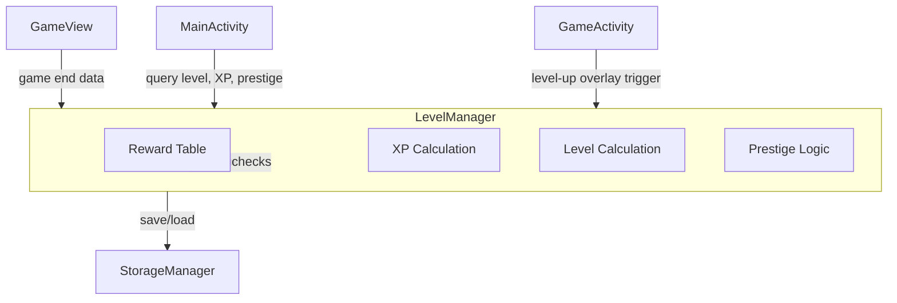

# Design Document: Level Progression & XP System

## Overview

This design adds a persistent level progression system to TileBlast. A `LevelManager` class encapsulates all XP calculation, level tracking, prestige logic, and reward unlocks. It integrates with the existing `StorageManager` for persistence, `ScoreManager` for game-end data, `GameView` for HUD display, and `MainActivity` for the progress bar and level indicator.

The system is intentionally self-contained: one class owns all progression state and exposes simple query methods for the UI layers.

## Architecture



**Key decision:** All progression logic lives in `LevelManager` rather than being split across multiple classes. This keeps the feature cohesive and testable — the class is a pure-logic core with a thin persistence boundary via `StorageManager`.

## Components and Interfaces

### LevelManager

```java
package com.allan.tileblast.progression;

public class LevelManager {
    // Construction
    public LevelManager(StorageManager storage);

    // XP Calculation — called at game end
    public int calculateGameXP(int finalScore, int[] comboLevels, int perfectClearCount);
    public void awardXP(int finalScore, int[] comboLevels, int perfectClearCount);

    // Level queries
    public int getLevel();              // 1-100
    public int getCurrentXP();          // XP within current level
    public int getXPForNextLevel();     // XP required for next level (level * 100)
    public float getProgressRatio();    // currentXP / xpForNextLevel (0.0-1.0)

    // Prestige
    public int getPrestigeCount();
    public double getPrestigeMultiplier(); // 1.0 + 0.1 * prestigeCount
    public boolean canPrestige();       // true only at level 100
    public void activatePrestige();     // reset level/XP, increment prestige, keep rewards

    // Rewards
    public List<Reward> getUnlockedRewards();
    public boolean isRewardUnlocked(Reward reward);

    // Persistence
    public void save();
    public void load();

    // Level-up detection (returns list of new levels reached after awardXP)
    public List<Integer> getNewLevelsReached(); // cleared after read
}
```

### Reward Enum

```java
public enum Reward {
    EXTRA_HINT(5, "Extra Hint"),
    NEON_PALETTE(10, "Neon Palette"),
    WOOD_SKIN(20, "Wood Skin"),
    EXTRA_POWERUP_SLOT(30, "Extra Power-Up Slot"),
    RETRO_PALETTE(50, "Retro Palette"),
    SPACE_SKIN(75, "Space Skin"),
    MASTER_BADGE(100, "Master Title Badge");

    public final int unlockLevel;
    public final String displayName;

    Reward(int unlockLevel, String displayName) {
        this.unlockLevel = unlockLevel;
        this.displayName = displayName;
    }
}
```

### Integration Points

| Component | Change |
|-----------|--------|
| `GameView` | After game over, call `levelManager.awardXP(score, comboLevels, perfectClears)`. Track combo levels and perfect clears during gameplay. Show level in HUD. |
| `GameActivity` | Check `getNewLevelsReached()` after XP award. Show level-up overlay if non-empty. |
| `MainActivity` | Draw progress bar and level indicator using `getLevel()`, `getProgressRatio()`, `getPrestigeCount()`. Add prestige button (visible only at level 100). |
| `StorageManager` | Add keys: `player_xp`, `player_level`, `prestige_count`, `unlocked_rewards`. |

## Data Models

### Persisted State (SharedPreferences keys)

| Key | Type | Description |
|-----|------|-------------|
| `player_level` | int | Current level (1-100) |
| `player_xp` | int | XP within current level |
| `prestige_count` | int | Number of times prestiged |
| `unlocked_rewards` | String (JSON array) | List of unlocked reward names |

### XP Formula

```
baseXP = floor(score / 10) + sum(5 * comboLevel_i) + (50 * perfectClearCount)
finalXP = floor(baseXP * (1.0 + 0.1 * prestigeCount))
```

### Level Threshold Formula

```
xpRequired(level) = level * 100
```

Level 1 needs 100 XP, Level 2 needs 200 XP, etc. Total XP from level 1 to 100 = sum(n*100, n=1..100) = 505,000 XP.

### Level Calculation from Cumulative XP

Given cumulative XP added to current state:
1. Add XP to `currentXP`
2. While `currentXP >= getXPForNextLevel()` and `level < 100`:
   - `currentXP -= getXPForNextLevel()`
   - `level++`
   - Record level-up
3. If `level == 100`, cap (no overflow)

## Correctness Properties

*A property is a characteristic or behavior that should hold true across all valid executions of a system — essentially, a formal statement about what the system should do. Properties serve as the bridge between human-readable specifications and machine-verifiable correctness guarantees.*

### Property 1: XP Formula Correctness

*For any* valid game result (score ≥ 0, array of combo levels ≥ 1, perfect clear count ≥ 0) and any prestige count ≥ 0, `calculateGameXP` SHALL return `floor((floor(score/10) + sum(5*comboLevel_i) + 50*perfectClears) * (1.0 + 0.1*prestigeCount))`.

**Validates: Requirements 1.1, 2.1, 2.2, 2.3, 3.1, 3.2, 4.1, 4.2, 4.3**

### Property 2: Level Calculation from Cumulative XP

*For any* sequence of XP awards, the resulting level SHALL equal the highest L in [1,100] such that the sum of thresholds from level 1 to L-1 (i.e., sum(n*100, n=1..L-1)) is ≤ total cumulative XP awarded, and `currentXP` SHALL equal total cumulative XP minus that sum of thresholds.

**Validates: Requirements 5.1, 5.3, 5.4, 5.5**

### Property 3: Progress Bar Fill Ratio

*For any* level in [1,99] and currentXP in [0, level*100), `getProgressRatio()` SHALL return `currentXP / (level * 100)`. At level 100, it SHALL return 1.0.

**Validates: Requirements 7.2, 7.3**

### Property 4: Reward Unlock Set Correctness

*For any* level L in [1,100], the set of unlocked rewards SHALL be exactly those rewards whose `unlockLevel ≤ L`.

**Validates: Requirements 9.1, 9.2, 9.3, 9.4, 9.5, 9.6, 9.7**

### Property 5: Prestige Reset Invariants

*For any* player state at level 100 with any set of unlocked rewards and any prestige count P, after `activatePrestige()`: level SHALL be 1, currentXP SHALL be 0, prestige count SHALL be P+1, and all previously unlocked rewards SHALL remain unlocked.

**Validates: Requirements 10.2, 10.3, 10.4, 10.5**

### Property 6: Persistence Round-Trip

*For any* valid progression state (level in [1,100], currentXP in valid range, prestige count ≥ 0, any subset of rewards), saving then loading SHALL produce an equivalent state.

**Validates: Requirements 11.1, 11.2, 11.3, 11.4, 11.5**

## Error Handling

| Scenario | Handling |
|----------|----------|
| Corrupted SharedPreferences data | Default to level 1, 0 XP, 0 prestige, no rewards. Log warning. |
| Negative score passed to XP engine | Clamp to 0 (no negative XP). |
| `awardXP` called when level is 100 | XP is ignored (no overflow). Prestige must be activated first. |
| `activatePrestige` called below level 100 | No-op, return early. |
| Empty combo array | Combo bonus = 0 (valid input). |

## Testing Strategy

### Property-Based Tests (JUnit + jqwik)

Use [jqwik](https://jqwik.net/) for property-based testing in Java. Each property test runs minimum 100 iterations.

| Test | Property | Generators |
|------|----------|------------|
| XP formula | Property 1 | Random scores [0,100000], combo arrays [0-20 elements, values 1-10], perfect clears [0-5], prestige [0-10] |
| Level calculation | Property 2 | Random XP sequences (1-50 awards, each 0-5000) |
| Progress ratio | Property 3 | Random levels [1,100], random currentXP within valid range |
| Reward unlocks | Property 4 | Random levels [1,100] |
| Prestige invariants | Property 5 | Random pre-prestige states (level=100, random rewards, random prestige count [0,20]) |
| Persistence round-trip | Property 6 | Random progression states |

Tag format: `@Label("Feature: level-progression-xp, Property N: <description>")`

### Unit Tests (JUnit)

- Level-up overlay triggered on level advance (example)
- Prestige button enabled only at level 100 (example)
- HUD displays correct level string (example)
- Edge: score=0 yields 0 XP
- Edge: exactly enough XP to level up (no remainder)
- Edge: massive XP award that skips multiple levels

### Integration Tests

- `StorageManager` save is called immediately after `awardXP` (verify timing)
- Full game flow: play game → game over → XP awarded → level displayed on menu
