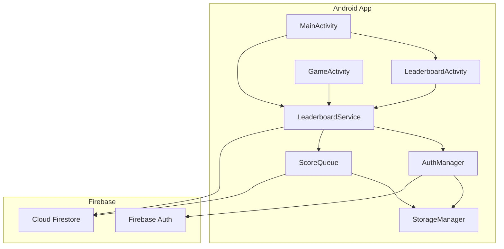
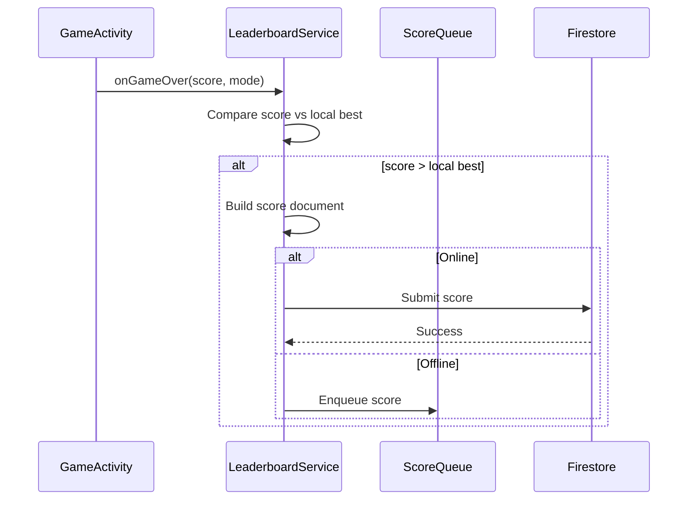

# Design Document: Online Leaderboard (Firebase)

## Overview

This design describes the online leaderboard system for TileBlast, built on Firebase Authentication and Cloud Firestore. The system enables global competition across five game modes with real-time updates, offline-first score submission, and minimal data collection.

The architecture introduces three new classes (`AuthManager`, `LeaderboardService`, `ScoreQueue`) and one new activity (`LeaderboardActivity`), integrating with the existing `StorageManager`, `GameActivity`, and `MainActivity`.

### Key Design Decisions

1. **Offline-first**: Scores are queued locally and synced when connectivity returns, ensuring no score is lost.
2. **Best-score-only submission**: Only personal bests are submitted to Firestore, reducing write costs and simplifying ranking.
3. **Client-side week filtering**: Weekly leaderboards use a Firestore query with timestamp filtering rather than separate collections, avoiding data duplication.
4. **Anonymous-first auth**: Players start anonymous and optionally link Google accounts, minimizing friction.
5. **Singleton services**: `AuthManager` and `LeaderboardService` use application-scoped singletons to share state across activities.

## Architecture



### Component Responsibilities

| Component | Responsibility |
|-----------|---------------|
| `AuthManager` | Firebase Auth lifecycle, anonymous/Google sign-in, account linking, display name |
| `LeaderboardService` | Score submission logic, Firestore queries, rank calculation, real-time listeners |
| `ScoreQueue` | Offline persistence of unsynced scores, connectivity-triggered sync |
| `LeaderboardActivity` | UI for viewing leaderboards with tabs and toggles |
| `StorageManager` | Extended to persist auth state, display name, queue data, cached rank |

### Data Flow: Score Submission



## Components and Interfaces

### AuthManager

**Package:** `com.allan.tileblast.leaderboard`

```java
public class AuthManager {
    private static AuthManager instance;
    private FirebaseAuth firebaseAuth;
    private StorageManager storageManager;
    private String displayName;
    private String userId;

    // Singleton access
    public static synchronized AuthManager getInstance(Context context);

    // Authentication
    public void signInAnonymously(AuthCallback callback);
    public void signInWithGoogle(Activity activity, int requestCode);
    public void handleGoogleSignInResult(Intent data, AuthCallback callback);
    public void linkGoogleAccount(AuthCredential credential, AuthCallback callback);
    public void signOut();
    public void deleteAccount(AuthCallback callback);

    // State
    public boolean isSignedIn();
    public boolean isAnonymous();
    public String getUserId();
    public String getDisplayName();

    // Display name
    private String generateAnonymousDisplayName();
    private void persistAuthState();

    // Callback interface
    public interface AuthCallback {
        void onSuccess();
        void onFailure(String errorMessage);
    }
}
```

**Behavior:**
- On first launch, calls `FirebaseAuth.signInAnonymously()`
- Generates display name as `"Player" + (1000 + random.nextInt(9000))` (ensures 4 digits)
- Persists `userId` and `displayName` in SharedPreferences via `StorageManager`
- On Google link, calls `firebaseAuth.getCurrentUser().linkWithCredential()`
- If link fails with `ERROR_CREDENTIAL_ALREADY_IN_USE`, offers sign-in to existing account

### LeaderboardService

**Package:** `com.allan.tileblast.leaderboard`

```java
public class LeaderboardService {
    private static LeaderboardService instance;
    private FirebaseFirestore firestore;
    private AuthManager authManager;
    private ScoreQueue scoreQueue;
    private StorageManager storageManager;
    private ListenerRegistration activeListener;

    // Singleton access
    public static synchronized LeaderboardService getInstance(Context context);

    // Score submission
    public void submitScore(int score, String mode);
    public boolean shouldSubmitScore(int score, String mode);
    private Map<String, Object> buildScoreDocument(int score, String mode);

    // Leaderboard queries
    public void getTopScores(String mode, boolean weekly, int limit,
                             LeaderboardCallback callback);
    public void getPlayerRank(String mode, RankCallback callback);

    // Real-time listener
    public void attachListener(String mode, boolean weekly,
                               LeaderboardCallback callback);
    public void detachListener();

    // Data management
    public void deleteAllPlayerData(DeleteCallback callback);

    // Week calculation
    public long getWeekStartTimestamp();
    public long getWeekEndTimestamp();

    // Callbacks
    public interface LeaderboardCallback {
        void onScoresLoaded(List<LeaderboardEntry> entries);
        void onError(String message);
    }

    public interface RankCallback {
        void onRankLoaded(int rank); // -1 for unranked
        void onError(String message);
    }

    public interface DeleteCallback {
        void onSuccess();
        void onFailure(String message);
    }
}
```

**Behavior:**
- `submitScore()` checks `shouldSubmitScore()` first, then either writes to Firestore or enqueues via `ScoreQueue`
- `shouldSubmitScore()` compares against local best stored in `StorageManager`
- `getTopScores()` queries Firestore with `.orderBy("score", DESCENDING).limit(100)`, adding `.whereGreaterThanOrEqualTo("timestamp", weekStart)` for weekly
- `getPlayerRank()` counts documents with score greater than the player's best, rank = count + 1
- `attachListener()` uses `addSnapshotListener()` on the query; `detachListener()` calls `remove()` on the `ListenerRegistration`
- `getWeekStartTimestamp()` calculates Monday 00:00 UTC of the current week

### ScoreQueue

**Package:** `com.allan.tileblast.leaderboard`

```java
public class ScoreQueue {
    private static final String PREF_KEY_QUEUE = "score_queue";
    private StorageManager storageManager;
    private ConnectivityManager connectivityManager;
    private ConnectivityManager.NetworkCallback networkCallback;

    public ScoreQueue(Context context, StorageManager storageManager);

    // Queue operations
    public void enqueue(Map<String, Object> scoreDocument);
    public List<Map<String, Object>> getQueuedScores();
    public void removeFromQueue(int index);
    public void clearQueue();
    public int getQueueSize();

    // Sync
    public void syncQueuedScores(SyncCallback callback);
    public void registerConnectivityListener();
    public void unregisterConnectivityListener();

    // Persistence (SharedPreferences via JSON)
    private void saveQueue(List<Map<String, Object>> queue);
    private List<Map<String, Object>> loadQueue();

    public interface SyncCallback {
        void onSyncComplete(int successCount, int failCount);
    }
}
```

**Behavior:**
- Serializes queue as JSON array in SharedPreferences under key `"score_queue"`
- On connectivity restored, iterates queue in chronological order (oldest first)
- On successful submission, removes entry from queue
- On transient failure (network error), retains entry for next attempt
- On permanent failure (Firestore rules rejection), removes entry and logs reason
- Registers `ConnectivityManager.NetworkCallback` to detect connectivity changes

### LeaderboardActivity

**Package:** `com.allan.tileblast`

```java
public class LeaderboardActivity extends AppCompatActivity {
    private LeaderboardService leaderboardService;
    private TabLayout tabLayout;        // Game mode tabs
    private ToggleButton timeToggle;    // All-time vs Weekly
    private RecyclerView scoreList;
    private LeaderboardAdapter adapter;
    private String currentMode;
    private boolean showWeekly;

    @Override
    protected void onCreate(Bundle savedInstanceState);

    @Override
    protected void onStart();   // Attach Firestore listener

    @Override
    protected void onStop();    // Detach Firestore listener

    private void loadLeaderboard();
    private void highlightPlayerEntry();
}
```

**Layout:** `activity_leaderboard.xml`
- `TabLayout` with 5 tabs: Classic, Chaos, Timed 60, Timed 90, Daily
- `ToggleButton` or `MaterialButtonToggleGroup` for All-Time / Weekly
- `RecyclerView` with `LeaderboardAdapter` showing rank, name, score
- Back button in toolbar

### LeaderboardEntry (Data Class)

```java
public class LeaderboardEntry {
    public String userId;
    public String displayName;
    public int score;
    public String mode;
    public long timestamp;
    public int rank; // Computed client-side from position in list
}
```

### LeaderboardAdapter

```java
public class LeaderboardAdapter extends RecyclerView.Adapter<LeaderboardAdapter.ViewHolder> {
    private List<LeaderboardEntry> entries;
    private String currentUserId;

    // Highlights the current player's row with a distinct background color
    public void setEntries(List<LeaderboardEntry> entries);
    public void setCurrentUserId(String userId);
}
```

## Data Models

### Firestore Collection Structure

```
firestore-root/
├── leaderboards/
│   ├── classic/
│   │   └── scores/
│   │       ├── {docId}: { userId, displayName, score, mode, timestamp }
│   │       └── ...
│   ├── chaos/
│   │   └── scores/
│   │       └── ...
│   ├── timed60/
│   │   └── scores/
│   │       └── ...
│   ├── timed90/
│   │   └── scores/
│   │       └── ...
│   └── daily/
│       └── scores/
│           └── ...
└── players/
    └── {userId}: { displayName, lastSubmission, lastMode }
```

### Score Document Schema

| Field | Type | Description |
|-------|------|-------------|
| `userId` | string | Firebase Auth UID |
| `displayName` | string | Player's display name |
| `score` | number | Score value (0–999999) |
| `mode` | string | Game mode identifier |
| `timestamp` | timestamp | Server timestamp of submission |

**Document ID strategy:** Use `{userId}` as the document ID within each mode's `scores` subcollection. This ensures one document per player per mode (personal best only), and makes updates/deletes straightforward.

### Player Document Schema

| Field | Type | Description |
|-------|------|-------------|
| `displayName` | string | Current display name |
| `lastSubmission` | timestamp | Last score submission time (for rate limiting) |
| `lastMode` | string | Most recently played game mode |

### Local Storage (SharedPreferences)

| Key | Type | Description |
|-----|------|-------------|
| `firebase_user_id` | string | Persisted Firebase UID |
| `display_name` | string | Player's display name |
| `is_anonymous` | boolean | Whether current auth is anonymous |
| `score_queue` | string (JSON) | Serialized queue of unsynced scores |
| `cached_rank_{mode}` | int | Cached rank per mode |
| `last_viewed_mode` | string | Last viewed leaderboard tab |

### Weekly Leaderboard Query Strategy

Rather than maintaining separate weekly collections, the weekly leaderboard is implemented as a filtered query:

```java
// All-time query
firestore.collection("leaderboards").document(mode)
    .collection("scores")
    .orderBy("score", Query.Direction.DESCENDING)
    .limit(100);

// Weekly query
long weekStart = getWeekStartTimestamp();
firestore.collection("leaderboards").document(mode)
    .collection("scores")
    .whereGreaterThanOrEqualTo("timestamp", new Timestamp(weekStart / 1000, 0))
    .orderBy("score", Query.Direction.DESCENDING)
    .limit(100);
```

**Note:** This requires a composite Firestore index on `(timestamp ASC, score DESC)` for each mode subcollection. Firestore will prompt to create this index on first query attempt.

### Firestore Security Rules

```
rules_version = '2';
service cloud.firestore {
  match /databases/{database}/documents {

    match /leaderboards/{mode}/scores/{scoreId} {
      allow read: if true;

      allow create: if request.auth != null
        && request.resource.data.userId == request.auth.uid
        && scoreId == request.auth.uid
        && request.resource.data.score >= 0
        && request.resource.data.score <= 999999
        && request.resource.data.mode in ['classic', 'chaos', 'timed60', 'timed90', 'daily']
        && request.resource.data.keys().hasAll(['userId', 'displayName', 'score', 'mode', 'timestamp']);

      allow update: if request.auth != null
        && resource.data.userId == request.auth.uid
        && request.resource.data.score >= 0
        && request.resource.data.score <= 999999;

      allow delete: if request.auth != null
        && resource.data.userId == request.auth.uid;
    }

    match /players/{userId} {
      allow read: if true;
      allow write: if request.auth != null
        && request.auth.uid == userId;
    }
  }
}
```

**Rate limiting approach:** The `players/{userId}` document stores `lastSubmission`. The client checks this before submitting. Server-side enforcement of the 10-second rule requires Cloud Functions (out of scope for initial implementation); client-side enforcement is sufficient for the game context.

## Correctness Properties

*A property is a characteristic or behavior that should hold true across all valid executions of a system — essentially, a formal statement about what the system should do. Properties serve as the bridge between human-readable specifications and machine-verifiable correctness guarantees.*

### Property 1: Display name format validity

*For any* generated anonymous display name, it SHALL match the pattern `"Player"` followed by exactly 4 decimal digits (range 1000–9999), producing names like "Player1000" through "Player9999".

**Validates: Requirements 3.1**

### Property 2: Score submission threshold

*For any* final score and existing best score for a given game mode, the system SHALL submit the score to Firestore if and only if the final score is strictly greater than the existing best. If the final score is equal to or less than the existing best, no submission SHALL occur.

**Validates: Requirements 4.1, 4.2, 4.3**

### Property 3: Score document completeness and minimality

*For any* score submission, the resulting Firestore document SHALL contain exactly the fields `userId`, `displayName`, `score`, `mode`, and `timestamp` — no fewer and no additional fields.

**Validates: Requirements 4.4, 11.4**

### Property 4: Weekly leaderboard routing

*For any* score submission with a timestamp falling within the current week (Monday 00:00 UTC to Sunday 23:59 UTC), the score SHALL appear in both the all-time query results and the weekly query results for that game mode.

**Validates: Requirements 4.5**

### Property 5: Score queue persistence round-trip

*For any* list of score documents enqueued in the ScoreQueue, serializing the queue to SharedPreferences and then deserializing it SHALL produce an identical list of score documents with all fields preserved.

**Validates: Requirements 5.5**

### Property 6: Queue chronological ordering

*For any* set of queued scores with distinct timestamps, when connectivity is restored the ScoreQueue SHALL submit them in strictly ascending timestamp order (oldest first).

**Validates: Requirements 5.2**

### Property 7: Queue removal after successful submission

*For any* score in the queue that is successfully submitted to Firestore, the ScoreQueue SHALL no longer contain that score after the submission completes.

**Validates: Requirements 5.3**

### Property 8: Top-100 selection and ordering

*For any* collection of scores for a given game mode, the leaderboard query SHALL return at most 100 entries, sorted in strictly descending order by score value, representing the highest scores in the collection.

**Validates: Requirements 6.1**

### Property 9: Score range validation

*For any* score value, the validation logic SHALL accept it if and only if it is an integer in the range [0, 999999]. Values less than 0 or greater than 999999 SHALL be rejected.

**Validates: Requirements 9.1**

### Property 10: Rate limit enforcement

*For any* two score submissions from the same user, if the second submission occurs less than 10 seconds after the first, the second submission SHALL be rejected.

**Validates: Requirements 9.3**

### Property 11: Game mode validation

*For any* string value provided as a game mode, the validation logic SHALL accept it if and only if it is one of: "classic", "chaos", "timed60", "timed90", "daily". All other strings SHALL be rejected.

**Validates: Requirements 9.4**

### Property 12: UTC week boundary calculation

*For any* UTC timestamp, the computed week start SHALL be the most recent Monday at 00:00:00 UTC on or before that timestamp, and the computed week end SHALL be the following Sunday at 23:59:59 UTC. All timestamps within a single Monday-to-Sunday span SHALL map to the same week boundaries.

**Validates: Requirements 10.1, 10.3**

## Error Handling

### Network Errors

| Scenario | Handling |
|----------|----------|
| Anonymous sign-in fails (no network) | Allow offline play, retry on next app launch |
| Google Sign-In fails | Show toast error, retain anonymous session |
| Score submission fails (transient) | Enqueue in ScoreQueue, retry on connectivity |
| Score submission rejected (rules) | Remove from queue, log rejection reason |
| Leaderboard query fails | Show cached data if available, display error message |
| Snapshot listener disconnects | Firestore SDK auto-reconnects; show stale indicator |

### Authentication Errors

| Scenario | Handling |
|----------|----------|
| Account linking conflict | Show dialog offering to sign in to existing account |
| Auth token expired | Firebase SDK auto-refreshes; if fails, re-authenticate |
| Account deletion fails | Retry once, then show error with manual retry option |

### Data Integrity

- **Duplicate submissions:** Using `userId` as document ID prevents duplicates per mode
- **Stale cache:** Rank cache is refreshed on each MainActivity resume; stale value shown with loading indicator
- **Queue corruption:** If JSON parsing fails, clear queue and log error (scores already submitted to Firestore are safe)

## Testing Strategy

### Unit Tests (JUnit + Mockito)

Focus on pure logic that doesn't require Firebase:

- `AuthManager.generateAnonymousDisplayName()` — format validation
- `LeaderboardService.shouldSubmitScore()` — threshold logic
- `LeaderboardService.buildScoreDocument()` — field completeness
- `LeaderboardService.getWeekStartTimestamp()` / `getWeekEndTimestamp()` — boundary calculation
- `ScoreQueue` serialization/deserialization — round-trip
- `ScoreQueue` ordering — chronological submission
- Score validation — range and mode checks
- Rate limit check — timestamp comparison

### Property-Based Tests (jqwik)

The project will use [jqwik](https://jqwik.net/) as the property-based testing library for Java.

Each property test runs a minimum of 100 iterations with randomized inputs.

**Configuration:**
```java
@Property(tries = 100)
```

**Tag format:** Each test method includes a comment:
```java
// Feature: online-leaderboard-firebase, Property N: <property text>
```

**Properties to implement:**
1. Display name format (Property 1)
2. Score submission threshold (Property 2)
3. Score document completeness (Property 3)
4. Queue persistence round-trip (Property 5)
5. Queue chronological ordering (Property 6)
6. Top-100 selection and ordering (Property 8)
7. Score range validation (Property 9)
8. Game mode validation (Property 11)
9. UTC week boundary calculation (Property 12)

**Note:** Properties 4 (weekly routing), 7 (queue removal), and 10 (rate limiting) involve Firestore interactions and are better tested as integration tests with mocked Firestore or as example-based unit tests with controlled timestamps.

### Integration Tests

- Firebase Auth anonymous sign-in flow
- Firebase Auth Google Sign-In + account linking
- Firestore score write and read
- Firestore security rules validation (using Firebase Emulator Suite)
- Real-time snapshot listener updates
- End-to-end: game over → score submission → leaderboard display

### UI Tests (Espresso)

- LeaderboardActivity tab switching
- All-time / Weekly toggle
- Player entry highlighting
- Back navigation
- MainActivity leaderboard button navigation

## Firebase SDK Integration Guide

### Dependencies

**Project-level `build.gradle.kts`:**
```kotlin
plugins {
    id("com.google.gms.google-services") version "4.4.2" apply false
}
```

**App-level `app/build.gradle.kts`:**
```kotlin
plugins {
    id("com.google.gms.google-services")
}

dependencies {
    // Firebase BoM
    implementation(platform("com.google.firebase:firebase-bom:33.7.0"))
    implementation("com.google.firebase:firebase-auth")
    implementation("com.google.firebase:firebase-firestore")

    // Google Sign-In
    implementation("com.google.android.gms:play-services-auth:21.3.0")

    // Testing
    testImplementation("net.jqwik:jqwik:1.9.1")
    testImplementation("org.mockito:mockito-core:5.14.2")
    testImplementation("junit:junit:4.13.2")
}
```

### Setup Checklist

1. Create Firebase project at console.firebase.google.com
2. Register Android app with package `com.allan.tileblast`
3. Download `google-services.json` → place in `app/` directory
4. Add SHA-1 fingerprint (debug + release) for Google Sign-In
5. Enable Anonymous and Google auth providers in Firebase Console
6. Create Firestore database in production mode
7. Deploy security rules from this design
8. Create composite index: `leaderboards/{mode}/scores` → `timestamp ASC, score DESC`
9. Build and verify Firebase initializes (check Logcat for `FirebaseApp initialization successful`)
