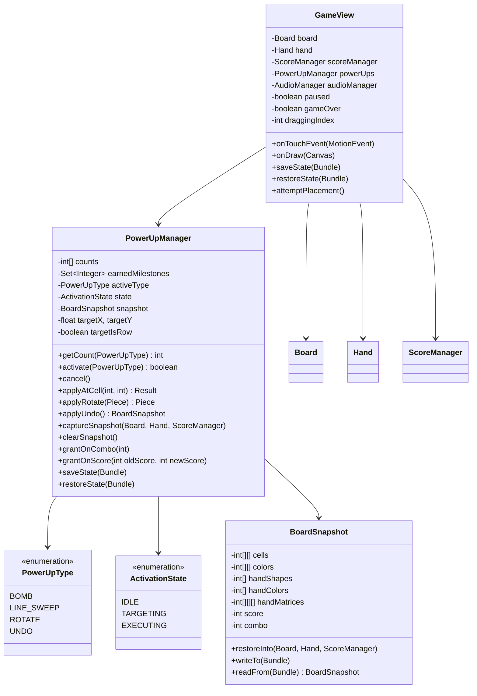
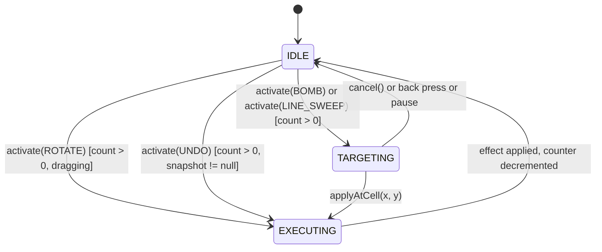

# Design Document

## Overview

The Power-Ups System adds four tactical abilities (Bomb, Line Sweep, Rotate, Undo) to TileBlast. The design adds a single new collaborator class, `PowerUpManager`, which owns the inventory and the activation state machine, plus a small immutable `BoardSnapshot` value class for Undo. All UI rendering, touch dispatch, and persistence integration lives in `GameView`, mirroring the existing pattern where `GameView` is the central coordinator over `Board`, `Hand`, `ScoreManager`, `AudioManager`, and `StorageManager`.

The activation state machine has three states - `IDLE`, `TARGETING`, and `EXECUTING` - and is driven entirely by player taps and `GameView` lifecycle hooks. Bomb and Line Sweep route through `TARGETING` (the player picks a cell, then the effect applies). Rotate and Undo execute synchronously from `IDLE` because they target the dragged piece or the retained snapshot directly. Persistence reuses the existing `Bundle`-based `saveState` / `restoreState` flow that already handles board, hand, and score, adding stable keys for counters and the optional snapshot.

### Goals

- Earn power-ups through skilled play (combo level 4+) and milestone progression (1000 / 5000 / 10000 / 25000 / 50000).
- Cap inventory at 2 per type (8 total) so power-ups stay scarce and the four-slot UI stays compact.
- Integrate without restructuring `GameView`: extend `onTouchEvent`, `onDraw`, `attemptPlacement`, `saveState`, `restoreState`.
- Survive configuration changes (rotation) including the Undo snapshot.

### Non-Goals

- Animated transitions (explosion particles, sweep gradient sweep). The design uses static highlights and the existing shake / vibrate hooks.
- Cross-game persistence (power-ups do not carry over between games).
- A separate Power-Ups settings screen or unlock progression. All four types are always potentially earnable.

## Architecture

### Class Diagram



### Activation State Machine



`TARGETING` is the only state visible to the player as a UI mode. `EXECUTING` is a transient internal state used to make the apply step atomic and to ensure no other input is processed mid-effect.

### Touch Routing in GameView

`onTouchEvent` adds two early branches before the existing pause / hand-drag logic:

1. If `powerUps.isTargeting()`: tap on grid -> `applyAtCell`; tap on Cancel button -> `cancel`; tap elsewhere -> ignore.
2. If tap is in a power-up slot: route to `powerUps.activate(type)` (which may transition to `TARGETING` or apply immediately).

If neither branch matches, the existing pause-button / hand-drag flow runs unchanged.

### Draw Routing in GameView

`onDraw` adds two passes after the existing hand and pause-button passes:

1. The four power-up slots, drawn in a row beneath `handY + handHeight`. Slot rendering reads `powerUps.getCount(type)`, `powerUps.getActiveType()`, and `powerUps.isUndoEnabled()`.
2. While `powerUps.isTargeting()`, a translucent overlay highlight on the cell or row/column under the finger, plus a Cancel button rendered in the top-right above the grid (separate from the existing pause button).

### Acquisition Hook

`attemptPlacement` calls into `PowerUpManager` at three points:

- Before mutating the board: `powerUps.captureSnapshot(board, hand, scoreManager)` (Requirement 8.1).
- After `scoreManager.processLineBreak`: `powerUps.grantOnCombo(scoreManager.getCombo())` (Requirement 2).
- After score is finalized: `powerUps.grantOnScore(prevScore, scoreManager.getScore())` (Requirement 3). `prevScore` is captured before placement.

If `linesBroken > 0`, `powerUps.clearSnapshot()` is also called so Undo is disabled (Requirement 8.5).

## Components and Interfaces

### PowerUpManager

```java
public class PowerUpManager {
    public enum ActivationState { IDLE, TARGETING, EXECUTING }

    public static final int MAX_PER_TYPE = 2;
    public static final int[] SCORE_MILESTONES = {1000, 5000, 10000, 25000, 50000};

    public static class ApplyResult {
        public boolean applied;
        public int cellsCleared;
        public int filledCellsCleared;
        public boolean wasRow;        // for LINE_SWEEP
        public int targetIndex;       // row or column index
    }

    public PowerUpManager(Random random);

    // Inventory
    public int getCount(PowerUpType type);
    public boolean canActivate(PowerUpType type, GameContext ctx);
    public boolean isUndoEnabled(GameContext ctx);

    // Activation
    public ActivationState getState();
    public PowerUpType getActiveType();
    public boolean isTargeting();

    // Returns true if state changed (entered TARGETING) or effect applied immediately.
    public boolean activate(PowerUpType type, GameContext ctx);
    public void cancel();

    // Targeting cursor for the highlight overlay (set on every touch MOVE during TARGETING).
    public void updateTargetCursor(int gridX, int gridY, float fracX, float fracY);
    public int getTargetGridX();
    public int getTargetGridY();
    public boolean isTargetingRow();   // for LINE_SWEEP

    // Apply effects
    public ApplyResult applyAtCell(int gridX, int gridY, float fracX, float fracY,
                                   Board board, ScoreManager scoreManager);
    public Piece applyRotate(Piece dragged);
    public BoardSnapshot applyUndo(Board board, Hand hand, ScoreManager scoreManager);

    // Snapshot lifecycle
    public void captureSnapshot(Board board, Hand hand, ScoreManager scoreManager);
    public void clearSnapshot();
    public boolean hasSnapshot();

    // Acquisition
    public PowerUpType grantOnCombo(int comboLevel);     // returns granted type, or null
    public List<PowerUpType> grantOnScore(int prev, int next);  // 0+ grants

    // Persistence
    public void saveState(Bundle out);
    public void restoreState(Bundle in);
    public void newGameReset();
}
```

`GameContext` is a small record-style struct (or just a few parameters - likely just three booleans inlined: `paused`, `gameOver`, `dragging`) that lets the manager evaluate gating rules without a back-reference to `GameView`.

### PowerUpType

```java
public enum PowerUpType {
    BOMB, LINE_SWEEP, ROTATE, UNDO;

    public static PowerUpType randomFrom(Random r) {
        return values()[r.nextInt(values().length)];
    }
}
```

The four-slot UI iterates `PowerUpType.values()` in declaration order to satisfy Requirement 9.2.

### BoardSnapshot

`BoardSnapshot` is an immutable value class. It holds copies of `Board.cells` and `Board.colors`, the four hand pieces (shape index, color index, and the active matrix - rotated or not), and `ScoreManager.score` and `combo`. It exposes:

```java
public class BoardSnapshot {
    final int[][] cells;
    final int[][] colors;
    final int[] handShapes;       // -1 for null slots
    final int[] handColors;
    final int[][][] handMatrices; // explicit matrix per slot to preserve rotation
    final int score;
    final int combo;

    public static BoardSnapshot capture(Board board, Hand hand, ScoreManager sm);
    public void restoreInto(Board board, Hand hand, ScoreManager sm);
    public void writeTo(Bundle out);
    public static BoardSnapshot readFrom(Bundle in);  // returns null if absent
}
```

The matrix is captured explicitly so a rotated piece survives undo. The static `Piece.SHAPES[shapeIndex]` matrix is used as a fallback when the captured matrix is null (e.g., backward-compatible restore from older bundles).

### Targeting UI

Targeting mode adds two overlays:

1. **Cell / line highlight** under the finger. For `BOMB`: the 3x3 area centered at the finger cell, intersected with grid bounds, drawn as a 50%-alpha white fill plus a 3 px white border on the center cell. For `LINE_SWEEP`: either the full row or the full column under the finger, decided by `LINE_SWEEP` row-vs-column rule (Requirement 5.3) - if the finger's vertical fraction within the cell is closer to 0.5 than the horizontal fraction is, choose row; else column.

2. **Cancel button** in the top-right corner of the grid area, sized at least 48 dp on a side, rendered as a red rounded rect with an "X" glyph. Positioned so it does not collide with the pause button.

Both overlays render only while `powerUps.isTargeting()`.

### Power-Up Slot Layout

Four slot rectangles in a single row beneath the hand area. Each slot is a square sized `max(48dp, blockSize)` with 8 dp inter-slot spacing, centered horizontally. Each slot draws:

- A rounded-rect background (dark gray at 100% alpha when count > 0, 40% alpha when count == 0).
- A type-distinct icon: bomb (filled circle with fuse stroke), line sweep (horizontal arrow with vertical bar), rotate (curved arrow), undo (left-curved arrow).
- A count badge: a small filled circle in the top-right corner with the count digit centered. Always rendered, even when count == 0 (Requirement 9.6).
- A 3 px highlight border in gold when `activeType == this slot's type` (Requirement 9.7).
- A 40% alpha overall when count == 0, when `UNDO` is disabled (Requirement 8.5/8.6/8.7), or when `ROTATE` and no piece is being dragged.

Layout is recomputed in `calculateLayout` and the rects stored in `slotRects[4]`.

### GameView Integration Points

`onTouchEvent` (`ACTION_DOWN`):
- If `powerUps.isTargeting()`:
  - If tap in cancelBtnRect: `powerUps.cancel(); invalidate(); return true;`
  - Else if tap in grid: store as the pending target (used on `ACTION_UP`).
  - Else: ignore (Requirement 6.3).
- Else if tap is in any `slotRects[i]`:
  - `powerUps.activate(PowerUpType.values()[i], context())` and handle ROTATE / UNDO immediately if applied; else if BOMB / LINE_SWEEP entered TARGETING, just `invalidate`. Return true.
- Else: existing pause / hand-drag logic.

`onTouchEvent` (`ACTION_MOVE`):
- If `powerUps.isTargeting()` and finger is inside the grid: compute `gridX, gridY, fracX, fracY` and call `powerUps.updateTargetCursor(...)`; `invalidate`.
- Else: existing drag-update logic.

`onTouchEvent` (`ACTION_UP`):
- If `powerUps.isTargeting()` and finger ends inside grid: call `powerUps.applyAtCell(...)` and process the result (sound, vibrate, score, game-over recheck per Requirement 10.5/10.6).
- Else: existing placement logic.

`onDraw`:
- After existing draw passes, call `drawPowerUpSlots(canvas, w)`.
- If `powerUps.isTargeting()`, call `drawTargetingOverlay(canvas)` then `drawCancelButton(canvas)`.

`attemptPlacement`:
- Before `board.placePiece`: capture `prevScore = scoreManager.getScore()` and `powerUps.captureSnapshot(board, hand, scoreManager)`.
- After `processLineBreak`:
  - If `linesBroken > 0`: `powerUps.clearSnapshot()`.
  - `PowerUpType combo = powerUps.grantOnCombo(scoreManager.getCombo()); if (combo != null) audioManager.playPlace(); /* TBD acquisition sound */`.
  - `List<PowerUpType> ms = powerUps.grantOnScore(prevScore, scoreManager.getScore()); if (!ms.isEmpty()) audioManager.playPlace();`.

`onBackPressed` (in `GameActivity`, exposed via `GameView.onBackPressed()`):
- If `powerUps.isTargeting()`: `powerUps.cancel(); invalidate(); return true;` (Requirement 6.4).

`saveState` / `restoreState`:
- Call `powerUps.saveState(outState)` after the existing fields are written.
- Call `powerUps.restoreState(savedState)` after the existing fields are restored.

## Data Models

### Inventory

```java
private final int[] counts = new int[PowerUpType.values().length]; // 4 slots
```

`counts[type.ordinal()]` is the live count, always between 0 and 2.

### Earned Milestones Set

```java
private final HashSet<Integer> earnedMilestones = new HashSet<>();
```

Stores the milestone score values already awarded in the current game (Requirement 3.4). Persisted to the Bundle as an `int[]`.

### Activation State

```java
private ActivationState state = ActivationState.IDLE;
private PowerUpType activeType = null;     // non-null only when state == TARGETING
private int targetGridX = -1, targetGridY = -1;
private float targetFracX = 0.5f, targetFracY = 0.5f;
private boolean targetIsRow = false;       // recomputed each move when activeType == LINE_SWEEP
```

### Board Snapshot

```java
private BoardSnapshot snapshot = null;     // null when no undo is available
```

### Bundle Keys

| Key | Type | Description |
|---|---|---|
| `pu_count_bomb` | int | BOMB counter |
| `pu_count_sweep` | int | LINE_SWEEP counter |
| `pu_count_rotate` | int | ROTATE counter |
| `pu_count_undo` | int | UNDO counter |
| `pu_milestones` | int[] | Score milestones already awarded |
| `pu_snap_present` | boolean | Whether a snapshot follows |
| `pu_snap_cells` | int[] | Snapshot board cells (size*size, row-major) |
| `pu_snap_colors` | int[] | Snapshot board colors (size*size, row-major) |
| `pu_snap_size` | int | Snapshot board size (for sanity check) |
| `pu_snap_hand_shapes` | int[] | Snapshot hand shape indices (-1 for null) |
| `pu_snap_hand_colors` | int[] | Snapshot hand color indices |
| `pu_snap_hand_matrix_<i>` | int[] | Flattened matrix for hand slot i (rows*cols), with rows / cols stored alongside |
| `pu_snap_hand_rows_<i>` | int | Rows for hand slot i matrix |
| `pu_snap_hand_cols_<i>` | int | Cols for hand slot i matrix |
| `pu_snap_score` | int | Snapshot score |
| `pu_snap_combo` | int | Snapshot combo |

`activeType` and `state` are deliberately NOT persisted - on `restoreState` the manager always returns to `IDLE` (Requirement 12.7).

### Acquisition Random Source

`PowerUpManager` accepts a `Random` in its constructor so tests can pass a seeded instance. Production code passes `new Random()`.

### Audio Mapping

The current `AudioManager` has no power-up specific clips. The design reuses existing clips and adds two methods:

- `playPowerUpAcquired()` - reuses `place.mp3` at slightly higher pitch (1.3f) as a temporary distinct cue.
- `playPowerUp(PowerUpType type)`:
  - `BOMB` -> `playJuiciness()` (existing punchy clip)
  - `LINE_SWEEP` -> `playBreak()` (existing line-break clip, Requirement 11.2)
  - `ROTATE` -> `playPlace()` at pitch 1.5f
  - `UNDO` -> `playPlace()` at pitch 0.7f

This avoids adding new audio assets while still satisfying Requirements 11.1-11.5 (each event plays a sound; no requirement says they must be distinct files, only that an effect plays).


## Correctness Properties

*A property is a characteristic or behavior that should hold true across all valid executions of a system - essentially, a formal statement about what the system should do. Properties serve as the bridge between human-readable specifications and machine-verifiable correctness guarantees.*

### Property 1: Inventory cap and combo-grant invariant

*For any* sequence of `grantOnCombo(level)` calls with arbitrary `level` values in `[0, 20]` applied to any starting inventory in `[0,2]^4`, after every call: every counter remains in `[0, 2]`, and the sum of counters changes by 0 (when `level < 4` or every counter is already at the cap) or 1 (when `level >= 4` and at least one counter is below the cap).

**Validates: Requirements 1.3, 1.4, 2.1, 2.2, 2.3, 2.4**

### Property 2: Milestone-grant uniqueness and count

*For any* `prevScore <= newScore` and any earned-milestones set, calling `grantOnScore(prevScore, newScore)` returns exactly one grant per milestone in the set `SCORE_MILESTONES` that satisfies `prevScore < milestone <= newScore` and is not already in the earned set; calling `grantOnScore` again with the same `(prevScore, newScore)` returns zero grants.

**Validates: Requirements 3.1, 3.2, 3.3, 3.4, 3.5**

### Property 3: Activation gating matrix

*For any* combination of `(type, count, paused, gameOver, dragging, hasSnapshot, lastPlacementClean)`, `activate(type, ctx)` enters `TARGETING` (for `BOMB` / `LINE_SWEEP`) or applies (for `ROTATE` / `UNDO`) if and only if all of the following hold:

- `count > 0`
- `!paused`
- `BOMB` / `LINE_SWEEP`: any `gameOver` value is allowed; for `BOMB` / `LINE_SWEEP`, `dragging` is false (a piece is not being dragged)
- `ROTATE`: `dragging` is true and `!gameOver`
- `UNDO`: `hasSnapshot && !gameOver && lastPlacementClean`

In every other case, `activate` returns false and leaves all counters and `state` unchanged.

**Validates: Requirements 4.1, 5.1, 7.5, 8.5, 8.6, 8.7, 10.1, 10.2, 10.3**

### Property 4: Bomb apply preserves and clears

*For any* board configuration, any target cell `(tx, ty)` in grid bounds, and any `BOMB` count in `[1, 2]`: after `applyAtCell(tx, ty)` while `activeType == BOMB`,

- every cell `(x, y)` with `tx-1 <= x <= tx+1`, `ty-1 <= y <= ty+1`, `0 <= x < size`, `0 <= y < size` is `Board.EMPTY`,
- every cell outside that bounded 3x3 is unchanged from before,
- `scoreManager.score` increased by exactly `10 * (number of FILLED cells in the bounded 3x3 before apply)`,
- `BOMB` count decreased by 1,
- `scoreManager.combo` is unchanged,
- `state == IDLE` and `activeType == null`.

**Validates: Requirements 4.4, 4.5, 4.6, 4.7**

### Property 5: Line-sweep apply preserves and clears

*For any* board configuration, any target cell `(tx, ty)` in grid bounds, any `(fracX, fracY)` in `[0, 1)^2`, and any `LINE_SWEEP` count in `[1, 2]`: after `applyAtCell(tx, ty, fracX, fracY)` while `activeType == LINE_SWEEP`,

- the chosen target is a row when `|fracY - 0.5| < |fracX - 0.5|`, otherwise a column,
- every cell in the chosen row or column is `Board.EMPTY`,
- every cell outside the chosen row or column is unchanged,
- `LINE_SWEEP` count decreased by 1,
- `scoreManager.combo` is unchanged,
- `state == IDLE` and `activeType == null`.

**Validates: Requirements 5.3, 5.4, 5.5, 5.6, 5.7**

### Property 6: Rotate is a 4-cycle and matches the rotation formula

*For any* `Piece` with matrix `M` of `R` rows and `C` cols and any `colorIndex`:

- `applyRotate` returns a piece whose matrix has `C` rows and `R` cols,
- the returned matrix `R'` satisfies `R'[c][R - 1 - r] == M[r][c]` for every `r` in `[0, R)` and `c` in `[0, C)`,
- the returned piece's `colorIndex` equals the input `colorIndex`,
- four consecutive `applyRotate` calls return a matrix bitwise-equal to `M`.

**Validates: Requirements 7.1, 7.2, 7.6**

### Property 7: Snapshot capture-restore round trip

*For any* `(Board, Hand, ScoreManager)` state `S`, `BoardSnapshot.capture(S).restoreInto(...)` produces a state equal to `S` with respect to: every cell value and color, every hand piece's shape index, color index, and active matrix (rotated or not), `score`, and `combo`. Mutations to the live `Board` / `Hand` / `ScoreManager` between capture and restore do not affect the restored state.

**Validates: Requirements 8.1, 8.2, 8.3, 8.4, 7.4**

### Property 8: Save-restore round trip

*For any* `PowerUpManager` state `M` reachable through any sequence of `grantOnCombo`, `grantOnScore`, `captureSnapshot`, `clearSnapshot`, and `applyXxx` calls: serializing `M` via `saveState(bundle)` then constructing a fresh manager and calling `restoreState(bundle)` yields a manager whose `getCount(type)` matches `M.getCount(type)` for every type, whose earned-milestones set equals `M`'s set, whose snapshot is equal to `M`'s snapshot (or both null), and whose `state` is `IDLE` with `activeType == null` regardless of `M`'s active state.

**Validates: Requirements 12.1, 12.2, 12.3, 12.4, 12.5, 12.6, 12.7**

### Property 9: Game-over flag tracks playability after apply

*For any* board configuration, hand, and `BOMB` or `LINE_SWEEP` apply at any in-bounds target: after the apply, `gameOver == !board.canPlaceAny(hand.getAll())`.

**Validates: Requirements 10.5, 10.6**

### Property 10: Cancel preserves inventory

*For any* manager state with `state == TARGETING` and any inventory: after `cancel()`, `state == IDLE`, `activeType == null`, and every counter equals its pre-cancel value.

**Validates: Requirements 6.2, 6.4, 10.4**

## Error Handling

### Invalid activation attempts

`activate(type, ctx)` is the single entry point for all activation gating. It returns `false` and is a no-op when any gating rule fails (count == 0, paused, dragging-for-BOMB-or-SWEEP, no-piece-for-ROTATE, no-snapshot-for-UNDO, etc.). The caller in `GameView` does not need to pre-check gates; it can always call `activate` and use the return value.

### Out-of-bounds taps in TARGETING

`onTouchEvent` only forwards `applyAtCell` when the tap coordinates resolve to a cell inside `[0, size)`. Out-of-bounds taps are ignored (Requirement 6.3). The 3x3 bomb area is always clamped via `Math.max(0, ...)` and `Math.min(size - 1, ...)`, so even a corner target produces a valid effect.

### Restore from a corrupted Bundle

`restoreState` reads each counter independently. A missing key defaults the counter to 0 (Requirement 12.4). Snapshot restoration is gated on the `pu_snap_present` flag; if true but any required key is missing or sized inconsistently, the snapshot is left as null and a debug log is emitted. Counter restoration is unaffected by snapshot-key issues (Requirement 12.5).

### Undo with mismatched snapshot

`applyUndo` validates that the snapshot's board size equals the current board's size. If not (e.g., the user changed game modes), the undo is skipped and the snapshot is cleared. This case is not exposed in the current UI (game-mode change always starts a new game) but is defended for safety.

### Acquisition randomness exhaustion

If all four counters are at the cap, `grantOnCombo` and `grantOnScore` still pick a random type and attempt to increment, but the cap clamps the increment to zero. This is correct per Requirement 1.4 (surplus discarded). The acquisition sound still plays only when a counter actually increased, so the player does not get false-positive audio feedback when their inventory is full.

### Audio failure

`AudioManager` already swallows load and play errors silently. The power-up code reuses the same instance and does not introduce new audio failure modes.

## Testing Strategy

### Test categories

- **Unit tests**: Specific examples for the small set of EXAMPLE-classified criteria (initial counts == 0, cancel-on-pause, slot rect sizing, audio invocations).
- **Property-based tests** using **jqwik** (a JVM property-based testing library compatible with JUnit 5). Each correctness property listed above maps to one `@Property` test method with `@Property(tries = 200)` (above the 100-iteration minimum).
- **Integration tests**: Two end-to-end Espresso tests that exercise the full Activity flow: earn a power-up via combo, activate it via tap, apply it to the grid, verify the visible counter and board change. These use 1-2 representative scenarios, not 100 iterations.

### Property test configuration

- Library: jqwik (`net.jqwik:jqwik:1.8.x`) added to `androidTest` and `test` source sets. Tests that need `Bundle` run in instrumented (`androidTest`) - all others run as plain JVM tests.
- `@Property(tries = 200)` for every property method, exceeding the 100 minimum.
- Each `@Property` method is preceded by a comment in the format `// Feature: power-ups-system, Property N: <property text>` referencing the design property by number.
- Generators:
  - `@Provide Arbitrary<int[][]> boards()` returns `size x size` int arrays with cells in `{EMPTY, FILLED}` and matching color indices.
  - `@Provide Arbitrary<Piece> pieces()` chooses a shape index from `Piece.SHAPES` and a color index from `[0, COLORS.length)`.
  - `@Provide Arbitrary<int[][]> arbitraryMatrices()` generates `R x C` `int` matrices with `R, C` in `[1, 5]` and entries in `{0, 1}` (used for rotate property).
  - `@Provide Arbitrary<PowerUpManager> managers()` builds a manager via a sequence of `grantOnCombo` and `grantOnScore` calls with an externally seeded `Random`.

### Concrete test mapping

| Property | Test method | Generators |
|---|---|---|
| P1 | `inventoryCapAndComboGrant` | random combo level + grant sequence |
| P2 | `milestoneUniqueAndCount` | (prevScore, newScore) pairs |
| P3 | `activationGatingMatrix` | enumeration of gate cross-product |
| P4 | `bombApplyPreservesAndClears` | random board + (tx, ty) |
| P5 | `lineSweepApplyPreservesAndClears` | random board + (tx, ty, fracX, fracY) |
| P6 | `rotateFourCycleAndShape` | random matrices and all `SHAPES` |
| P7 | `snapshotRoundTrip` | random board + hand + score |
| P8 | `saveRestoreRoundTrip` | random manager state + Bundle |
| P9 | `gameOverFlagAfterApply` | random board + hand + apply |
| P10 | `cancelPreservesInventory` | random inventory + active type |

### Unit tests

- `PowerUpManager_initialState_allCountersZero`
- `PowerUpManager_pauseDuringTargeting_resetsToIdle`
- `GameView_slotLayout_meetsMinimum48dpTouchTarget`
- `PowerUpManager_audioInvokedOnApply` (mocks `AudioManager`)
- `PowerUpManager_acquisitionAudioInvokedWhenCounterIncreases` (mocks `AudioManager`)
- `PowerUpManager_acquisitionAudioNotInvokedAtCap` (mocks `AudioManager`)

### Integration tests

- `comboFourEarnsPowerUpAndAppliesBomb` (Espresso): drag pieces to force a 4-line combo, verify a slot's count went up, tap the slot, tap a grid cell, verify the 3x3 area cleared.
- `screenRotationPreservesInventoryAndSnapshot` (Espresso): place a piece, rotate the device, verify the snapshot still allows undo and counters survived.

### Out-of-scope for tests

- The exact pixel layout of slots and the cancel button (visual snapshot).
- Vibration timing (relies on the platform `Vibrator`).
- Sound clip selection (the requirement says "play a sound", not "play this exact clip").
