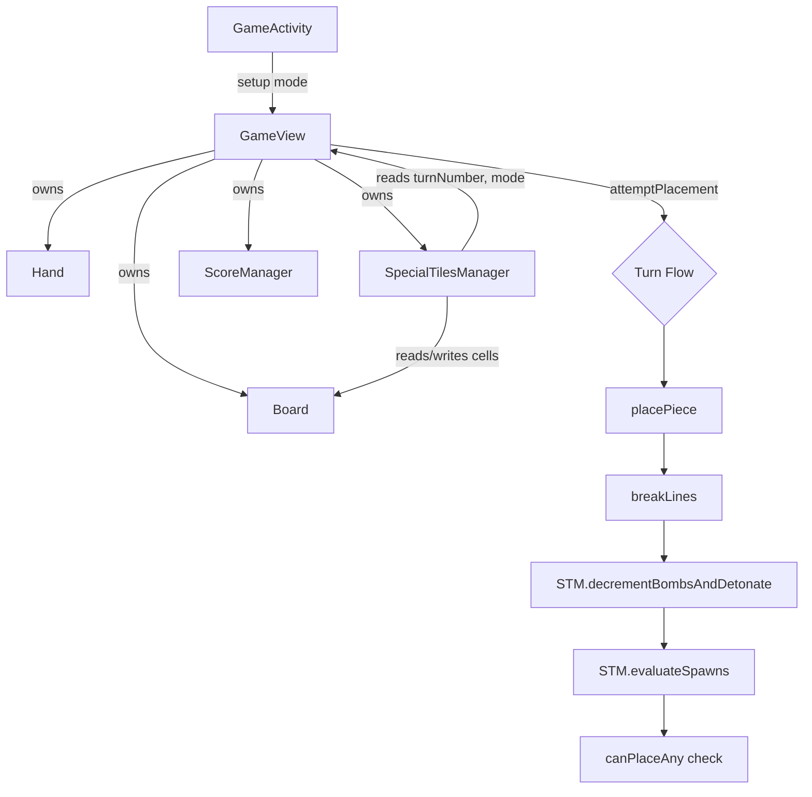

# Design Document

## Overview

The Special Tiles feature introduces three new obstacle tile types to TileBlast — **Frozen**, **Locked**, and **Bomb** — to enrich the strategic depth of Chaos and Daily Challenge modes. Each tile has its own destruction rule, placement constraint, and visual treatment. Special tiles spawn dynamically at the start of each turn (after the placement that ends the previous turn), persist across pause/resume via the existing `Bundle` save mechanism, and integrate cleanly with the existing line-break and game-over flow.

The design extends the existing `Board` cell-state model with four new states (`FROZEN`, `FROZEN_CRACKED`, `LOCKED`, `BOMB_TILE`), introduces a `SpecialTilesManager` to own spawn probabilities, per-tile metadata (bomb countdowns), and mode gating, and updates `GameView` to render the new tiles and trigger spawn/decrement at the right phases of the turn.

### Design Goals

- **Minimal disruption** — Reuse the existing `int[][] cells` representation rather than introducing a parallel tile object model.
- **Single source of spawn truth** — `SpecialTilesManager` is the only place that decides when, where, and which special to place.
- **Deterministic line-break semantics** — Frozen, Locked, and Bomb cells count as "filled" for line-completion checks and follow well-defined post-break transitions.
- **Mode purity** — Classic and Timed never see spawn evaluation; the manager is a no-op in those modes.

## Architecture



### Turn Lifecycle Integration

The current turn flow inside `GameView.attemptPlacement` is:

1. `placePiece` → 2. `breakLines` → 3. score/audio/shake → 4. hand refill → 5. game-over check.

The new flow inserts special-tile hooks after the line break and before the game-over check:

1. `placePiece`
2. `breakLines` — extended to handle frozen, locked, and bomb cells per their rules. A bomb cleared by line break does **not** detonate; frozen converts EMPTY → CRACKED → EMPTY across two breaks; locked clears to EMPTY in one break.
3. `SpecialTilesManager.decrementBombsAndDetonate` — decrement countdowns; detonate any that hit zero (3x3 clear, bounded by edges); if a detonation overlaps another bomb, signal game over.
4. `SpecialTilesManager.evaluateSpawns(turnNumber)` — at most one of each type per turn, gated by mode and per-type caps.
5. Hand refill and `canPlaceAny` game-over check.

`turnNumber` is incremented by `GameView` after each successful placement and is used by the spawn manager (Frozen requires `turnNumber > 5`).

### Mode Gating

`GameActivity` already passes a `mode` string to `GameView.setup`. The values used by the existing app are `"classic"` and `"chaos"`; `"timed"` and `"daily"` are introduced by sibling specs. The `SpecialTilesManager` consults this string and short-circuits all spawn logic for `"classic"` and `"timed"`, satisfying Requirements 4.1 and 4.2 without touching `Board` or `GameView` rendering paths.

## Components and Interfaces

### `Board` (extended)

New cell-state constants are added alongside the existing `EMPTY`, `FILLED`, `HOVERED`, `HOVERED_BREAK_FILLED`, `HOVERED_BREAK_EMPTY`:

```java
public static final int FROZEN = 5;
public static final int FROZEN_CRACKED = 6;
public static final int LOCKED = 7;
public static final int BOMB_TILE = 8;
```

A parallel `int[][] bombCountdowns` field stores the countdown for any cell whose state is `BOMB_TILE`. Non-bomb cells hold any value (treated as undefined; only read when `cells[y][x] == BOMB_TILE`).

New / modified methods:

```java
// Helper: any of the four special states
public static boolean isSpecial(int cellState);

// Helper: counts as filled for line-completion checks
public static boolean isLineFillable(int cellState);

// Bomb metadata
public int  getBombCountdown(int x, int y);
public void setBombCountdown(int x, int y, int value);

// Special-tile placement (used by SpecialTilesManager)
public void setSpecial(int x, int y, int specialState, int initialCountdown);

// Existing methods updated:
public boolean canPlace(Piece piece, int px, int py);  // rejects on isSpecial(cell)
public int     breakLines();                            // applies special-tile transitions
public boolean canPlaceAny(Piece[] hand);               // unchanged, but canPlace now blocks specials
```

`canPlace` change: a piece overlaps a cell if the cell is `FILLED` **or** `isSpecial(cells[by][bx])`. This satisfies Requirements 1.4, 2.3, 3.6, and 7.1.

`isLineFillable(state)` returns true for `FILLED`, `FROZEN`, `FROZEN_CRACKED`, `LOCKED`, and `BOMB_TILE`. It is used by both `breakLines` and `setHover`/`updateHoveredBreaks` so the player sees the same line-break preview regardless of whether the line contains specials. This satisfies Requirements 1.5 and 2.4.

### `breakLines` semantics (extended)

The current implementation clears completed rows/columns to `EMPTY`. The extended version performs a two-pass clear:

1. **Detect** complete rows and columns using `isLineFillable`.
2. **For each cell** in a cleared row/column, apply the per-state transition:
   - `FILLED` → `EMPTY` (existing behavior).
   - `FROZEN` → `FROZEN_CRACKED` (Requirement 1.2). The cell is **not** emptied.
   - `FROZEN_CRACKED` → `EMPTY` (Requirement 1.3).
   - `LOCKED` → `EMPTY` (Requirement 2.2).
   - `BOMB_TILE` → `EMPTY`, no detonation, countdown metadata cleared (Requirement 3.7).

The return value remains the count of completed lines.

Edge case: a frozen tile in a completed row that converts to `FROZEN_CRACKED` still occupies the cell, so the line is **not** physically cleared at that cell. This is intentional — the next break that includes it will clear it.

### `SpecialTilesManager` (new)

Owns spawn evaluation, mode gating, and bomb decrement/detonation. Lives in `com.allan.tileblast.game`.

```java
public class SpecialTilesManager {
    public static final int   BOMB_INITIAL_COUNTDOWN = 5;
    public static final int   FROZEN_MIN_TURN        = 5;     // strict: spawn only when turn > 5
    public static final int   FROZEN_CAP             = 5;
    public static final int   LOCKED_CAP             = 3;
    public static final int   BOMB_CAP               = 2;
    public static final float FROZEN_PROBABILITY     = 0.10f;
    public static final float LOCKED_PROBABILITY     = 0.05f;
    public static final float BOMB_PROBABILITY       = 0.03f;

    public interface DetonationCallback {
        void onChainBombGameOver();   // Requirement 3.5 / 7.3
    }

    public SpecialTilesManager(Board board, String mode, Random rng);

    // Returns true if the active mode allows special-tile spawning.
    public boolean isModeEligible();

    // Called once per turn AFTER breakLines and BEFORE evaluateSpawns.
    // Returns the number of bombs that detonated; invokes
    // callback.onChainBombGameOver if a bomb detonation cleared another bomb.
    public int decrementBombsAndDetonate(DetonationCallback cb);

    // Called once per turn AFTER decrementBombsAndDetonate.
    // Performs at most one spawn evaluation per type, in any order.
    public void evaluateSpawns(int turnNumber);

    // Persistence helpers
    public void saveState(Bundle out);
    public void restoreState(Bundle in);
}
```

#### Spawn algorithm (per type)

For each of frozen, locked, bomb (Requirement 5):

```
if !isModeEligible(): return
if countOnBoard(type) >= cap: return
if type == FROZEN and turnNumber <= 5: return
empties = listEmptyCells(board)
if empties.isEmpty(): return
if rng.nextFloat() >= probability: return
cell = empties[rng.nextInt(empties.size())]
placeSpecial(cell, type)   // BOMB_TILE additionally writes countdown = 5
```

The order of evaluation across types is fixed (frozen → locked → bomb) but each evaluation is independent; up to three specials may spawn in a single turn.

Probability and cap thresholds match Requirements 5.1–5.6 exactly. The empty-cell check before the probability roll is required (5.7, 5.8) so a full board never burns a spawn opportunity. Uniform random selection from empties satisfies 5.9.

#### Bomb detonation algorithm

```
hits = list of (x, y) where cells[y][x] == BOMB_TILE
for each hit:
    countdown[hit] -= 1
detonations = list of hits where countdown[hit] == 0
for each (bx, by) in detonations:
    chainHit = false
    for dy in -1..1:
        for dx in -1..1:
            x = bx + dx; y = by + dy
            if x < 0 or x >= size or y < 0 or y >= size: continue
            if (x, y) != (bx, by) and cells[y][x] == BOMB_TILE:
                chainHit = true
            cells[y][x]      = EMPTY
            countdown[y][x]  = 0
    if chainHit:
        cb.onChainBombGameOver()
        return  // Requirement 7.3 short-circuits remaining work
```

Bounded by edges (Requirement 3.4). A bomb whose 3x3 zone contains another bomb triggers immediate game over via the callback — `GameView` then sets `gameOver = true` and shows the overlay regardless of remaining hand placement options.

### `GameView` integration

#### `setup`

Constructs `SpecialTilesManager` after `board` and `hand`:

```java
this.specialTiles = new SpecialTilesManager(board, modeName, new Random());
this.turnNumber   = 0;
```

If `restoreState` is later called, the manager's `restoreState` repopulates internal counters.

#### `attemptPlacement` (extended)

```java
private void attemptPlacement() {
    if (hoverGridX < 0 || hoverGridY < 0) return;
    Piece piece = hand.get(draggingIndex);
    if (piece == null || !board.canPlace(piece, hoverGridX, hoverGridY)) return;

    board.clearHover();
    board.placePiece(piece, hoverGridX, hoverGridY);
    audioManager.playPlace();
    vibrate();
    scoreManager.addPlacement(piece.getBlockCount());

    int linesBroken = board.breakLines();
    int comboLevel  = scoreManager.processLineBreak(linesBroken);
    handleLineBreakAudioVisual(linesBroken, comboLevel);

    // === SPECIAL TILES ===
    final boolean[] chainGameOver = { false };
    specialTiles.decrementBombsAndDetonate(() -> chainGameOver[0] = true);
    if (chainGameOver[0]) { triggerGameOver(); return; }
    turnNumber++;
    specialTiles.evaluateSpawns(turnNumber);
    // === END SPECIAL TILES ===

    if (scoreManager.getScore() > bestScore) bestScore = scoreManager.getScore();
    hand.remove(draggingIndex);
    if (hand.isEmpty()) hand.refill();

    if (!board.canPlaceAny(hand.getAll())) triggerGameOver();
    calculateLayout(getWidth(), getHeight());
}
```

`triggerGameOver` is extracted from the existing inline game-over branch to be reusable for chain-bomb game over (Requirement 7.3) and the standard no-move game over (7.2).

#### `Tile_Renderer` (rendering inside `GameView.drawGrid`)

A new `drawSpecialCell(canvas, cx, cy, blockSize, x, y, cellState)` method renders the four states. It is invoked from `drawGrid`'s switch when `Board.isSpecial(cell)` is true, before the empty-cell fallthrough.

| State            | Fill color           | Overlay                                                         |
|------------------|----------------------|-----------------------------------------------------------------|
| `FROZEN`         | RGB(160, 220, 255)   | Subtle inner highlight (lighter top-left wedge)                 |
| `FROZEN_CRACKED` | RGB(160, 220, 255)   | Frozen base + 2–3 white crack lines drawn as `Path`s            |
| `LOCKED`         | RGB(64, 64, 64)      | Chain icon: two interlocking rounded rects, white               |
| `BOMB_TILE`      | RGB(200, 30, 30)     | Centered countdown digit in white silkscreen-bold font          |

Icons are drawn procedurally with `Canvas` primitives (no asset additions). The countdown digit uses the existing `fontBold` typeface and is sized to ~`blockSize * 0.55f`.

### Persistence

`SpecialTilesManager.saveState(Bundle)`:

```
out.putInt("st_turn_number", turnNumber);
// Cell-state restoration is NOT done here — board cells are already saved by GameView.
// Only bomb countdowns need separate storage:
int[] bombCountdownGrid = flattenedCountdowns(); // size*size, 0 where no bomb
out.putIntArray("st_bomb_countdowns", bombCountdownGrid);
```

`GameView.saveState` is extended:

- The current code only saves `FILLED` or `EMPTY`. It must be extended to also save `FROZEN`, `FROZEN_CRACKED`, `LOCKED`, `BOMB_TILE` cell states verbatim (Requirement 6.1). Hover states still collapse to their underlying real state.
- `GameView.saveState` calls `specialTiles.saveState(out)` to persist countdowns and turn number (6.2).

`GameView.restoreState`:

- Restores cell states verbatim (preserving specials).
- Calls `specialTiles.restoreState(in)` to rebuild `bombCountdowns` and `turnNumber`.
- Cap enforcement (6.5) is satisfied implicitly: caps are evaluated against the live board contents on each spawn evaluation, so restoring the same cells re-enforces the same caps without storing a separate counter.

## Data Models

### Board state (extended)

```java
class Board {
    // existing
    int     size;
    int[][] cells;       // values: EMPTY, FILLED, HOVERED, HOVERED_BREAK_FILLED,
                         //         HOVERED_BREAK_EMPTY, FROZEN, FROZEN_CRACKED,
                         //         LOCKED, BOMB_TILE
    int[][] colors;
    int[][] hoverColors;

    // new
    int[][] bombCountdowns; // valid only where cells[y][x] == BOMB_TILE
}
```

### SpecialTilesManager state

```java
class SpecialTilesManager {
    final Board  board;
    final String mode;        // "classic" | "timed" | "chaos" | "daily"
    final Random rng;
    int          turnNumber;  // mirrored in GameView for clarity; manager is the persisted source
}
```

Counts of each tile type are derived on demand by scanning the board, avoiding desync between mirror counters and ground-truth cell states.

### Bundle keys

| Key                   | Type    | Purpose                                                         |
|-----------------------|---------|-----------------------------------------------------------------|
| `board_cells`         | int[]   | Existing — extended to carry special states verbatim            |
| `board_colors`        | int[]   | Existing                                                        |
| `st_turn_number`      | int     | Current turn count                                              |
| `st_bomb_countdowns`  | int[]   | size*size flattened; 0 outside bomb cells, positive on bombs    |
