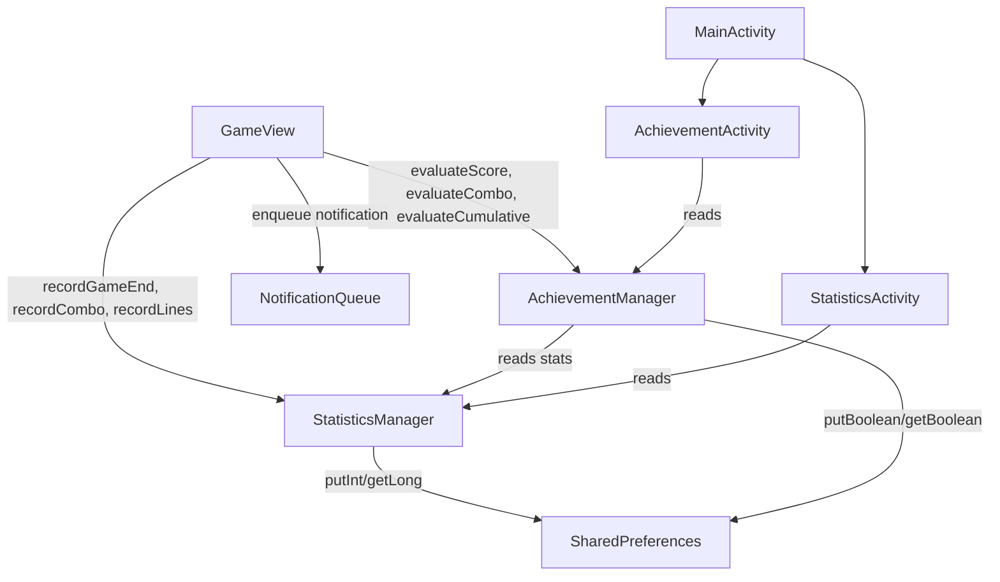

# Design Document: Statistics & Achievements

## Overview

This feature adds a statistics tracking system and an achievement system to TileBlast. A `StatisticsManager` records per-game and cumulative metrics (games played, scores, combos, lines, play time, win streaks). An `AchievementManager` defines 20 achievements, evaluates unlock conditions after each relevant game event, and persists unlock state. Two new Activities display the data, and an in-game notification queue shows achievement unlocks during gameplay.

All persistence uses `SharedPreferences` via the existing `StorageManager` pattern (same prefs file, new keys).

## Architecture



**Key design decisions:**
- `StatisticsManager` and `AchievementManager` are plain Java classes instantiated with `Context` (for SharedPreferences access). No singletons — each Activity/GameView creates its own instance reading from the same SharedPreferences.
- Achievement evaluation is pull-based: GameView calls `evaluate*` methods at the right moments rather than using an event bus.
- Notification queue lives inside GameView as a simple `LinkedList<String>` rendered during `onDraw`.

## Components and Interfaces

### StatisticsManager

```java
package com.allan.tileblast.stats;

public class StatisticsManager {
    public StatisticsManager(Context context);

    // Recording methods (called from GameView)
    public void recordGameEnd(String mode, int finalScore);
    public void recordCombo(int comboLevel);
    public void recordLinesCleared(int count);
    public void recordPlayTime(long sessionSeconds);

    // Query methods (called from StatisticsActivity)
    public int getGamesPlayed(String mode);   // "classic","chaos","timed"
    public int getTotalGamesPlayed();
    public int getAverageScore(String mode);  // returns 0 if no games
    public int getBestCombo();
    public int getTotalLinesCleared();
    public long getTotalPlayTimeSeconds();
    public int getCurrentWinStreak();
    public int getBestWinStreak();
}
```

`recordGameEnd` handles: increment games played (mode + total), accumulate score for average, update win streak logic (score > 1000 increments, else resets).

### AchievementManager

```java
package com.allan.tileblast.stats;

public class AchievementManager {
    public AchievementManager(Context context);

    // Evaluation triggers (return list of newly unlocked achievement names)
    public List<String> evaluateScore(int finalScore, String mode);
    public List<String> evaluateCombo(int comboLevel);
    public List<String> evaluateCumulative(StatisticsManager stats);
    public List<String> evaluatePerfectClear();
    public List<String> evaluatePrestige();

    // Query methods
    public boolean isUnlocked(AchievementDef achievement);
    public int getUnlockedCount();
    public AchievementDef[] getAllAchievements();
}
```

Each `evaluate*` method checks relevant `AchievementDef` conditions, unlocks if met and not already unlocked, persists, and checks Completionist. Returns newly unlocked names for the notification queue.

### AchievementDef Enum

```java
package com.allan.tileblast.stats;

public enum AchievementDef {
    // Score-based
    FIRST_GAME("First Game", "Complete 1 game", Category.SCORE, 1),
    CENTURION("Centurion", "Score 100+", Category.SCORE, 100),
    THOUSAND_CLUB("Thousand Club", "Score 1000+", Category.SCORE, 1000),
    FIVE_THOUSAND("Five Thousand", "Score 5000+", Category.SCORE, 5000),
    TEN_THOUSAND("Ten Thousand", "Score 10000+", Category.SCORE, 10000),

    // Combo-based
    COMBO_STARTER("Combo Starter", "Combo x2", Category.COMBO, 2),
    COMBO_MASTER("Combo Master", "Combo x5", Category.COMBO, 5),
    COMBO_LEGEND("Combo Legend", "Combo x10", Category.COMBO, 10),

    // Line-based
    LINE_BREAKER("Line Breaker", "Clear 10 lines", Category.LINES, 10),
    LINE_DESTROYER("Line Destroyer", "Clear 100 lines", Category.LINES, 100),
    LINE_ANNIHILATOR("Line Annihilator", "Clear 1000 lines", Category.LINES, 1000),

    // Games-played
    MARATHON("Marathon", "Play 10 games", Category.GAMES, 10),
    DEDICATED("Dedicated", "Play 50 games", Category.GAMES, 50),
    VETERAN("Veteran", "Play 100 games", Category.GAMES, 100),

    // Special
    SPEED_DEMON("Speed Demon", "Score 500+ in Timed 60s", Category.SPECIAL, 500),
    PERFECT("Perfect", "Achieve a perfect clear", Category.SPECIAL, 1),
    STREAK_3("Streak 3", "Win streak of 3", Category.SPECIAL, 3),
    STREAK_7("Streak 7", "Win streak of 7", Category.SPECIAL, 7),
    PRESTIGE("Prestige", "Prestige once", Category.SPECIAL, 1),
    COMPLETIONIST("Completionist", "Unlock all 19 others", Category.SPECIAL, 19);

    public final String displayName;
    public final String description;
    public final Category category;
    public final int threshold;

    public enum Category { SCORE, COMBO, LINES, GAMES, SPECIAL }
}
```

### Notification Queue (in GameView)

```java
// Fields added to GameView
private LinkedList<String> achievementQueue = new LinkedList<>();
private String currentNotification = null;
private long notificationEndTime = 0;

// Called after evaluate* methods
public void enqueueAchievement(String name) {
    achievementQueue.add(name);
}
```

Rendering: during `onDraw`, if `currentNotification` is null and queue is non-empty, dequeue next and set `notificationEndTime = now + 3000`. Draw a gold banner at top of screen with achievement name. After 3s, clear and check queue again.

## Data Models

### SharedPreferences Keys

All keys prefixed with `stats_` or `ach_` to avoid collision with existing keys.

| Key | Type | Default | Description |
|-----|------|---------|-------------|
| `stats_games_classic` | int | 0 | Games played in classic mode |
| `stats_games_chaos` | int | 0 | Games played in chaos mode |
| `stats_games_timed` | int | 0 | Games played in timed mode |
| `stats_games_total` | int | 0 | Total games played |
| `stats_score_classic` | long | 0 | Cumulative score for classic |
| `stats_score_chaos` | long | 0 | Cumulative score for chaos |
| `stats_score_timed` | long | 0 | Cumulative score for timed |
| `stats_best_combo` | int | 0 | Best combo ever achieved |
| `stats_lines_total` | int | 0 | Total lines cleared |
| `stats_playtime` | long | 0 | Total play time in seconds |
| `stats_streak_current` | int | 0 | Current win streak |
| `stats_streak_best` | int | 0 | Best win streak |
| `ach_<ENUM_NAME>` | boolean | false | Unlock state per achievement |

### Integration Hooks in GameView

**In `attemptPlacement()` — after `board.breakLines()`:**
```java
// Track lines
if (linesBroken > 0) {
    statisticsManager.recordLinesCleared(linesBroken);
    // Check perfect clear
    if (board.isEmpty()) {
        List<String> unlocked = achievementManager.evaluatePerfectClear();
        for (String name : unlocked) enqueueAchievement(name);
    }
}
// Track combo
if (comboLevel >= 2) {
    statisticsManager.recordCombo(comboLevel);
    List<String> unlocked = achievementManager.evaluateCombo(comboLevel);
    for (String name : unlocked) enqueueAchievement(name);
}
```

**In game-over block (inside `attemptPlacement()` when `gameOver = true`):**
```java
statisticsManager.recordGameEnd(modeName, scoreManager.getScore());
List<String> unlocked = achievementManager.evaluateScore(scoreManager.getScore(), modeName);
unlocked.addAll(achievementManager.evaluateCumulative(statisticsManager));
for (String name : unlocked) enqueueAchievement(name);
```

**Board.isEmpty() helper** (new method): returns true if all cells are EMPTY.

**Play time tracking**: `setup()` records `sessionStartTime = System.currentTimeMillis()`. Game-over and pause persist elapsed time via `statisticsManager.recordPlayTime(elapsed)`.

## Correctness Properties

*A property is a characteristic or behavior that should hold true across all valid executions of a system — essentially, a formal statement about what the system should do. Properties serve as the bridge between human-readable specifications and machine-verifiable correctness guarantees.*

### Property 1: Games played counter invariant

*For any* game mode and any sequence of N game-end events for that mode, the mode-specific games played counter SHALL equal N, and the total games played counter SHALL equal the sum of all mode counters.

**Validates: Requirements 1.1, 1.2**

### Property 2: Average score formula correctness

*For any* game mode and any non-empty sequence of final scores, the average score SHALL equal the integer division of the cumulative sum of scores by the number of games played for that mode. For an empty sequence, the average SHALL be 0.

**Validates: Requirements 2.1, 2.3**

### Property 3: Best combo is maximum of all observed combos

*For any* sequence of combo levels reported to StatisticsManager, the best combo value SHALL equal the maximum value in that sequence (or 0 if the sequence is empty).

**Validates: Requirements 3.1, 3.2**

### Property 4: Lines cleared accumulation

*For any* sequence of line-clear events with counts [c1, c2, ..., cn], the total lines cleared SHALL equal c1 + c2 + ... + cn.

**Validates: Requirements 4.1**

### Property 5: Win streak correctness

*For any* sequence of final scores, the current win streak SHALL equal the length of the longest suffix of consecutive scores > 1000, and the best win streak SHALL equal the length of the longest contiguous subsequence of scores > 1000 anywhere in the sequence.

**Validates: Requirements 6.1, 6.2, 6.3**

### Property 6: Achievement evaluation correctness

*For any* final score, combo level, and cumulative statistics values, the set of achievements that `evaluate*` methods mark as unlocked SHALL be exactly those whose threshold is met by the corresponding stat value.

**Validates: Requirements 8.1, 8.2, 8.3**

### Property 7: Achievement unlock idempotence

*For any* achievement and any sequence of evaluation calls where the condition is met, calling evaluate multiple times SHALL not change the unlock state after the first successful evaluation (unlocking is idempotent).

**Validates: Requirements 8.4**

### Property 8: Corrupt/missing data defaults to zero/locked

*For any* SharedPreferences state where statistics keys are missing or contain invalid values, StatisticsManager SHALL initialize all counters to 0, and AchievementManager SHALL initialize all achievements to locked.

**Validates: Requirements 12.5, 12.6**

## Error Handling

| Scenario | Handling |
|----------|----------|
| SharedPreferences read returns default (key missing) | Use 0 / false defaults — this is the normal first-launch path |
| Division by zero in average calculation | Return 0 when gamesPlayed == 0 (checked before division) |
| Null piece/mode passed to record methods | Guard with early return, no crash |
| Achievement notification queue overflow | No cap needed — max 20 achievements total, queue drains at 3s each |
| Board.isEmpty() called during hover state | Only call after clearHover + breakLines (hover states already cleared) |

## Testing Strategy

**Unit tests** (JUnit, no Android dependencies for manager logic):
- StatisticsManager: verify each record method updates the correct fields
- AchievementManager: verify each achievement unlocks at exact threshold
- Edge cases: zero games average, streak reset, Completionist trigger at exactly 19

**Property-based tests** (jqwik, minimum 100 iterations each):
- Property 1–5: Generate random event sequences, verify StatisticsManager invariants
- Property 6–7: Generate random stat values, verify AchievementManager correctness and idempotence
- Property 8: Generate random corrupt prefs states, verify defaults

Tag format: `@Label("Feature: statistics-achievements, Property N: <text>")`

**Integration tests** (AndroidX Test / Robolectric):
- Verify SharedPreferences round-trip: write stats, create new manager instance, read back
- Verify GameView integration hooks fire correctly on placement and game-over
- Verify notification queue renders and auto-dismisses

**Manual tests:**
- StatisticsActivity displays correct values
- AchievementActivity grid layout, locked/unlocked styling
- Notification banner positioning doesn't obstruct gameplay
