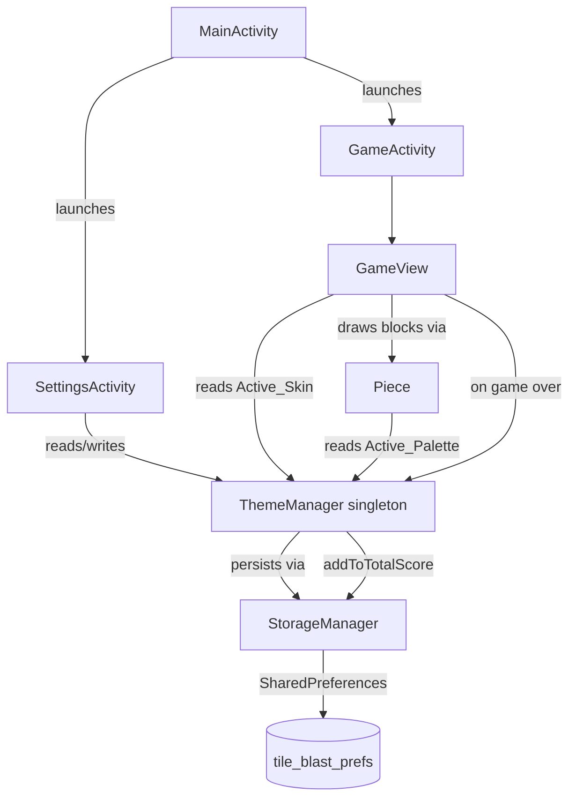

# Design Document

## Overview

Themes & Customization adds a `ThemeManager` singleton, a `SettingsActivity`, and persistent palette/skin/total-score state to TileBlast. The feature exposes 6 color palettes (which recolor the 6 piece colors used by `Piece`) and 5 board skins (which paint the grid background drawn by `GameView`). All non-default palettes and skins are gated behind cumulative-score thresholds, with progress accumulated across every game in every mode.

The design touches three layers:

1. **Domain model** — `ColorPalette` and `BoardSkin` enums, plus a `ThemeManager` singleton holding `Active_Palette`, `Active_Skin`, and `Total_Score`.
2. **Persistence** — extension of the existing `StorageManager` with three new keys (palette id, skin id, total score) and three new accessor pairs.
3. **Presentation** — a new `SettingsActivity` (with a self-drawing `Canvas` preview view), a "Settings" entry on `MainActivity`, and small refactors in `Piece` and `GameView` so they read live colors and the active skin from `ThemeManager` instead of hard-coding `Piece.COLORS` and a black grid background.

The change is intentionally non-invasive in the gameplay path: `Board`, `Hand`, and `ScoreManager` are untouched. Existing call sites that read `Piece.COLORS[i]` continue to work because the palette swap is implemented inside `Piece`'s static accessors — the indices `0..5` retain the same meaning, only the RGB values behind them change.

### Goals

- Six palettes and five skins, immediately switchable from a Settings screen with live preview.
- Unlocks driven by `Total_Score`, persisted across launches.
- Selections persisted across launches, with a defensive fallback to Default when persisted state references a now-locked or unknown id.
- One source of truth (`ThemeManager`) for everything theme-related.

### Non-Goals

- No bitmap assets; all skins are drawn procedurally with `Canvas` primitives so APK size stays unchanged.
- No per-mode themes (one global selection covers Classic and Chaos).
- No animation between theme switches.

## Architecture



### Component responsibilities

| Component | Responsibility |
|---|---|
| `ThemeManager` | Singleton holding active palette, active skin, total score. Owns unlock logic and persistence orchestration. |
| `ColorPalette` | Enum: id, display name, six RGB triplets, unlock threshold. |
| `BoardSkin` | Enum: id, display name, unlock threshold, `drawBackground(Canvas, RectF, int blockSize)` method. |
| `StorageManager` | Existing class, extended with `getActivePaletteId/setActivePaletteId`, `getActiveSkinId/setActiveSkinId`, `getTotalScore/setTotalScore/addToTotalScore`. |
| `SettingsActivity` | Hosts a custom `View` that draws palette grid, skin grid, preview area, and handles taps. |
| `Piece` (refactor) | Replace `static final int[][] COLORS` with a static accessor `getPaletteColors()` that delegates to `ThemeManager.getInstance().getActivePalette().getColors()`. |
| `GameView` (refactor) | In `drawGrid`, replace the hard-coded `Color.BLACK` background fill with a call to `ThemeManager.getInstance().getActiveSkin().drawBackground(canvas, gridRect, blockSize)`. On game over, call `ThemeManager.addToTotalScore(finalScore)`. |
| `MainActivity` (refactor) | Add a Settings button in `activity_main.xml` that launches `SettingsActivity`. |

### Lifetime and threading

- `ThemeManager` is initialized on first `getInstance(Context)` call. Initialization loads palette id, skin id, and total score from `StorageManager`. If persisted ids are missing, unrecognized, or refer to currently-locked entries, Active_Palette and Active_Skin fall back to Default.
- All `ThemeManager` mutations (`setActivePalette`, `setActiveSkin`, `addToTotalScore`) happen on the UI thread; SharedPreferences `apply()` is async-safe so no extra synchronization is needed.
- The singleton holds an application-context reference (not the activity) to avoid leaks: `ThemeManager.init(context.getApplicationContext())`.

### Why a singleton

`Piece`'s color accessors are static and called from many sites (`GameView.drawBeveledBlock`, `getColor()`, `getTopBorder()`, etc.). Threading a `ThemeManager` reference through every call would require touching `Board`, `GameView`, and constructors. A singleton lets `Piece.getPaletteColors()` resolve the active palette in one line without changing call sites.

## Components and Interfaces

### `ColorPalette` (enum)

```java
public enum ColorPalette {
    DEFAULT("Default", 0, new int[][]{
        {227, 143, 16}, {186, 19, 38}, {16, 158, 40},
        {20, 56, 184}, {101, 19, 148}, {31, 165, 222}
    }),
    NEON("Neon", 5000, new int[][]{
        {255, 20, 147},  {0, 255, 255},   {57, 255, 20},
        {255, 255, 0},   {255, 105, 180}, {138, 43, 226}
    }),
    PASTEL("Pastel", 10000, new int[][]{
        {255, 179, 186}, {255, 223, 186}, {255, 255, 186},
        {186, 255, 201}, {186, 225, 255}, {218, 191, 255}
    }),
    RETRO("Retro", 25000, new int[][]{
        {229, 96, 36},  {234, 162, 33},  {236, 201, 41},
        {72, 142, 87},  {61, 105, 158},  {115, 65, 128}
    }),
    DARK("Dark", 50000, new int[][]{
        {139, 0, 0},   {0, 100, 0},   {0, 0, 139},
        {75, 0, 130},  {139, 69, 19}, {47, 79, 79}
    }),
    OCEAN("Ocean", 100000, new int[][]{
        {0, 119, 190},  {72, 202, 228}, {144, 224, 239},
        {0, 150, 136},  {0, 77, 64},    {26, 35, 126}
    });

    public final String displayName;
    public final int unlockThreshold;
    private final int[][] colors; // 6 rows of {r,g,b}

    ColorPalette(String displayName, int unlockThreshold, int[][] colors) {
        this.displayName = displayName;
        this.unlockThreshold = unlockThreshold;
        this.colors = colors;
    }

    public int[][] getColors() { return colors; }
    public int getColor(int idx) { /* Color.rgb */ }

    public static ColorPalette fromId(String id) {
        for (ColorPalette p : values()) if (p.name().equals(id)) return p;
        return DEFAULT;
    }
}
```

The constructor enforces 6 colors per palette (validated by a static initializer assertion).

### `BoardSkin` (enum + drawing strategy)

`BoardSkin` is an enum with an abstract `drawBackground` method so each variant supplies its own rendering strategy.

```java
public enum BoardSkin {
    DEFAULT("Default", 0) {
        @Override public void drawBackground(Canvas c, RectF rect, int blockSize, Paint paint) {
            paint.setStyle(Paint.Style.FILL);
            paint.setColor(Color.BLACK);
            c.drawRect(rect, paint);
            // existing per-cell border (kept for parity with current GameView)
        }
    },
    WOOD("Wood", 5000) {
        @Override public void drawBackground(Canvas c, RectF rect, int blockSize, Paint paint) {
            // brown gradient + horizontal grain lines
        }
    },
    METAL("Metal", 25000) { /* gray gradient + brushed-metal hatch */ },
    SPACE("Space", 50000) { /* deep blue + procedurally placed star dots */ },
    PIXEL_ART("Pixel Art", 100000) { /* 2x2 checkerboard tiles */ };

    public final String displayName;
    public final int unlockThreshold;
    BoardSkin(String displayName, int threshold) { /* ... */ }

    public abstract void drawBackground(Canvas c, RectF rect, int blockSize, Paint paint);

    public static BoardSkin fromId(String id) { /* fallback to DEFAULT */ }
}
```

All five `drawBackground` implementations use only `Canvas` primitives (`drawRect`, `drawLine`, `drawCircle`, `LinearGradient` shaders). No bitmap resources are added.

### `ThemeManager`

```java
public final class ThemeManager {
    private static ThemeManager INSTANCE;

    private final StorageManager storage;
    private ColorPalette activePalette;
    private BoardSkin activeSkin;
    private int totalScore;

    public static synchronized ThemeManager getInstance(Context ctx) {
        if (INSTANCE == null) INSTANCE = new ThemeManager(ctx.getApplicationContext());
        return INSTANCE;
    }

    private ThemeManager(Context ctx) {
        this.storage = new StorageManager(ctx);
        this.totalScore = storage.getTotalScore();
        this.activePalette = resolvePalette(storage.getActivePaletteId());
        this.activeSkin    = resolveSkin(storage.getActiveSkinId());
    }

    // --- queries
    public ColorPalette getActivePalette() { return activePalette; }
    public BoardSkin getActiveSkin() { return activeSkin; }
    public int getTotalScore() { return totalScore; }
    public boolean isUnlocked(ColorPalette p) { return totalScore >= p.unlockThreshold; }
    public boolean isUnlocked(BoardSkin s)    { return totalScore >= s.unlockThreshold; }

    // --- mutations
    public boolean setActivePalette(ColorPalette p) {
        if (!isUnlocked(p)) return false;
        activePalette = p;
        storage.setActivePaletteId(p.name());
        return true;
    }
    public boolean setActiveSkin(BoardSkin s) {
        if (!isUnlocked(s)) return false;
        activeSkin = s;
        storage.setActiveSkinId(s.name());
        return true;
    }
    public void addToTotalScore(int delta) {
        if (delta <= 0) return;
        totalScore = Math.max(0, totalScore + delta);
        storage.setTotalScore(totalScore);
    }

    // --- persistence-resolution helpers
    private ColorPalette resolvePalette(String id) {
        if (id == null) return ColorPalette.DEFAULT;
        ColorPalette p = ColorPalette.fromId(id); // returns DEFAULT for unknown
        return isUnlocked(p) ? p : ColorPalette.DEFAULT;
    }
    private BoardSkin resolveSkin(String id) {
        if (id == null) return BoardSkin.DEFAULT;
        BoardSkin s = BoardSkin.fromId(id);
        return isUnlocked(s) ? s : BoardSkin.DEFAULT;
    }
}
```

`setActivePalette`/`setActiveSkin` return `false` for locked entries instead of throwing, so the SettingsActivity can show a "needs N points" toast without exception handling.

### `StorageManager` extension

Three new keys appended to the existing class. The class signature is preserved so no caller breaks.

```java
private static final String KEY_ACTIVE_PALETTE = "active_palette";
private static final String KEY_ACTIVE_SKIN    = "active_skin";
private static final String KEY_TOTAL_SCORE    = "total_score";

public String getActivePaletteId()           { return prefs.getString(KEY_ACTIVE_PALETTE, null); }
public void   setActivePaletteId(String id)  { prefs.edit().putString(KEY_ACTIVE_PALETTE, id).apply(); }

public String getActiveSkinId()              { return prefs.getString(KEY_ACTIVE_SKIN, null); }
public void   setActiveSkinId(String id)     { prefs.edit().putString(KEY_ACTIVE_SKIN, id).apply(); }

public int    getTotalScore()                { return Math.max(0, prefs.getInt(KEY_TOTAL_SCORE, 0)); }
public void   setTotalScore(int score)       { prefs.edit().putInt(KEY_TOTAL_SCORE, Math.max(0, score)).apply(); }
public void   addToTotalScore(int delta) {
    if (delta <= 0) return;
    setTotalScore(getTotalScore() + delta);
}
```

`getTotalScore` clamps to non-negative on read as a defensive measure against direct prefs editing.

### `SettingsActivity` and its custom view

`SettingsActivity` is a single full-screen activity that hosts `SettingsView extends View`. The view draws three regions in a fixed vertical layout:

```
+----------------------------------+
| [<- Back]   SETTINGS             |  <- header (50dp)
+----------------------------------+
| COLOR PALETTE                    |
| [P0][P1][P2]                     |  <- 2x3 grid of palette tiles
| [P3][P4][P5]                     |
+----------------------------------+
| BOARD SKIN                       |
| [S0][S1][S2][S3][S4]             |  <- 1x5 strip of skin tiles
+----------------------------------+
|         [ Preview area ]         |
|  4x4 sample grid (Active_Skin)   |
|  with 3 sample pieces in         |
|  Active_Palette colors           |
+----------------------------------+
```

Each palette tile shows the 6 colors as a 2x3 swatch; each skin tile shows a thumbnail rendered by calling that skin's `drawBackground` into a small `RectF`. Locked tiles draw a 50% black overlay plus a lock glyph and the threshold ("5,000").

#### Tile rectangles and tap handling

```java
private RectF[] paletteRects = new RectF[6];
private RectF[] skinRects    = new RectF[5];
private RectF backRect, previewRect;

@Override public boolean onTouchEvent(MotionEvent e) {
    if (e.getAction() != MotionEvent.ACTION_UP) return true;
    float x = e.getX(), y = e.getY();

    if (backRect.contains(x, y)) { finish(); return true; }

    for (int i = 0; i < paletteRects.length; i++) {
        if (paletteRects[i].contains(x, y)) {
            ColorPalette p = ColorPalette.values()[i];
            if (theme.isUnlocked(p)) theme.setActivePalette(p);
            else showLockedToast(p.unlockThreshold);
            invalidate(); return true;
        }
    }
    // same loop for skinRects
}
```

After every successful selection the view calls `invalidate()`, so the preview re-renders in the next frame (well under the 100ms requirement).

#### Preview rendering

The preview is a 4x4 sample board with three pre-placed shapes drawn with the same `drawBeveledBlock` math as `GameView`. It calls:

```java
ThemeManager.getInstance(ctx).getActiveSkin()
    .drawBackground(canvas, previewRect, sampleBlockSize, paint);
```

then iterates a fixed `int[][] sampleBoard` and uses `Piece.getColorFromIndex(i)` (which now reads through `ThemeManager`) to color each cell. This guarantees the preview is pixel-identical to in-game rendering.

### `Piece` refactor

The minimum change: replace `public static final int[][] COLORS` with a getter, and adjust internal callers to use it.

```java
public class Piece {
    // OLD:
    // public static final int[][] COLORS = { ... };

    // NEW:
    public static int[][] getColors() {
        return ThemeManager.getInstance(AppContext.get()).getActivePalette().getColors();
    }

    public int getColor() {
        int[] c = getColors()[colorIndex];
        return Color.rgb(c[0], c[1], c[2]);
    }
    // every other accessor (getTopBorderColor, getColorFromIndex, etc.) replaces COLORS[i] with getColors()[i]
}
```

Because the singleton needs a `Context`, and `Piece` static methods do not have one, we introduce a tiny `AppContext` helper:

```java
public final class AppContext {
    private static Context applicationContext;
    public static void init(Context c) { applicationContext = c.getApplicationContext(); }
    public static Context get() { return applicationContext; }
}
```

`MainActivity.onCreate` calls `AppContext.init(this)` once. Alternatively, we can require every `Activity` to call `ThemeManager.getInstance(this)` early; the `AppContext` approach is chosen because it keeps `Piece`'s API call-site-free of `Context`.

The constant `COLORS.length` is replaced by the literal `6` (the number is fixed by the requirements: every palette is exactly 6 colors).

### `GameView` refactor

Two surgical edits:

1. In `drawGrid`, replace
   ```java
   paint.setColor(Color.BLACK);
   canvas.drawRect(gridLeft, gridTop, gridLeft + gridW, gridTop + gridH, paint);
   ```
   with
   ```java
   RectF gridRect = new RectF(gridLeft, gridTop, gridLeft + gridW, gridTop + gridH);
   ThemeManager.getInstance(getContext()).getActiveSkin()
       .drawBackground(canvas, gridRect, blockSize, paint);
   ```
2. After saving the high score in `attemptPlacement` on game-over, call:
   ```java
   ThemeManager.getInstance(getContext()).addToTotalScore(scoreManager.getScore());
   ```

No other change to gameplay logic.

### `MainActivity` refactor

Add a new button `btnSettings` to `activity_main.xml` and wire it:

```java
findViewById(R.id.btnSettings).setOnClickListener(v ->
    startActivity(new Intent(this, SettingsActivity.class)));
```

`AppContext.init(getApplicationContext())` is called at the top of `MainActivity.onCreate` so `Piece`'s static accessors always see a valid context.

## Data Models

### Persisted data (SharedPreferences `tile_blast_prefs`)

| Key | Type | Default | Notes |
|---|---|---|---|
| `active_palette` | String | `null` | Enum name, e.g. `"DEFAULT"`, `"NEON"`. `null` or unknown ids resolve to `DEFAULT`. |
| `active_skin` | String | `null` | Same convention as above. |
| `total_score` | int | `0` | Cumulative across all games. Clamped to `>=0` on read and write. |

Existing keys (`high_scores`, `volume`) are untouched.

### In-memory data

```java
class ThemeManager {
    ColorPalette activePalette;  // never null after init
    BoardSkin    activeSkin;     // never null after init
    int          totalScore;     // >= 0
}
```

### Palette / skin tables

| Color Palette | Threshold | RGB swatches (6) |
|---|---|---|
| Default | 0 | (227,143,16) (186,19,38) (16,158,40) (20,56,184) (101,19,148) (31,165,222) |
| Neon | 5,000 | (255,20,147) (0,255,255) (57,255,20) (255,255,0) (255,105,180) (138,43,226) |
| Pastel | 10,000 | (255,179,186) (255,223,186) (255,255,186) (186,255,201) (186,225,255) (218,191,255) |
| Retro | 25,000 | (229,96,36) (234,162,33) (236,201,41) (72,142,87) (61,105,158) (115,65,128) |
| Dark | 50,000 | (139,0,0) (0,100,0) (0,0,139) (75,0,130) (139,69,19) (47,79,79) |
| Ocean | 100,000 | (0,119,190) (72,202,228) (144,224,239) (0,150,136) (0,77,64) (26,35,126) |

| Board Skin | Threshold | Background |
|---|---|---|
| Default | 0 | Solid black |
| Wood | 5,000 | Vertical brown gradient + grain lines |
| Metal | 25,000 | Gray gradient + 45° hatching |
| Space | 50,000 | Dark blue + scattered star dots |
| Pixel Art | 100,000 | 2x2 alternating-color checkerboard |


## Correctness Properties

*A property is a characteristic or behavior that should hold true across all valid executions of a system — essentially, a formal statement about what the system should do. Properties serve as the bridge between human-readable specifications and machine-verifiable correctness guarantees.*

The themes-customization feature is dominated by pure logic (enum lookup, threshold comparison, SharedPreferences round-trips), so property-based testing applies cleanly to the `ThemeManager` and `StorageManager` extension. UI rendering correctness (lock icons, selection indicators, preview pixels) is outside PBT's scope and is covered by example tests in the Testing Strategy.

### Property 1: Active palette propagates to piece colors

*For any* unlocked `ColorPalette` p, after calling `ThemeManager.setActivePalette(p)`, the array returned by `Piece.getColors()` is element-for-element equal to `p.getColors()`.

**Validates: Requirements 1.4, 4.1, 9.1**

### Property 2: Active skin is the active skin

*For any* unlocked `BoardSkin` s, after calling `ThemeManager.setActiveSkin(s)`, `ThemeManager.getActiveSkin()` returns s.

**Validates: Requirements 2.4, 4.2, 9.2**

### Property 3: Default theme is always unlocked

*For any* non-negative integer total score, `ThemeManager.isUnlocked(ColorPalette.DEFAULT)` returns true and `ThemeManager.isUnlocked(BoardSkin.DEFAULT)` returns true.

**Validates: Requirements 5.1**

### Property 4: Unlock predicate matches threshold comparison

*For any* `ColorPalette` p (or `BoardSkin` s) and any non-negative integer total score t, `ThemeManager.isUnlocked(p)` returns true if and only if t >= p.unlockThreshold (and the same for s).

**Validates: Requirements 5.4, 5.5, 5.6, 5.7**

### Property 5: Locked selection is a no-op

*For any* `ColorPalette` p (or `BoardSkin` s) where `isUnlocked` is false, calling `setActivePalette(p)` (or `setActiveSkin(s)`) returns false and leaves `getActivePalette()` (or `getActiveSkin()`) unchanged from its prior value.

**Validates: Requirements 6.3, 6.4**

### Property 6: Total score accumulates and stays non-negative

*For any* sequence of non-negative integer deltas d1, d2, ..., dn applied via `addToTotalScore`, the resulting `getTotalScore()` equals the sum of the prior total and all deltas, and remains greater than or equal to 0 after every step.

**Validates: Requirements 7.1, 7.5**

### Property 7: Total score persistence round-trip

*For any* non-negative integer t, after `StorageManager.setTotalScore(t)`, a freshly constructed `StorageManager` reading the same SharedPreferences returns t from `getTotalScore()`, and a freshly constructed `ThemeManager` reports `getTotalScore() == t`.

**Validates: Requirements 7.2, 7.3**

### Property 8: Selection persistence round-trip

*For any* unlocked `ColorPalette` p and unlocked `BoardSkin` s, after calling `setActivePalette(p)` and `setActiveSkin(s)` on a `ThemeManager`, a fresh `ThemeManager` constructed against the same SharedPreferences (with total score sufficient to keep p and s unlocked) reports `getActivePalette() == p` and `getActiveSkin() == s`.

**Validates: Requirements 8.1, 8.2, 8.3, 8.4**

### Property 9: Invalid persisted state resolves to Default

*For any* string id that either (a) is not a valid `ColorPalette` enum name or (b) names a `ColorPalette` whose unlock threshold exceeds the persisted total score, a freshly constructed `ThemeManager` reads `Active_Palette` as `DEFAULT`. The same property holds for `BoardSkin`.

**Validates: Requirements 8.5, 8.6, 8.7, 8.8**

## Error Handling

The feature has a small surface for runtime errors; most failure modes are data-validation issues already neutralized inside `ThemeManager`.

| Failure mode | Source | Handling |
|---|---|---|
| Persisted palette id is `null`, empty, or not in the enum | SharedPreferences corruption / app downgrade | `ColorPalette.fromId` returns `DEFAULT` (covered by Property 9). |
| Persisted skin id likewise invalid | Same | `BoardSkin.fromId` returns `DEFAULT`. |
| Persisted palette/skin is valid enum but currently locked (e.g., user wiped their high scores externally and total score dropped) | Manual prefs editing | `resolvePalette`/`resolveSkin` re-check unlock state and fall back to `DEFAULT`. |
| Persisted total score is negative | Manual prefs editing | `getTotalScore` clamps to 0. |
| `addToTotalScore` called with a negative delta (e.g., a future bug in score-saving) | Programmer error | Method short-circuits when `delta <= 0`; total stays unchanged. |
| `setActivePalette(p)` called with a locked palette (race between unlock display and tap) | UI race | Method returns `false`; activity shows "Unlock at N" toast. State unchanged (Property 5). |
| `Piece.getColors()` called before `AppContext.init` ran (theoretically, e.g., in a background process) | Wrong startup order | `ThemeManager.getInstance` falls back to constructing with `null` context guarded by an `IllegalStateException`. `MainActivity.onCreate` initializes `AppContext` synchronously before any draw, making this unreachable in practice; the exception serves as a fail-fast for misconfiguration. |
| `BoardSkin.drawBackground` throws (e.g., out-of-memory shader allocation on Pixel Art) | Device pressure | Wrapped in a `try/catch` inside `GameView.drawGrid`; on exception the grid falls back to solid black for that frame. |
| SharedPreferences write fails | Storage full / crash | `apply()` is best-effort; in-memory state is the source of truth for the session. The next session falls back to defaults on read failure. |

No explicit `Exception` types are added beyond what `SharedPreferences` already throws.

## Testing Strategy

### Approach overview

The feature splits cleanly into a pure-logic layer (theme manager, palette/skin enums, storage round-trips) and a UI layer (settings screen, preview rendering, main-menu wiring).

- **Pure logic** (Properties 1–9 above) is tested with **property-based tests** using **jqwik** (a JUnit 5–compatible PBT library for the JVM). jqwik runs on the local JVM tests in `app/src/test/java`, isolated from Android — `SharedPreferences` is replaced by a fake implementation backed by an in-memory `Map`, and `Color.rgb` calls are stubbed via the `roboletric` shadow path or a thin wrapper so tests don't require the Android framework.
- **UI** (settings screen layout, button presence, preview rendering) is tested with **example-based instrumentation tests** using **Espresso** in `app/src/androidTest/java`, plus a small set of **snapshot tests** for the lock badge and selection indicator visuals.
- **Integration** (palette swap reflected in actual `GameView` rendering) uses one **Espresso end-to-end test** that selects a non-default palette, launches `GameActivity`, and verifies a sampled pixel from the grid matches the expected palette color within tolerance.

### Property-based tests

| Property | Test name | Generators |
|---|---|---|
| 1 | `palette_swap_propagates_to_piece_colors` | `Arbitraries.of(ColorPalette.values())` filtered by unlocked |
| 2 | `skin_swap_returns_active_skin` | `Arbitraries.of(BoardSkin.values())` filtered by unlocked |
| 3 | `default_always_unlocked` | `Arbitraries.integers().between(0, Integer.MAX_VALUE)` |
| 4 | `unlock_predicate_iff_threshold` | Pairs of `(theme, score)` with score in `[0, MAX]` |
| 5 | `locked_selection_is_noop` | `(theme, score)` where `score < theme.threshold` |
| 6 | `total_score_accumulates_nonneg` | `Arbitraries.integers().between(0, 1_000_000).list().ofMaxSize(50)` |
| 7 | `total_score_round_trip` | `Arbitraries.integers().between(0, Integer.MAX_VALUE)` |
| 8 | `selection_round_trip` | `(palette, skin)` cross-product, both unlocked |
| 9 | `invalid_persisted_id_resolves_to_default` | `Arbitraries.strings()` (any string, including enum names with mismatched score) plus `(theme, score < threshold)` pairs |

**Configuration** (jqwik):
- Each `@Property` annotated with `tries = 100` (minimum 100 iterations per the workflow requirement).
- Each test carries a Javadoc comment of the form:
  `// Feature: themes-customization, Property 1: For any unlocked ColorPalette p, after setActivePalette(p), Piece.getColors() == p.getColors()`
- A shared `@BeforeEach` resets the `ThemeManager` singleton via a test-only `ThemeManager.resetForTests()` and rebinds the in-memory fake `SharedPreferences`.

### Example-based unit tests

These cover acceptance criteria classified as EXAMPLE in the prework:

- `ColorPalette_has_six_entries_with_expected_names` (Req 1.1)
- `every_palette_has_six_valid_rgb_colors` (Req 1.2; iterates the fixed enum)
- `BoardSkin_has_five_entries_with_expected_names` (Req 2.1)
- `every_skin_drawBackground_does_not_throw` (Req 2.2; uses a `Picture`-backed canvas)
- `fresh_install_active_palette_is_default` (Req 1.3)
- `fresh_install_active_skin_is_default` (Req 2.3)
- `palette_thresholds_match_spec` (Req 5.2)
- `skin_thresholds_match_spec` (Req 5.3)
- `empty_prefs_yields_zero_total_score` (Req 7.4)

### Instrumentation / Espresso tests

- `main_menu_shows_settings_button` (Req 3.1)
- `tapping_settings_launches_settings_activity` (Req 3.2)
- `settings_screen_shows_palette_and_skin_sections` (Req 3.3)
- `settings_screen_shows_preview_area` (Req 3.4)
- `back_button_closes_settings` (Req 3.5)
- `selecting_palette_updates_preview_within_100ms` (Req 4.3) — measured via `View.postOnAnimation` callback timing
- `selecting_skin_updates_preview_within_100ms` (Req 4.4)
- `selected_palette_has_indicator` (Req 4.5) — snapshot diff of selected vs unselected tile
- `selected_skin_has_indicator` (Req 4.6) — snapshot diff
- `locked_palette_shows_lock_and_threshold` (Req 6.1)
- `locked_skin_shows_lock_and_threshold` (Req 6.2)
- `gameview_uses_active_palette_after_selection` (Req 9.3) — integration: change palette, launch GameActivity, sample a placed-block pixel, expect it to match the palette color within ±2 RGB tolerance.

### Why these tests cover the requirements

Every acceptance criterion maps to either a property test, an example test, or an instrumentation test in the tables above. Properties 1–9 collectively cover all logic-level requirements (1.4, 2.4, 4.1, 4.2, 5.1, 5.4–5.7, 6.3, 6.4, 7.1–7.3, 7.5, 8.1–8.8, 9.1, 9.2). The remaining requirements are visual/lifecycle and are covered by the Espresso suite. The instrumentation case `gameview_uses_active_palette_after_selection` is the single end-to-end seam that confirms the property-tested logic is actually wired into the rendering pipeline.

### Test-only hooks

To make the singleton testable without spinning up the Android runtime:

```java
class ThemeManager {
    @VisibleForTesting static void resetForTests() { INSTANCE = null; }
    @VisibleForTesting static void setInstanceForTests(ThemeManager tm) { INSTANCE = tm; }
}
```

A small in-memory `FakeStorageManager extends StorageManager` is used by the property tests; it overrides every getter/setter against a `HashMap<String, Object>` so we can drive arbitrary persisted state for the round-trip and fallback properties (Properties 7, 8, 9) without touching disk.
