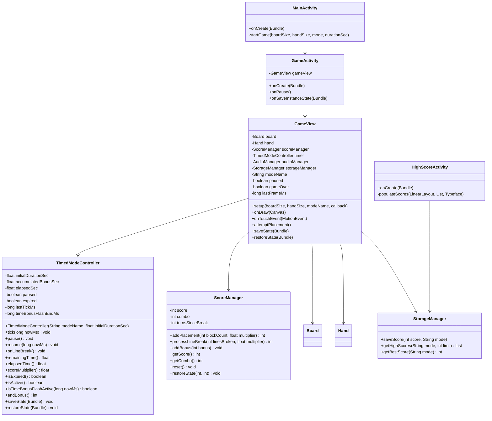
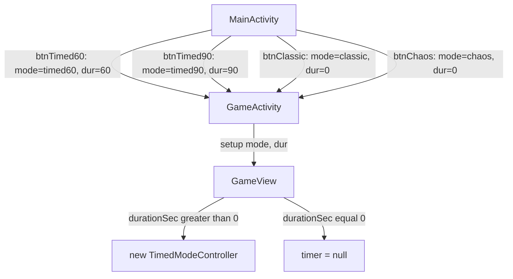
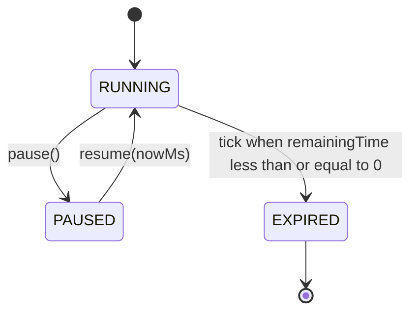

# Design Document

## Overview

Timed Mode is a sprint variant of TileBlast on the Classic 8x8 board with a 3-piece hand. The Player has a fixed initial duration (60 or 90 seconds), earns a 1.5 second time bonus on every placement that breaks at least one line, and gets an elapsed-time score multiplier that grows in 15-second steps from 1.0x up to 2.5x (3.0x in `timed90` after 60s of play). Power-ups are disabled. The round ends when the timer hits zero or no piece can be placed; leftover seconds convert to a `5 x floor(remaining)` end-of-round bonus.

The feature is added by introducing a single new collaborator class - `TimedModeController` - that owns the timer state machine (initial duration, accumulated bonus, elapsed time, paused flag), exposes the current `Score_Multiplier` and `Remaining_Time`, and handles save / restore. `GameView` keeps its role as the central coordinator: it ticks the controller from `onDraw`, multiplies score increments through `ScoreManager`, draws the countdown HUD element, and decides game-over both on "no placeable piece" (existing) and on "timer expired" (new). `MainActivity` gains two buttons that launch `GameActivity` with `mode = "timed60"` or `mode = "timed90"`. `StorageManager` already keys high scores by mode string and needs no schema change - the new mode keys flow through unchanged. `HighScoreActivity` adds two new sections that read the same API with `"timed60"` and `"timed90"`.

### Goals

- Add Timed Mode as a first-class mode alongside Classic and Chaos with no rework of `Board`, `Hand`, or `Piece`.
- Keep all timed-mode logic (multiplier curve, time bonus, end-bonus) in one testable controller class so it can be exercised with property tests independent of `Canvas` and `Activity`.
- Reuse the existing `mode` Intent-extra plumbing (`MainActivity` -> `GameActivity` -> `GameView`) - no new Activity, no new layout.
- Survive screen rotation: the timer resumes paused with elapsed time, accumulated bonus, and remaining time intact.

### Non-Goals

- Animated transitions for the multiplier change (the multiplier text simply updates).
- A separate landing screen or per-duration tutorial.
- Power-ups in Timed Mode (Requirement 8 explicitly disables them).
- Cross-mode leaderboards (`timed60` and `timed90` are independent lists, separate from `classic` and `chaos`).

## Architecture

### Class Diagram



### Mode Routing

`MainActivity` maps each menu button to a `(boardSize, handSize, mode, durationSec)` tuple. The `durationSec` extra is new - existing modes pass `0` for it, indicating "untimed". `GameActivity` reads the mode and duration from `Intent` and passes both into `GameView.setup`. `GameView` constructs a `TimedModeController` only when `durationSec > 0` and the mode key starts with `timed`; otherwise the field stays `null` and every timer-related branch is skipped. This keeps Classic and Chaos exactly as they are today.



### Frame Loop and Timer Tick

`GameView` already triggers `invalidate()` only when there is something to redraw (shake, combo overlay). Timed Mode requires the countdown to update at least 10 Hz (Requirement 2.1). The design adds a self-rescheduling `invalidate()` call inside `onDraw` whenever `timer != null && timer.isActive()`, and `onDraw` calls `timer.tick(System.currentTimeMillis())` once per frame before drawing the HUD.

The controller computes deltas off `nowMs` rather than tracking its own clock, so:

- It does not need a `Handler` or `Choreographer`.
- It naturally pauses when no `invalidate` is requested (e.g., during `paused` or `gameOver`, where `tick` is bypassed).
- After a long pause / restore, it resumes from the saved `elapsedSec` without snapping forward in time.

Pseudo-code for the relevant `onDraw` block:

```java
@Override
protected void onDraw(Canvas canvas) {
    super.onDraw(canvas);
    if (board == null) return;

    long now = System.currentTimeMillis();
    if (timer != null && !paused && !gameOver) {
        timer.tick(now);
        if (timer.isExpired()) {
            transitionToGameOver();
        }
    }

    // ... existing draw passes ...
    drawHUD(canvas, w);          // now also draws countdown + multiplier
    // ... rest unchanged ...

    if (timer != null && !paused && !gameOver) {
        invalidate();             // keep ticking at full frame rate
    }
}
```

### State Machine

The controller has three states:



`tick(nowMs)`:

- If `paused || expired`: no-op (just refreshes `lastTickMs` if not paused so that resume does not double-count).
- Else: `delta = (nowMs - lastTickMs) / 1000f`; `elapsedSec += delta`; `lastTickMs = nowMs`. If the resulting `remainingTime() <= 0`, set `expired = true` and clamp `elapsedSec` so `remainingTime()` is exactly 0 (no negatives leaking into the end-bonus calc).

`pause()`:

- If `!paused`: set `paused = true`. `elapsedSec` already reflects everything up to the most recent `tick`, so no extra accounting is needed.

`resume(nowMs)`:

- `paused = false; lastTickMs = nowMs`. The next `tick` call will produce a delta starting from `nowMs`.

### Pause Integration

Two sources call into the controller's pause API:

- `GameView.setPaused(true)` (user taps the pause button or the back button) -> `timer.pause()`.
- `GameActivity.onPause()` (Activity going to background) -> `gameView.setPaused(true)` -> `timer.pause()`. This satisfies Requirement 9.4.

`GameView.setPaused(false)` calls `timer.resume(System.currentTimeMillis())`.

### Game Over Integration

`GameView.attemptPlacement` already calls `board.canPlaceAny(hand.getAll())` after each placement and transitions to game-over if false. The design adds a second source of game-over - timer expiry - and refactors the transition into a single `transitionToGameOver()` helper:

```java
private void transitionToGameOver() {
    if (gameOver) return;
    gameOver = true;
    long gameOverMs = System.currentTimeMillis();
    inputDeadlineMs = gameOverMs + 100;  // Requirement 5.3
    int finalScore = scoreManager.getScore();
    if (timer != null) {
        int bonus = timer.endBonus();
        if (bonus > 0) {
            scoreManager.addBonus(bonus);
            timeRemainingBonusForOverlay = bonus;
        }
        finalScore = scoreManager.getScore();
    }
    audioManager.playGameover();
    storageManager.saveScore(finalScore, modeName);
    if (callback != null) callback.onGameOver(finalScore);
}
```

`onTouchEvent` checks `System.currentTimeMillis() < inputDeadlineMs` before processing placement input after `gameOver` is set; taps that arrive after the 100 ms grace window are ignored (Requirement 5.3).

### Multiplier Curve

`scoreMultiplier()` is a pure function of `elapsedSec` and `initialDurationSec`:

| Elapsed (s) | Multiplier |
|---|---|
| `[0, 15)` | 1.0 |
| `[15, 30)` | 1.5 |
| `[30, 45)` | 2.0 |
| `[45, 60)` | 2.5 |
| `>= 60` and `initialDurationSec >= 90` | 3.0 |
| `>= 60` and `initialDurationSec < 90` | 2.5 (clamped at last band) |

The clamp matters because `timed60` rounds can keep ticking past 60 seconds via accumulated time bonuses; in that case the curve stays at its top band of 2.5x rather than jumping to 3.0x (Requirement 3.5 makes 3.0x conditional on `timed90`).

### Score Application

`ScoreManager.addPlacement(blockCount, multiplier)` computes `Math.round(blockCount * multiplier)` and adds it to `score`. `ScoreManager.processLineBreak(linesBroken, multiplier)` does the same for the existing line-break formula `linesBroken * boardSize * 10f * combo`. For Classic and Chaos, `GameView` passes `1.0f` as the multiplier and the rounding is a no-op. `addBonus(int)` adds an already-final integer (used for the end-of-round time bonus, which is not multiplied).

### HUD Layout

The countdown timer is rendered at the very top of the HUD, above the score. To meet "at least 1.5x the score text size" (Requirement 2.2), the design uses 56 px for the timer (the existing score is 36 px). The score and best are pushed down by an additional `80 px` when `timer != null`:

```
     [ 47 ]          <- 56 px, color depends on remaining time
     12345           <- 36 px score
     BEST: 9876      <- 16 px best
     COMBO x3        <- 20 px combo (existing)
     x2.0            <- 20 px multiplier (only when multiplier > 1.0)
```

The multiplier text appears just below the combo line in `0xFFFFD700` (gold) to match the combo color. It is omitted for multiplier `1.0` (Requirement 3.7).

The "+1.5s" indicator floats just below the countdown for 800 ms after `onLineBreak()` (Requirement 4.2). The controller exposes `isTimeBonusFlashActive(nowMs)`; `GameView` reads it during `drawHUD`.

### Color and Pulse Rules for the Countdown

`GameView.drawCountdown` reads `timer.remainingTime()` and applies:

| Remaining (s) | Color | Effect |
|---|---|---|
| `> 30` | `#FFFFFFFF` (white) | None |
| `(10, 30]` | `#FFFFD700` (yellow) | None |
| `(5, 10]` | `#FFFF3333` (red) | None |
| `(0, 5]` | `#FFFF3333` (red) | Pulse scale 1.0 -> 1.2 at 2 Hz |

The pulse scale is `1.0 + 0.2 * (0.5 + 0.5 * sin(2 * pi * 2 * (nowMs / 1000)))`. `GameView` applies the scale via `Canvas.scale(s, s, cx, cy)` around the centered text bounding box. While the timer is in the pulsing band, `GameView` keeps invalidating (the existing `if (timer != null) invalidate();` already handles that).

### Power-Ups Suppression

The current codebase does not yet implement power-ups (`power-ups-system` is a sibling spec). When that feature lands, its `PowerUpManager` will be conditionally constructed - in `GameView.setup`, only when `modeName != "timed60" && modeName != "timed90"`. Touch-routing branches that depend on the manager will short-circuit to `null` and ignore power-up taps, satisfying Requirements 8.1, 8.2, 8.3 without coupling this design to that feature's API. This document records the contract in the Components section but does not modify any power-up file.

## Components and Interfaces

### TimedModeController

```java
package com.allan.tileblast.game;

import android.os.Bundle;

public class TimedModeController {
    public static final float TIME_BONUS_PER_LINE_BREAK_SEC = 1.5f;
    public static final int   END_BONUS_PER_SECOND          = 5;
    public static final long  TIME_BONUS_FLASH_DURATION_MS  = 800L;

    // Multiplier band boundaries (seconds)
    private static final float BAND_15  = 15f;
    private static final float BAND_30  = 30f;
    private static final float BAND_45  = 45f;
    private static final float BAND_60  = 60f;

    private final String modeName;            // "timed60" or "timed90"
    private final float initialDurationSec;   // 60 or 90

    private float accumulatedBonusSec;        // total seconds added by line-break bonuses
    private float elapsedSec;                 // seconds of active gameplay
    private boolean paused;
    private boolean expired;

    private long lastTickMs;                  // wall-clock ms of the last tick / resume
    private long timeBonusFlashEndMs;         // wall-clock ms when "+1.5s" indicator should disappear

    public TimedModeController(String modeName, float initialDurationSec);

    // --- Tick / pause / resume ---
    public void tick(long nowMs);
    public void pause();
    public void resume(long nowMs);

    // --- Events from GameView ---
    public void onLineBreak();   // adds 1.5s and starts the flash

    // --- Queries ---
    public float remainingTime();           // initial + accumulatedBonus - elapsed, clamped >= 0
    public float elapsedTime();
    public float scoreMultiplier();         // 1.0 / 1.5 / 2.0 / 2.5 / 3.0
    public boolean isExpired();
    public boolean isPaused();
    public boolean isActive();              // !expired && !paused
    public String getModeName();
    public float getInitialDurationSec();
    public boolean isTimeBonusFlashActive(long nowMs);
    public int endBonus();                  // 5 * floor(max(0, remainingTime()))

    // --- Persistence ---
    public void saveState(Bundle out);
    public void restoreState(Bundle in);    // restores into PAUSED state regardless of saved paused flag
}
```

`TimedModeController` has no Android dependency beyond `Bundle`, so its multiplier and time-arithmetic logic can be tested as pure JVM code (mocking `Bundle` or splitting the persistence into a parallel value object - see Testing Strategy).

### GameView changes

The new fields:

```java
private TimedModeController timer;       // null when mode is not timed
private long inputDeadlineMs = 0L;       // grace window after game-over; 0 means "no deadline yet"
private int  timeRemainingBonusForOverlay = 0;
```

The new / modified methods:

```java
public void setup(int boardSize, int handSize, String modeName, float durationSec, GameCallback cb) {
    // ... existing setup ...
    if (durationSec > 0f && (modeName.equals("timed60") || modeName.equals("timed90"))) {
        this.timer = new TimedModeController(modeName, durationSec);
        this.timer.resume(System.currentTimeMillis());
    } else {
        this.timer = null;
    }
}

private void drawHUD(Canvas canvas, int w) {
    int y = 50;
    if (timer != null) {
        drawCountdown(canvas, w, y);
        y += 80;
    }
    // existing score / best / combo block, shifted by y
    if (timer != null && timer.scoreMultiplier() > 1.0f) {
        drawMultiplier(canvas, w, y + 50);
    }
}

private void drawCountdown(Canvas canvas, int w, int yTop) { /* see HUD Layout */ }
private void drawMultiplier(Canvas canvas, int w, int y)   { /* see HUD Layout */ }
```

`attemptPlacement` is updated to:

1. Compute `multiplier = (timer != null) ? timer.scoreMultiplier() : 1.0f` once at entry.
2. Pass `multiplier` to both `scoreManager.addPlacement(...)` and `scoreManager.processLineBreak(...)`.
3. After `processLineBreak`, if `linesBroken > 0 && timer != null`, call `timer.onLineBreak()`.
4. On the existing "no piece can be placed" branch, route through `transitionToGameOver()` (instead of inlining the save / callback) so that the timer-expiry path can share it.

### GameActivity changes

```java
@Override
protected void onCreate(Bundle savedInstanceState) {
    // ... existing setup ...
    int boardSize = getIntent().getIntExtra("boardSize", 8);
    int handSize  = getIntent().getIntExtra("handSize", 3);
    String mode   = getIntent().getStringExtra("mode");
    float duration = getIntent().getFloatExtra("durationSec", 0f);   // NEW extra
    if (mode == null) mode = "classic";

    gameView = new GameView(this);
    setContentView(gameView);
    gameView.setup(boardSize, handSize, mode, duration, this);

    if (savedInstanceState != null) {
        gameView.restoreState(savedInstanceState);
    }
}

@Override
protected void onPause() {
    super.onPause();
    if (gameView != null && !gameView.isGameOver()) {
        gameView.setPaused(true);   // Requirement 9.4
    }
}
```

`onSaveInstanceState` is unchanged - it already delegates to `gameView.saveState(outState)`.

### MainActivity changes

`activity_main.xml` adds two new `LinearLayout` button rows below the existing Chaos button and above the High Scores button, using the same shape and font as `btnClassic` and `btnChaos`:

```xml
<LinearLayout android:id="@+id/btnTimed60" ...>
    <TextView android:id="@+id/btnTimed60Text" android:text="Timed 60s" ... />
    <TextView android:id="@+id/btnTimed60Desc" android:text="8x8 Grid - 60 Seconds" ... />
</LinearLayout>
<LinearLayout android:id="@+id/btnTimed90" ...>
    <TextView android:id="@+id/btnTimed90Text" android:text="Timed 90s" ... />
    <TextView android:id="@+id/btnTimed90Desc" android:text="8x8 Grid - 90 Seconds" ... />
</LinearLayout>
```

A new drawable `btn_timed.xml` mirrors the gradient style of `btn_classic.xml` and `btn_chaos.xml` with a distinct accent color (e.g., teal `#FF00BFA5`). Both buttons share the same drawable.

`MainActivity.startGame` gets an extra parameter:

```java
private void startGame(int boardSize, int handSize, String mode, float durationSec) {
    Intent i = new Intent(this, GameActivity.class);
    i.putExtra("boardSize", boardSize);
    i.putExtra("handSize", handSize);
    i.putExtra("mode", mode);
    i.putExtra("durationSec", durationSec);
    startActivity(i);
}
```

Existing buttons call it with `durationSec = 0f`. New buttons call it with `60f` and `90f`.

### ScoreManager changes

```java
public class ScoreManager {
    // ... existing fields ...

    // Existing signatures kept for binary compat (delegate to overloads with multiplier=1.0f)
    public int addPlacement(int blockCount) { return addPlacement(blockCount, 1.0f); }
    public int processLineBreak(int linesBroken) { return processLineBreak(linesBroken, 1.0f); }

    public int addPlacement(int blockCount, float multiplier) {
        int delta = Math.round(blockCount * multiplier);
        score += delta;
        return delta;
    }

    public int processLineBreak(int linesBroken, float multiplier) {
        if (linesBroken > 0) {
            turnsSinceBreak = 0;
            combo += linesBroken;
            int rawBonus = Math.round(linesBroken * boardSize * 10f * combo);
            int delta = Math.round(rawBonus * multiplier);
            score += delta;
            return combo;
        } else {
            turnsSinceBreak++;
            if (turnsSinceBreak >= 2) combo = 0;
            return 0;
        }
    }

    public void addBonus(int bonus) {
        if (bonus > 0) score += bonus;
    }
}
```

The two-step rounding (`Math.round` on the raw line bonus, then `Math.round` again on the multiplied result) keeps line-break score behavior in Classic / Chaos identical to the current code (multiplier `1.0` collapses to a single rounded value).

### StorageManager - no changes

`StorageManager.saveScore(int, String)` and `getHighScores(String, int)` already key by an arbitrary mode string. Passing `"timed60"` or `"timed90"` works without any code changes. The `HighScore.mode` JavaDoc-style comment will be updated from `// "classic" or "chaos"` to `// e.g., "classic", "chaos", "timed60", "timed90"` for clarity but no logic moves.

### HighScoreActivity changes

`activity_highscores.xml` gets two more sections (label + LinearLayout list) below the Chaos section:

```xml
<TextView android:id="@+id/timed60Label" android:text="- Timed 60s -" ... />
<LinearLayout android:id="@+id/timed60List" ... />
<TextView android:id="@+id/timed90Label" android:text="- Timed 90s -" ... />
<LinearLayout android:id="@+id/timed90List" ... />
```

`HighScoreActivity.onCreate` adds two `populateScores` calls:

```java
populateScores(findViewById(R.id.timed60List), storage.getHighScores("timed60", 10), fontReg);
populateScores(findViewById(R.id.timed90List), storage.getHighScores("timed90", 10), fontReg);
```

`populateScores` itself is unchanged.

## Data Models

### TimedModeController fields

| Field | Type | Range / values | Notes |
|---|---|---|---|
| `modeName` | `String` | `"timed60"`, `"timed90"` | Used by `getBestScore` and `saveScore`. |
| `initialDurationSec` | `float` | `60.0` or `90.0` | Set in constructor; immutable. |
| `accumulatedBonusSec` | `float` | `>= 0` | Total seconds added by `onLineBreak()`. Monotonically increasing during a round. |
| `elapsedSec` | `float` | `>= 0` | Seconds of active play. Increments only when not paused and not expired. |
| `paused` | `boolean` | true / false | True after `pause()`, false after `resume(...)`. |
| `expired` | `boolean` | true / false | Set once when `remainingTime()` first hits 0. Never cleared during a round. |
| `lastTickMs` | `long` | wall-clock ms | Monotonic input from `System.currentTimeMillis()`. |
| `timeBonusFlashEndMs` | `long` | wall-clock ms | 0 means "no flash". |

### Derived values

| Value | Formula |
|---|---|
| `remainingTime()` | `max(0, initialDurationSec + accumulatedBonusSec - elapsedSec)` |
| `scoreMultiplier()` | piecewise on `elapsedSec` (table above), capped at 2.5 for `timed60` |
| `endBonus()` | `END_BONUS_PER_SECOND * (int) Math.floor(remainingTime())` if `remainingTime > 0` else `0` |
| `isActive()` | `!paused && !expired` |
| `isTimeBonusFlashActive(now)` | `now < timeBonusFlashEndMs` |

### Bundle keys (added)

| Key | Type | Description |
|---|---|---|
| `timer_present` | `boolean` | `true` when the active mode is timed and a controller exists. |
| `timer_mode` | `String` | `"timed60"` or `"timed90"`. |
| `timer_initial` | `float` | Initial duration in seconds. |
| `timer_bonus_sec` | `float` | Accumulated time bonus seconds. |
| `timer_elapsed_sec` | `float` | Elapsed seconds. |
| `timer_expired` | `boolean` | Whether the timer has expired. |
| `timer_paused` | `boolean` | Persisted but ignored on restore (always restored as paused, per Requirement 10.2). |

`lastTickMs` and `timeBonusFlashEndMs` are not persisted - both are wall-clock anchors that lose meaning after a restart. On `restoreState`, `lastTickMs` is set to `0` so that the next `resume(nowMs)` initializes it correctly, and `timeBonusFlashEndMs` is set to `0` (the indicator does not survive rotation).

### Intent extras (added)

| Extra | Type | Purpose |
|---|---|---|
| `durationSec` | `float` | `60.0` for `timed60`, `90.0` for `timed90`, `0.0` otherwise. Routed from `MainActivity` to `GameActivity` to `GameView.setup`. |

### Mode key glossary

| Mode key | Source | Meaning |
|---|---|---|
| `classic` | existing | Classic Mode (8x8, 3-piece). |
| `chaos` | existing | Chaos Mode (10x10, 5-piece). |
| `timed60` | new | Timed Mode (8x8, 3-piece, 60 second initial duration). |
| `timed90` | new | Timed Mode (8x8, 3-piece, 90 second initial duration). |


## Correctness Properties

*A property is a characteristic or behavior that should hold true across all valid executions of a system - essentially, a formal statement about what the system should do. Properties serve as the bridge between human-readable specifications and machine-verifiable correctness guarantees.*

The properties below cover the testable acceptance criteria after the prework reflection. Layout / static-UI criteria (1.1-1.4, 2.7, 5.4, 6.3, 7.4, 7.5, 8.x) and the lifecycle hook 9.4 are exercised with example or instrumentation tests rather than property tests.

### Property 1: Multiplier band table holds across the elapsed range

*For any* `elapsedSec >= 0` and any `modeName` in `{"timed60", "timed90"}`, `controller.scoreMultiplier()` equals:

- `1.0` when `elapsedSec` is in `[0, 15)`
- `1.5` when `elapsedSec` is in `[15, 30)`
- `2.0` when `elapsedSec` is in `[30, 45)`
- `2.5` when `elapsedSec` is in `[45, 60)` or (when `modeName == "timed60"`) `>= 60`
- `3.0` when `modeName == "timed90"` and `elapsedSec >= 60`

**Validates: Requirements 3.1, 3.2, 3.3, 3.4, 3.5**

### Property 2: Score increments multiply, round, and add

*For any* `blockCount >= 0`, any `linesBroken >= 0`, any `boardSize > 0`, any pre-existing `combo >= 0`, and any `multiplier > 0`:

- after `addPlacement(blockCount, multiplier)`, the score increases by exactly `Math.round(blockCount * multiplier)`,
- after `processLineBreak(linesBroken, multiplier)` with `linesBroken > 0`, the score increases by exactly `Math.round(Math.round(linesBroken * boardSize * 10f * (combo + linesBroken)) * multiplier)`,
- after `processLineBreak(0, multiplier)`, the score is unchanged.

**Validates: Requirements 3.6**

### Property 3: Multiplier label formatting

*For any* `multiplier` in `[1.0, 3.0]`:

- if `multiplier > 1.0`, `multiplierLabel(multiplier)` equals `String.format("x%.1f", multiplier)`,
- if `multiplier <= 1.0`, `multiplierLabel(multiplier)` is null.

**Validates: Requirements 3.7**

### Property 4: Countdown color band and pulse scale

*For any* `remaining > 0` and any `nowMs`:

- the integer displayed equals `(int) Math.floor(remaining)`,
- the rendered color equals `#FFFFFFFF` when `remaining > 30`, `#FFFFD700` when `remaining` is in `(10, 30]`, and `#FFFF3333` when `remaining <= 10`,
- the pulse scale is `1.0` when `remaining > 5`, and is in `[1.0, 1.2]` when `remaining` is in `(0, 5]`.

**Validates: Requirements 2.1, 2.3, 2.4, 2.5, 2.6**

### Property 5: Line-break time bonus accumulates exactly 1.5s per call

*For any* controller state and any `N >= 0`: calling `onLineBreak()` `N` times in succession increases `remainingTime()` by exactly `1.5 * N` seconds (modulo any `tick` calls interleaved, which are accounted for separately) and never clamps `remainingTime()` to an upper bound.

**Validates: Requirements 4.1, 4.3**

### Property 6: Time-bonus flash window

*For any* `onLineBreak()` call at wall-clock time `t0` and any later observation time `t`: `isTimeBonusFlashActive(t)` returns `true` if and only if `t` is in `[t0, t0 + 800)` (in milliseconds), and returns `false` after a subsequent `onLineBreak()` resets the window to start at the new call time.

**Validates: Requirements 4.2**

### Property 7: Timer expiry is idempotent

*For any* controller and any sequence of `tick(nowMs)` calls that drive `elapsedSec` past `initialDurationSec + accumulatedBonusSec`: after the first such tick, `isExpired() == true`, `remainingTime() == 0`, and any subsequent `tick(nowMs')` call leaves `remainingTime()` and `elapsedSec` unchanged.

**Validates: Requirements 5.1, 5.3**

### Property 8: Post-game-over input grace window

*For any* game-over transition at wall-clock `gameOverMs` and any later input time `inputMs`: `GameView` processes placement input if and only if `inputMs - gameOverMs <= 100` milliseconds.

**Validates: Requirements 5.3**

### Property 9: End-of-round time bonus formula

*For any* `remaining` (which may be any real number, including negatives produced by clamping logic): `endBonus()` equals `5 * (int) Math.floor(remaining)` when `remaining > 0`, and equals `0` otherwise.

**Validates: Requirements 6.1, 6.2**

### Property 10: Pause freezes time advancement

*For any* controller in the running state, after `pause()` and any sequence of `tick(nowMs)` calls with arbitrary `nowMs` values: `remainingTime()`, `elapsedTime()`, and `scoreMultiplier()` all return the same values they returned at the moment `pause()` was called.

**Validates: Requirements 9.1, 9.2**

### Property 11: Pause/resume is observationally transparent

*For any* controller state, any pause start time `t1`, any pause duration `dt > 0`, and any post-resume tick offset `x > 0`: the value of `elapsedSec` after `tick(t1)`, `pause()`, `resume(t1 + dt)`, `tick(t1 + dt + x)` equals the value `elapsedSec` would have after `tick(t1)`, `tick(t1 + x)` without any pause.

**Validates: Requirements 9.3**

### Property 12: High-score storage is per-mode

*For any* sequence of `(score, mode)` pairs saved via `saveScore(score, mode)`: for each distinct mode key `k`, `getHighScores(k, N)` returns only entries whose recorded mode equals `k`, and the union over all keys equals (modulo MAX_SCORES truncation) the input set. In particular, scores saved under `timed60` never appear in the `timed90`, `classic`, or `chaos` lists.

**Validates: Requirements 7.1, 7.2, 7.3**

### Property 13: Controller save / restore round trip with paused-on-restore invariant

*For any* `TimedModeController` state `S` reachable through any sequence of `tick`, `pause`, `resume`, and `onLineBreak` calls: serializing `S` via `saveState(bundle)` and constructing a fresh controller from `restoreState(bundle)` yields a controller `S'` such that:

- `S'.modeName == S.modeName`,
- `S'.initialDurationSec == S.initialDurationSec`,
- `S'.elapsedSec == S.elapsedSec`,
- `S'.accumulatedBonusSec == S.accumulatedBonusSec`,
- `S'.remainingTime() == S.remainingTime()`,
- `S'.isExpired() == S.isExpired()`,
- `S'.isPaused() == true` regardless of `S.isPaused()`,

and for any `mode` not in `{"timed60", "timed90"}` saved in the bundle, `GameView.restoreState` constructs `timer == null` and the persisted mode key is preserved on the active mode.

**Validates: Requirements 10.1, 10.2, 10.3**

## Error Handling

### Negative or non-monotonic clock deltas

`tick(nowMs)` accepts any `long` for `nowMs`. If `nowMs < lastTickMs` (clock went backwards - e.g., during DST transitions, or because the device clock was changed), the controller treats the delta as 0 and advances `lastTickMs` to `nowMs`. This prevents `elapsedSec` from decreasing and avoids spuriously triggering expiry. Property 7 (idempotent expiry) and Property 1 (multiplier band table) both stay valid because `elapsedSec` is monotonic.

### Restoring a corrupt or partial Bundle

`restoreState(bundle)` reads each field independently. Missing fields fall back to defaults: `accumulatedBonusSec = 0`, `elapsedSec = 0`, `expired = false`. If `timer_present` is missing or false, the controller is not constructed at all and `GameView.timer` stays null.

If the persisted `timer_mode` is not `"timed60"` or `"timed90"`, `GameView.restoreState` skips the controller construction entirely (Requirement 10.3), keeping the active mode as restored from the existing `mode` key. This means a corrupted bundle that claims `timer_present = true` but lists `mode = "classic"` simply runs as Classic Mode with no timer, which is a safer failure mode than silently starting a timer in the wrong mode.

### Game-over while a placement is mid-flight

`transitionToGameOver()` is idempotent (the early-return guard `if (gameOver) return;`). The 100 ms input deadline ensures that a placement currently being processed when timer expiry fires will complete (its score and time bonus apply), but any subsequent finger-up event after the deadline is ignored. The end-of-round bonus is computed using the timer's `remainingTime()` after the in-flight placement applied its time bonus, so a final-second line break can still earn the player extra seconds before the cap.

### Best-score retrieval failure

`StorageManager.getBestScore(mode)` already returns 0 for unknown / empty mode keys. No new code is needed - `timed60` and `timed90` keys with no saved scores yet will simply show "BEST: 0" until the first round completes.

### Activity backgrounded mid-pulse

The pulsing red countdown depends on a continuous frame loop. When the Activity is paused (`onPause` -> `setPaused(true)` -> `timer.pause()`), the controller stops advancing and the pulse animation stops because `invalidate()` is no longer called from the bottom of `onDraw`. On resume, the next frame draws the timer at the held value with no pulse glitch.

## Testing Strategy

### Test categories

- **Unit tests (JVM)**: `TimedModeController` and `ScoreManager` are pure JVM classes (the only Android dependency on the controller is `Bundle`, which is shimmed by Robolectric in the JVM test source set). Both can be exhaustively property-tested without an emulator.
- **Property tests (JVM, jqwik)**: Each correctness property maps to one `@Property` test method with `@Property(tries = 200)` (above the 100-iteration minimum). Generators are JVM-pure because the controller does not touch `Canvas`.
- **Instrumentation tests (Espresso)**: 1-2 representative end-to-end checks - menu button taps launching the right Intent, and a screen-rotation test that verifies the timer survives a configuration change.
- **Layout tests (Robolectric or instrumentation)**: View-id existence and font assertions for the new menu and high-score sections.

### Library and configuration

- **jqwik** (`net.jqwik:jqwik:1.8.x`) added to the `test` source set in `app/build.gradle.kts`.
- **Robolectric** (`org.robolectric:robolectric:4.11.x`) added to the `test` source set so that `Bundle` and Android utility classes are available during JVM property tests.
- **AndroidX Test / Espresso** already pulled in by the existing `androidx.appcompat` dependency for instrumentation tests.

Each `@Property` method is tagged with a comment in the format:

```java
// Feature: timed-mode, Property N: <property text>
@Property(tries = 200)
boolean propertyName(@ForAll @FloatRange(min = 0f, max = 200f) float elapsedSec, ...) {
    // ...
}
```

### Generator design

| Generator | Output |
|---|---|
| `@Provide Arbitrary<Float> elapsedSeconds()` | uniform in `[0, 200]` (covers all multiplier bands plus past-expiry). |
| `@Provide Arbitrary<Float> remainingSeconds()` | uniform in `[-5, 200]` (covers negative remaining for end-bonus property). |
| `@Provide Arbitrary<String> timedModeKey()` | one of `"timed60"`, `"timed90"`. |
| `@Provide Arbitrary<String> anyModeKey()` | one of `"classic"`, `"chaos"`, `"timed60"`, `"timed90"`, plus a small set of malformed keys (for Property 13). |
| `@Provide Arbitrary<Long> tickDeltas()` | uniform in `[0, 5000]` ms (per-tick increment). |
| `@Provide Arbitrary<List<TimedAction>> actionSequences()` | random sequences of `TICK(dt)`, `PAUSE`, `RESUME(dt)`, `LINE_BREAK` actions. Used for Properties 5, 7, 10, 11, 13. |
| `@Provide Arbitrary<Integer> blockCounts()` | uniform in `[1, 25]` (matches `Piece.getBlockCount()` range). |
| `@Provide Arbitrary<Integer> linesBroken()` | uniform in `[0, 16]` (max for an 8x8 board is 16, for a 10x10 is 20). |

### Concrete test mapping

| Property | Test method | Generator |
|---|---|---|
| P1 | `multiplierBandTableHolds` | elapsedSeconds + timedModeKey |
| P2 | `scoreApplyMultiplierAndRound` | blockCounts + linesBroken + multiplier |
| P3 | `multiplierLabelFormat` | uniform multiplier in `[1.0, 3.0]` |
| P4 | `countdownColorBandAndPulse` | remainingSeconds + tickDeltas (used as `nowMs`) |
| P5 | `lineBreakBonusExactly1_5s` | uniform `N` in `[0, 200]` |
| P6 | `timeBonusFlashWindow` | tickDeltas |
| P7 | `expiryIdempotent` | actionSequences with TICK actions past expiry |
| P8 | `inputGraceWindowHonors100ms` | tickDeltas |
| P9 | `endBonusFormula` | remainingSeconds |
| P10 | `pauseFreezesTime` | actionSequences forcing PAUSE |
| P11 | `pauseResumeTransparent` | tickDeltas + pause durations |
| P12 | `storagePerModeIndependence` | random `(score, mode)` lists |
| P13 | `controllerSaveRestoreRoundTrip` | actionSequences + anyModeKey |

### Example-based tests

- `MainActivity_buttonExists_timed60` - inflate the layout and assert the view id is present with the expected text.
- `MainActivity_buttonExists_timed90` - same shape.
- `MainActivity_tap_timed60_launchesGameActivityWithMode` - Espresso tap and Intent capture, asserting `boardSize=8`, `handSize=3`, `mode="timed60"`, `durationSec=60f`.
- `MainActivity_tap_timed90_launchesGameActivityWithMode` - same shape with 90.
- `MainActivity_timedButtonsMatchClassicTypeface` - assert `Typeface` and `textSize` parity.
- `HighScoreActivity_timed60And90SectionsExist` - inflate and assert two new view ids.
- `HighScoreActivity_displaysOnlyTimed60InTimed60List` - save mixed scores, open the activity, assert the `timed60List` only contains `timed60` rows.
- `GameView_classicMode_doesNotConstructTimer` - assert `timer == null` after `setup(8, 3, "classic", 0f, cb)`.
- `GameView_timedMode_doesNotConstructPowerUpManager` - placeholder test to be enabled when the `power-ups-system` feature lands.
- `GameView_gameOverOverlay_showsThreeLabeledLinesInTimedMode` - force game-over with non-zero remaining time and assert the overlay draws "Score", "Time Bonus", "Final" lines.
- `GameActivity_onPause_pausesTimer` - Espresso lifecycle test that backgrounds the activity and asserts `gameView.isPaused()`.
- `GameActivity_screenRotation_preservesTimer` - Espresso test that rotates the device and asserts elapsed / remaining / accumulated-bonus values match (and `isPaused() == true` after restore).

### Out-of-scope for tests

- Pixel-perfect rendering of the countdown text and pulse animation (visual snapshot territory; not in scope).
- Vibration timing (the existing code already swallows vibration errors).
- Audio playback at the moment of expiry-driven game-over (the existing `playGameover` integration is already covered by the audio module).
- Power-up suppression in Timed Mode (deferred until `power-ups-system` lands - the contract is documented in the Components section).
